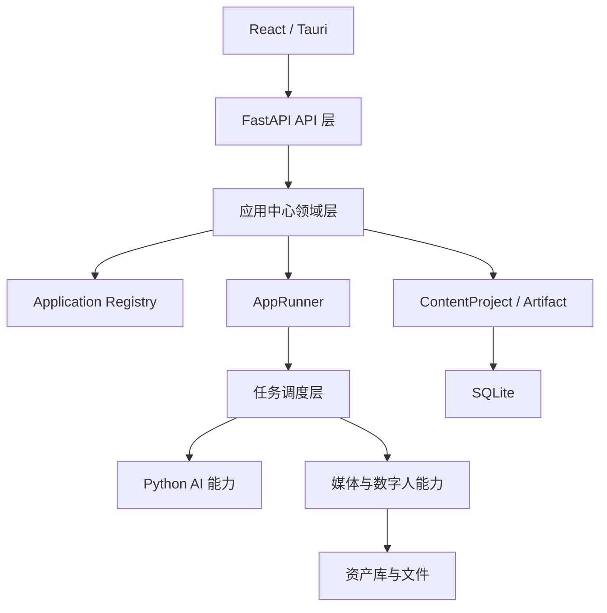
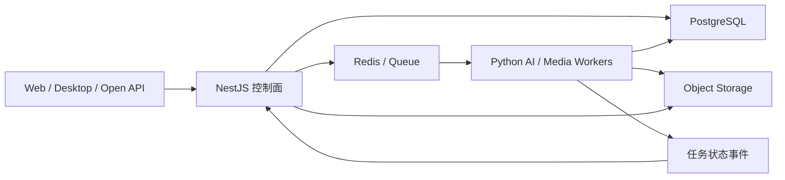

# ADR-007：应用中心保留 FastAPI 与未来 SaaS 混合架构边界

- 状态：Accepted（应用中心 AC-0 前置架构决策）
- 日期：2026-07-18
- 负责人：Pixelle Video
- 适用范围：应用中心、模型配置复用、AI/媒体执行后端，以及未来账户、商业化和云端多租户平台

## 背景

当前 Pixelle Video 是 React/Tauri 桌面端配套本地 FastAPI sidecar 的模块化单体。后台已经通过 Python 实现 LLM、结构化输出、TTS、图片/视频生成、数字人、HTML 渲染、FFmpeg 合成、任务、资产库和 IP 口播工作流。`ConfigManager/PixelleVideoConfig.llm` 已统一保存默认模型的 `api_key/base_url/model`，桌面配置接口和页面提供脱敏读写，`LLMService` 会在每次调用时读取最新配置并支持 Pydantic 结构化输出。

应用中心首期要补的是应用注册、创作项目、应用运行、产物版本和跨应用流转等业务平台层，而不是替换已经跑通的 AI/媒体执行内核。此时把 FastAPI 全量改写为 Node.js/Express 会重复实现大量 Python 能力，并不能自动解决任务持久化、项目/产物模型、并发、重试和恢复问题。

另一方面，如果产品未来进入账户、组织、RBAC、套餐、支付、订单、Webhook、开放 API、运营后台或云端多租户 SaaS 阶段，身份、商业化和对外平台能力将形成独立的控制面；AI 与媒体执行仍更适合保留在 Python 执行面。需要提前锁定两阶段架构边界，防止当前过早迁移，也防止未来把全部 SaaS 控制逻辑继续堆入本地 FastAPI sidecar。

## 决策

### 1. 当前阶段保留 FastAPI

应用中心 P0 及桌面端阶段继续使用 FastAPI 作为：

- 应用目录、创作项目、应用运行、产物和流转 API；
- LLM、内容生成、数字人、媒体处理和渲染能力入口；
- 本地任务、资产、配置和发布准备接口；
- 现有默认 LLM 配置、就绪检查和结构化模型调用的唯一入口；
- React/Tauri 桌面端的本地受控 sidecar。

当前阶段明确不做：

- 不把 FastAPI 全量迁移到 Node.js/Express；
- 不为“前后端统一 TypeScript”重写 Python AI/媒体能力；
- 不增加一个仅做转发、没有独立领域职责的 Node 网关；
- 不在应用中心 P0 提前拆微服务；
- 不让新应用继续把业务逻辑写进 FastAPI router 或全局核心单例。

FastAPI 保留不等于维持现状不动。应用中心必须在 Python 内增加清晰的 `app_center` 领域层、版本化 Schema、Application Registry、App Runner、Project/Run/Artifact/Handoff Repository，并继续通过已有 LLM、资产、任务和口播能力执行。

### 2. 当前目标是模块化单体

推荐的近期目标架构：



任务调度层首期复用并补强现有 `TaskManager`；Python AI 能力包括结构化 LLM Executor；媒体与数字人能力包括图文渲染、现有 `IpBroadcastWorkflow`、TTS、数字人和 FFmpeg。路由只负责传输协议和权限校验，领域服务负责业务规则，执行器负责调用模型/渲染/工作流，Repository 负责持久化。新增应用不得直接依赖任意磁盘路径、前端组件名或第三方 provider 实现。

### 2.1 P0 复用现有模型管理，管理后台延期

应用中心 P0 不建设第二套模型管理，也不建设应用管理员控制台或可视化模型路由。需要 LLM 的应用统一通过不保存配置的 `AppLLMPort` 薄适配层调用现有 `PixelleVideoCore.llm/LLMService`：

```text
Application Executor
→ AppLLMPort
→ PixelleVideoCore.llm / LLMService
→ ConfigManager.config.llm
→ 当前用户在“配置 > LLM 设置”维护的 local-default
```

当前约束：

- `PixelleVideoConfig.llm` 是默认模型配置唯一事实源；
- manifest 只声明 `llm` capability，不包含 provider、model、base URL、API key 或动态代码路径；
- 执行 API 不接受模型配置覆盖，AppRun、Artifact、Task 和日志不保存密钥；
- P0 所有应用共享当前 `local-default`，不做按应用选模型、fallback chain、成本路由或模型 A/B；
- `LLMService` 继续负责实际 provider 兼容和结构化调用，应用 Executor 只负责领域 prompt、schema、validator 和 repair；
- P0 通过内置 Registry、manifest、feature flag 和 Program Gate 控制应用上线，不增加 `AppControlPolicy` 数据库或管理 UI。

未来出现运营后台或多租户 SaaS 后，NestJS 控制面增加可视化 `ModelProfile/ModelRoutingPolicy`，负责可用模型目录、默认选择、按应用/租户/套餐映射、限额、灰度、回滚和审计；Python 执行面继续负责 provider adapter、凭证解析、模型调用、结构化输出和调用证据。任务只携带版本化 `model_profile_ref`，不得携带明文密钥。当前 `local-default` 必须作为兼容 profile 保留，使旧桌面项目无需迁移即可继续执行。

管理后台作为 `AC-ADMIN-CONTROL（P1/P2 Deferred Capability）` 登记。以下任一条件成立即触发独立评审与实施 Program：

1. 应用数量明显增加；
2. 需要不发版远程上下架；
3. 出现组织、多人或多租户；
4. 套餐决定可使用的应用；
5. 需要按客户或渠道灰度；
6. 引入第三方应用或插件；
7. 需要运营审计和远程熔断。

只涉及应用运营效率时可以先建设 P1 轻量控制层；涉及身份、多租户、套餐权益、插件生态或统一云端控制面时按 P2/SaaS 边界实施。触发条件成立只要求启动评审，不允许在没有新方案、迁移、安全和回滚 Gate 的情况下直接向 P0 FastAPI sidecar 堆入管理后台。

### 3. SaaS 阶段采用 NestJS + Python 混合架构

当产品正式建设以下一类或多类平台能力，或整体升级为云端多租户 SaaS 时，启动混合架构阶段：

- 账户与登录；
- 组织、成员与 RBAC；
- 套餐、权益与用量；
- 支付、订单、退款与对账；
- 第三方 Webhook；
- 对外开放 API；
- 运营后台；
- 云端多租户、多人协作与跨设备同步。

目标职责固定为：

| 组件 | 权威职责 |
| --- | --- |
| NestJS 控制面 | 账户、租户、组织、成员、RBAC、套餐、权益、支付、订单、Webhook、开放 API、运营后台、模型目录与路由策略写模型 |
| Python 执行面 | LLM provider adapter、凭证解析、结构化输出、内容生成、数字人、TTS、图片/视频处理、模板渲染、FFmpeg、AI/媒体任务执行 |
| PostgreSQL | 云端业务数据、租户数据、项目/运行/产物元数据、模型 profile/策略非敏感元数据、账务与审计记录 |
| Redis/队列 | 异步任务调度、并发控制、重试、延迟任务、状态事件和短期缓存 |
| 对象存储 | 图片、视频、音频、封面、图文包和其他二进制产物 |

目标结构：



NestJS 不通过本机子进程直接运行 Python，也不复制 AI/媒体实现。控制面通过版本化任务契约写入队列；Python Worker 消费任务、幂等执行、写入产物并发布状态事件。同步查询使用内部受控 API，长任务使用队列和事件，不用一次长 HTTP 请求维持生命周期。

### 4. 数据所有权与边界

混合架构阶段遵循单一权威来源：

- NestJS 拥有账户、租户、权限、套餐、支付、订单、Webhook、运营配置以及 ModelProfile/ModelRoutingPolicy 写模型；
- Python 拥有 prompt/executor 版本、provider adapter、凭证解析、实际模型调用、生成过程、媒体执行细节和可复现执行快照；
- 项目、运行、产物元数据落 PostgreSQL，通过独立 schema/repository 明确写入所有者；
- 二进制文件只落对象存储，数据库只保存对象 key、hash、大小、类型和版本；
- Redis/队列不是长期事实来源；最终状态必须回写 PostgreSQL；
- 跨服务共享稳定 ID 和版本化契约，不共享语言内部对象或直接访问对方私有表。

### 5. 当前为未来保留的兼容性

应用中心 P0 在不引入 SaaS 复杂度的前提下必须保留以下演进空间：

- 所有 project、run、attempt、artifact 使用全局唯一稳定 ID；
- 领域记录允许未来增加 `tenant_id`、`workspace_id`、`owner_id`，当前不伪造本地租户；
- 输入、上下文、产物和任务消息都有 `schema_version`；
- App Runner 和媒体执行支持幂等键、取消、重试和 attempt；
- API 不返回供客户端长期保存的绝对路径；
- artifact 使用文件引用抽象，不把 SQLite BLOB 作为主媒体存储；
- 账户、权限和计费判断不写进 Prompt、Executor 或媒体服务；
- 当前应用通过 AppLLMPort 依赖 `local-default`，不直接依赖 ConfigManager 或 OpenAI SDK；
- 未来控制面只传版本化 `model_profile_ref`，明文凭证不进入任务消息、项目、产物或审计正文；
- provider adapter、模型调用和 workflow 执行细节留在 Python 执行面；
- NestJS 将来可以通过 OpenAPI/JSON Schema 和任务消息契约接入，而不重写 P0 应用语义。

这些是兼容性要求，不授权当前提前建设 PostgreSQL、Redis、对象存储、NestJS 或多租户 UI。

## 备选方案

### 全量迁移 Express：拒绝

Express 只替换 HTTP 框架，不能替代 Python AI/媒体生态，也不自动提供领域架构、结构化输出、任务恢复和数据模型。迁移将带来高重写成本和双运行时复杂度，当前没有对应收益。

### 当前直接使用 NestJS + Python：拒绝

首期仍是本地单用户桌面产品，控制面职责尚未形成。现在引入 NestJS 会产生部署、契约和故障面成本，并延迟应用中心价值验证。

### 永久只使用 FastAPI：不作为长期目标

技术上可以继续扩展，但当身份、商业化、开放 API 和多租户成为主要领域后，独立控制面更利于职责、团队和安全边界。届时按本 ADR 启动混合架构，而不是被动在单体内继续堆叠。

### Go/Rust 重写执行后端：拒绝

当前性能瓶颈主要来自外部 AI、媒体生成和 FFmpeg/渲染任务，不在 HTTP 路由。重写会失去 Python 生态且不能消除外部等待成本。

## 触发与门禁

进入混合架构前必须单独产出 SaaS 架构方案和迁移 ADR，至少确认：

1. 租户、身份、RBAC 和数据隔离模型；
2. NestJS/Python API 与队列消息契约；
3. PostgreSQL schema 所有权与迁移策略；
4. Redis/队列的投递语义、幂等、重试、死信和取消；
5. 对象存储 key、签名访问、生命周期与迁移；
6. 本地桌面项目/资产到云端的导入和冲突处理；
7. 支付、订单、Webhook 的签名、幂等、审计与对账；
8. 可观测性、成本、容量、备份、灾备和回滚；
9. 分阶段流量迁移和旧 FastAPI 本地模式的兼容策略。
10. ModelProfile/ModelRoutingPolicy、凭证解析、租户权益、灰度回滚与 `local-default` 兼容策略。

在该 Gate 通过前，不允许因为单个账户页面、简单 Webhook 或团队偏好就启动全量重写。

## 后果

正面后果：

- 当前最大化复用已跑通的 Python AI/媒体能力；
- 应用中心可以先验证用户价值，不被技术迁移阻塞；
- 未来控制面与执行面职责清晰；
- 数据库、队列和对象存储的升级方向明确；
- NestJS 接入不要求重写 P0 应用和媒体执行语义。

负面后果：

- 当前 Python 模块化边界和任务内核仍需要补强；
- 未来 SaaS 阶段会同时维护 TypeScript 与 Python 两套服务；
- 跨服务契约、分布式任务和可观测性复杂度会上升；
- 从本地 SQLite/文件到云端 PostgreSQL/对象存储需要专门迁移工程。

这些成本只有在 SaaS 控制面价值和规模明确后才合理，因此不提前支付。
