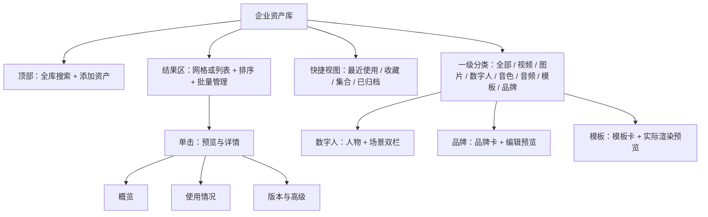

# 企业资产库 V2 完善与“门店老板低门槛”实施方案

- 日期：2026-07-18
- 修订版本：v1.1（UX-A 契约补强版）
- 交付对象：Luna（产品、前端、后端、测试均可据此拆任务）
- 实施基线：企业资产库 V2 已默认启用，旧页面与旧接口仅保留回滚窗口
- 方案范围：资产浏览、搜索、上传、预览、维护、数字人/品牌/模板管理，以及生产流中的选择、快捷添加和回填
- 不在本轮范围：完全自动发布、多人云协作/RBAC、数字人市场、第三方素材商城、重做资产内核

## 0. 结论与实施授权

**可以安排 Luna 按本方案启动阶段 UX-0。只有本方案新增的契约附件与门禁证据全部通过 UX-A，才允许进入 UX-1。**

实施不得被理解成“再做一个纯简化版”。本轮的目标是：

1. 保留 V2 的统一资产内核、稳定 ID、revision、收藏、标签、集合、使用记录、批量管理和生产快照；
2. 恢复旧版按资产类别快速定位的清晰感，并补齐 V2 尚未暴露的领域管理能力；
3. 让门店老板第一次使用时不需要理解技术概念，让熟练用户仍能低成本完成批量、版本、筛选和高级配置；
4. 降低一次任务的**总操作成本**，而不是单纯减少当前屏幕上的按钮数量；
5. 资产中心和生产流继续共用同一数据、查询、卡片、预览、上传和选择组件，不维护“老板版/专业版”两套产品。

本方案采用“阶段 + 门禁”推进。任何阶段未通过对应门禁，不得提前默认开启后续新版界面，更不得清理旧回滚实现。

### 0.1 v1.1 复审修订摘要

本次复审把此前仅有方向、尚不足以编码的四项补成确定契约：

1. 模板编辑器与最终合成使用同一 `TemplateLayoutContract`、同一坐标系、同一字体解析结果和服务端权威预览；
2. 音色从“所有 audio 的临时投影”升级为引用音频 revision 的 `VoiceProfile` 领域资源；
3. 重复上传改为“上传完成但延迟入库 → 用户选择策略 → finalize”的状态机，三种处理结果均有确定语义；
4. 本轮重启恢复明确为“识别中断并重新选择原文件重传”，不再误称断点续传；真正 offset 续传留作后续增强。

同时补充稳定游标、共享组件边界、触屏可达性和可用性测试口径。v1.1 是 **UX-A 候选方案**，不等于 UX-A 已通过；门禁仍需 Luna 交付 ADR、schema、fixture、迁移 dry-run、交互基线和回滚证据。

## 1. 证据基线与评审边界

本方案基于以下真实实现，而不是只按概念图推演：

- V2 页面：`desktop/src/features/assets/components/AssetCenterV2.tsx`；
- 生产共享选择器：`desktop/src/features/assets/components/AssetPickerDialog.tsx`；
- 前端 API：`desktop/src/api.ts`；
- V2 路由与领域接口：`api/routers/assets_v2.py`；
- 数据契约：`api/schemas/asset_library_v2.py`；
- 旧资产分类页面与生产流接入：`desktop/src/StudioApp.tsx`；
- 主题系统：`desktop/src/theme.ts` 与 `desktop/src/styles.css`；
- 已通过的内核与生产闭环证据：`docs/reviews/2026-07-17-enterprise-asset-library-stage3-gate-c.md`。

本轮运行中已通过桌面可访问性树核对当前 V2 的可见控件、分类、卡片和弹窗状态；专用应用内浏览器仍受 `Cannot redefine property: process` 运行时错误影响，Computer Use 截图又返回空白，因此**不能把本轮空白截图当作视觉验收证据**。Luna 在阶段 0 必须补录可复现的当前版截图、任务录像和操作基线，作为后续视觉对比依据。

## 2. 不可违背的产品原则

### 2.1 一套产品，不做双模式分叉

禁止新增“老板版 / 专业版”“简单模式 / 高级模式”两套导航、两套数据或两套组件。不同用户的差异通过以下方式解决：

- 默认层：高频动作、业务语言、最近使用、明确预览；
- 详情层：编辑、标签、使用记录、替换版本、场景和品牌配置；
- 高级层：revision、renderer、资源 ID、技术诊断和完整契约。

高级层是同一界面的渐进展开，不是另一个产品。展开状态、视图密度和上次筛选可本地记忆。

### 2.2 优化总任务成本，不追求“屏幕看起来最少”

以下做法看似简化，实际会增加成本，明确禁止：

- 把所有分类入口收进一个不透明的“更多”菜单；
- 为每次上传强制走多步向导；
- 为了页面干净而隐藏搜索、批量管理或收藏；
- 让用户先去资产中心上传，再回生产步骤重新搜索；
- 把品牌、模板、数字人降级成只有名称的普通文件卡；
- 用模糊的“智能推荐”替代可解释的筛选和手动选择；
- 让卡片单击立即修改生产 session，导致误选与频繁远程写入。

### 2.3 业务语言优先，技术信息可追溯

默认界面使用“最近用于成片”“竖屏”“门店场景”“字幕位置”等语言，不直接暴露：

- `resource_id`、`session_id`；
- `provider`、`renderer_version`；
- `default_scene_id`、`quality_state`；
- 原始 `summary` key；
- API 地址与服务堆栈错误。

这些信息仍保留在“高级信息 / 复制诊断信息”中，便于排错和专业维护。

### 2.4 主题与视觉系统不另起炉灶

继续使用 `--app-*` token 和现有 Ant Design 主题配置。默认清新紫、珊瑚红及其他主题必须共用同一组件结构；禁止为“老板低门槛”再造一套颜色、圆角、字体或图标体系。

### 2.5 契约先于界面

以下能力在 UX-A 前必须先有版本化契约、失败语义、迁移与回滚方案，禁止先做看起来可操作的界面再补后端：

- 模板坐标、字体和预览渲染；
- 音色与普通音频的领域身份；
- 重复文件的三种处理策略；
- 上传中断后的恢复能力；
- 跨类型列表的分页、排序与 facets；
- 管理页和生产选择器的点击/确认副作用。

界面不得展示后端尚不能兑现的选项；例如重复文件策略未实现前只能显示“使用已有资产”，不能先放三个按钮。

## 3. V2 与旧版横向差距：本轮必须解决什么

| 维度 | 旧版相对优点 | V2 已有优点 | V2 当前主要不足 | 本轮决策 |
| --- | --- | --- | --- | --- |
| 分类定位 | 六个页签直接、类别心智清楚 | 全库统一搜索和统一资源投影 | 全部类型平铺，顶部动作过多；分类数量由当前结果计算，切换后其他分类会显示 0 | 保留统一中心，同时恢复稳定可见的分类导航；数量由全局 facets 返回 |
| 搜索筛选 | 能力弱，但每页语境单一 | 名称/描述搜索、收藏、标签 API 已有 | 页面只展示基础搜索与类型；集合 API 未接 UI；无方向、时长、来源、状态等上下文筛选 | 默认只给高频筛选，展开“更多筛选”保留完整能力；接入集合 |
| 列表规模 | 小数据量简单直接 | 可统一排序、收藏、标签、批量操作 | 前端一次拉 500 条，超过 500 条不可达；无分页/虚拟滚动；卡片信息过度通用 | 服务端分页 + 增量加载/虚拟化；卡片骨架共用、内容按类型投影 |
| 图片展示 | 每类独立，容易做专属预览 | 已使用 contain 和透明棋盘格方向 | 仍缺完整/填充切换、方向/比例标识、放大查看、失败恢复、安全区/用途提示 | 补齐图片检查器与用途视图，不覆盖原图 |
| 视频/音频预览 | 独立页面容易找到预览 | 详情可播放，poster/variant 已有 | 列表视频只是 poster；音频无波形/时长主信息；预览和“使用”上下文不够清楚 | 共用预览容器，按媒体类型提供播放、试听和规格摘要 |
| 上传 | 路径直接 | 已有流式写入、进度、取消、逐项失败重试 | 仍需先选类型；无真正拖放、本地预览、自动识别、逐文件命名/标签、重复决策；一个全局进度不适合批量；不支持断点续传 | 一个上传队列 + 自动识别 + 逐文件状态；保留快速上传；断点能力作为接口升级项 |
| 详情维护 | 各类型字段较贴合 | 有标签、收藏、归档、版本、使用记录 | 默认泄漏原始 ID、英文 key、内部 session；编辑名称/描述未接 UI；所有能力挤在单一长抽屉 | 详情分为“概览 / 使用情况 / 版本与高级”；业务化展示，技术字段后置 |
| 数字人 | 旧版至少保持“形象库”入口清楚 | 已升级为档案 + 场景，已有双栏预览，创建时可分开上传封面和演示视频 | 当前场景点击直接“用于生产”，不能只预览；预览默认取第一个有媒体场景而非当前场景；无场景新增/编辑/归档/排序；创建后资料难维护 | 完整采纳参考图的“人物列表 → 当前人物预览 → 场景选择 → 明确使用”逻辑，并补齐管理能力 |
| 品牌 | 独立品牌包语义清楚 | 后端已支持 Logo、BGM、字体、结尾卡、地址、电话、优惠话术 | 前端只开放名称和两种颜色，V2 能力大部分不可用 | 新增品牌编辑器和实时预览；高频项首屏，高级项展开 |
| 模板 | 独立模板库入口清楚 | revision、renderer、字幕/封面契约和渲染快照已具备 | 前端暴露“模板 ID/字幕字号”等技术字段；没有视觉预览、标题/字幕安全区和版本影响说明 | 模板以视觉预设编辑；技术契约只在高级层；预览必须使用真实渲染契约 |
| 生产流选择 | 部分步骤有快捷上传并自动选中 | 已统一使用 `AssetPickerDialog` 和稳定 ID | 卡片点击有时直接提交；数字人要二次面板但预览弱；品牌/模板不可就地新建；缺兼容性与“为何不可选”；上传队列与主库不共享 | 一个共享选择器内完成搜索、预览、添加、兼容性判断、明确确认和回填 |
| 错误与恢复 | 错误简单但粗糙 | 已有重试和 sidecar 探测 | 存在内容已加载但仍显示“加载失败”的幽灵错误；错误可能包含技术地址；局部失败会污染全页状态 | 页面、列表、预览、单文件上传分别维护错误边界；成功请求清除相应旧错误 |
| 测试 | 独立页容易人工检查 | 后端闭环和构建回归扎实 | 前端不少测试仍是源码字符串断言；缺交互、视觉、键盘、1000+ 资产性能回归 | 建立组件测试、桌面 E2E、视觉对比和性能门禁 |

## 4. 目标信息架构：统一中心，但保留类别心智

### 4.1 页面骨架



### 4.2 顶部动作重新分级

当前“刷新、显示归档、批量管理、上传资产、新建数字人、新建品牌、新建模板”七个动作同级，扫描成本过高。改为：

- 唯一主按钮：`添加资产 ▾`；
- 下拉内容：`上传图片/视频/音频`、`添加数字人`、`新建品牌`、`新建模板`；
- `批量管理` 保持次级可见；
- `刷新、已归档、集合管理、显示设置` 进入 `管理 ▾`；
- 页面发生上传、编辑、归档后自动局部刷新，用户不应依赖手动刷新；
- 若当前分类是数字人，主按钮文案变成 `添加数字人`，下拉仍可访问其他类型；其他领域分类同理。

这不是隐藏功能：高频上下文动作更近，低频全局动作统一归位，所有能力仍不超过一次展开。

### 4.3 分类与筛选

- 一级分类始终可见，不放入“更多”；在较窄窗口允许横向滚动；
- 数量来自与当前查询一致的服务端 facets，而不是前端当前 `items`；
- `全部` 默认展示最近使用优先，不把“最近使用”伪装成更新时间；
- 高频筛选行：`收藏`、`最近使用`、`标签/集合`；
- 点击 `更多筛选` 后展示按类型变化的条件：
  - 图片/视频：横竖屏、比例、时长、分辨率、来源、处理状态；
  - 音色/音频：时长、语言/用途、来源、授权状态；
  - 数字人：图片/视频形象、场景、景别、地点、风格；
  - 模板：画布比例、字幕布局、封面布局、状态；
  - 品牌：是否含 Logo/BGM/联系信息、状态。
- 只显示有值的 facet，避免空筛选堆满页面；
- 筛选条件用可移除的 chip 回显；提供“清除全部”；
- 本地记忆上次分类、视图密度和排序，不记忆可能造成困惑的临时搜索词。

### 4.4 网格、列表和批量模式

- 默认网格适合视觉素材；列表适合文件核对、批量标签和版本维护；
- 网格/列表只切换展现，不改变查询或选择；
- 批量模式进入后卡片主点击变成勾选；退出后恢复预览；
- 批量栏固定在结果区底部，支持收藏、取消收藏、加标签、移除标签、加入集合、归档、恢复；
- 归档是可恢复操作；不在主界面提供永久删除；
- 1000+ 资产必须分页或游标增量加载，并对网格/列表做虚拟化，不能继续一次取 500 条后宣称“全库”。

## 5. “低门槛但不减能力”的三层交互模型

| 层级 | 默认内容 | 目标用户行为 | 不能丢失的能力 |
| --- | --- | --- | --- |
| 第 1 层：快速完成 | 搜索、分类、最近、收藏、预览、添加、用于生产 | 老板/店长不培训即可完成高频任务 | 明确预览、快速上传、生产回填 |
| 第 2 层：日常管理 | 编辑名称/说明、标签、集合、场景、品牌字段、模板视觉设置、使用记录 | 熟练用户维护可复用资产 | 批量操作、领域字段、替换版本 |
| 第 3 层：专业与诊断 | revision、hash、资源 ID、renderer、原始契约、失败诊断 | 运营负责人/技术支持排错和复现 | 完整技术可追溯性与回滚 |

规则：

- 第 2 层最多比第 1 层多一次点击；
- 第 3 层从详情的“高级信息”进入，不放在主卡片；
- 任何高级修改都要有业务说明和影响范围，例如“切换当前版本会影响今后新建任务，不会改动已生成成片”；
- 不为新用户强制展示一次性教程；首次空状态只给一个可跳过的三步提示，之后不反复打扰；
- 不把所有任务做成向导。上传采用单页队列，数字人/品牌/模板采用“左侧表单 + 右侧预览”或分区编辑，支持直接保存。

## 6. 共享组件与页面规格

### 6.1 卡片统一骨架，内容按类型投影

共用 `AssetCard` 骨架：

- 预览区；
- 名称；
- 类型和状态；
- 一行最有决策价值的规格；
- 收藏状态；
- 指针 hover 时可显示 `预览`、`用于生产`、`更多`，但这只是效率增强；键盘 focus、触屏点击和读屏操作必须有等价且始终可达的入口；
- 卡片只复用无副作用的视觉骨架和 view model。管理页使用 `ManagementAssetCard` 适配器，生产选择器使用 `PickerAssetCard` 适配器；不得让共享卡片内部直接 patch session、归档或跳转。

不同类型必须显示不同业务摘要：

| 类型 | 预览规则 | 默认摘要 | 快捷动作 |
| --- | --- | --- | --- |
| 图片 | 完整图 `contain`；透明图棋盘格 | 尺寸、比例、透明/不透明、用途标签 | 预览、用于生产、收藏 |
| 视频 | poster + 播放标识，不把 MP4 当图片 | 时长、方向、分辨率、是否有声 | 播放、用于生产、收藏 |
| 音频/BGM | 类型图标或波形摘要 | 时长、用途/授权标签 | 试听、用于生产、收藏 |
| 音色 | 头像/音色图标 | 语言、风格、参考音时长 | 试听、用于配音、收藏 |
| 数字人 | 3:4/9:16 海报 | 场景数、默认场景、图片/视频形象 | 预览、用于生产、收藏 |
| 模板 | 实际渲染的封面或短预览 | 画布比例、字幕位置、适用场景 | 预览、套用、收藏 |
| 品牌 | Logo + 品牌色预览 | Logo/BGM/联系方式完整度 | 预览、套用、编辑 |

### 6.2 图片检查器

针对用户已明确指出的图片规范显示问题，详情预览必须提供：

- `完整显示` 与 `填充预览` 切换，默认完整显示；
- 1:1、16:9、9:16 等当前比例标识；
- 放大、缩小、适应窗口；
- 透明 PNG 棋盘格；
- 用于封面时可打开标题安全区；用于画面覆盖时可显示目标画布；
- 原图尺寸、文件格式、大小放在概览，不用英文 key；
- 缩略图失败时显示“重新生成预览”，原文件仍可打开；
- 低分辨率、极端长图等只警告，不擅自裁切或覆盖原图；
- 裁切结果必须保存为 variant/revision 引用，不改写原始文件。

### 6.3 详情抽屉

将当前单一长抽屉拆成三个 tab：

1. `概览`：预览、名称、说明、标签、集合、业务规格、收藏、用于生产；
2. `使用情况`：最近用于哪条视频、哪个步骤、时间；点击可回到任务（若任务存在）；不显示内部 session ID；
3. `版本与高级`：替换文件、revision 列表、激活版本、hash、资源 ID、分析状态、复制诊断信息。

补充规则：

- 名称和说明可内联编辑，复用现有 `PATCH /api/v2/media-assets/{id}` 或各领域 PATCH；
- `summary` 必须先经过类型化 view model，不允许 `Object.entries(summary)` 直接渲染；
- 时间按本地时区格式化为“今天 14:30 / 2026-07-18”；
- 字节、时长、分辨率统一格式化；
- 归档放在 `更多`，并有确认与影响说明；
- 操作成功用局部 toast，失败留在操作附近，不能让一个旧错误一直挂在页面顶部。

## 7. 上传中心：快速路径与管理能力并存

### 7.1 一个上传队列，两种进入上下文

- 从资产中心打开：上传后留在当前分类并高亮新资产；
- 从生产选择器打开：继承当前允许类型和规格，上传成功后回到选择器并选中，不丢失已选内容；
- 两处共用同一个 `AssetUploadQueue`，不得复制上传逻辑。

### 7.2 单页流程，不做冗长向导

1. 拖入、粘贴或选择多个文件；
2. 根据 MIME、扩展名和媒体探测自动识别图片/视频/音频；
3. 立即生成本地预览和逐文件行；
4. 自动用文件名生成可编辑名称；
5. 顶部可批量设置标签、集合、用途；逐文件仍可覆盖；
6. 显示预检：格式、大小、方向、时长、分辨率、磁盘空间与当前生产步骤兼容性；
7. 用户点击一次“开始上传”；
8. 每个文件独立显示等待、上传、分析、成功、重复、失败、取消；
9. 成功项可立即使用；失败项可单项重试，不重传成功项。

### 7.3 快速路径

熟练用户拖入合规文件后可以直接开始上传，不强制填写说明、标签或用途。门店老板第一次上传时，系统用推荐值而不是空表单阻塞：

- 名称默认去掉扩展名；
- 方向和媒体类型自动识别；
- 从当前分类/生产步骤推断用途；
- 标签与集合可稍后补；
- 上传后在成功行直接提供“用于当前视频”。

### 7.4 重复与续传

当前后端在发现相同 SHA 后会删除临时文件并直接返回 `duplicate_asset_id`，无法支持用户事后选择。因此新上传队列不得沿用“PUT 完成即自动入库”的语义。采用兼容的 deferred finalize 协议：

```text
POST /api/v2/uploads
  body: { ..., decision_mode: "deferred" }

PUT /api/v2/uploads/{upload_id}/content
  result: status = uploaded | awaiting_duplicate_decision
  # 只完成传输、字节校验、SHA 和媒体预检，不删除临时文件，不创建正式资产

POST /api/v2/uploads/{upload_id}/finalize
  body: {
    duplicate_policy?: "reuse_existing" | "attach_revision" | "create_separate",
    target_asset_id?: string
  }
```

兼容规则：旧客户端不传 `decision_mode` 时保留当前自动 finalize；新 `AssetUploadQueue` 一律使用 `deferred`。

唯一文件进入 `uploaded` 后，finalize 不要求 `duplicate_policy`，直接创建新 asset/revision；只有 `awaiting_duplicate_decision` 状态才要求三选一。服务端必须拒绝状态与策略不匹配的请求。

三种策略的确定语义：

- `reuse_existing`：默认推荐。删除临时文件，返回已存在的 asset/revision，不创建新资源；上传时填写的新名称/说明不得静默覆盖已有资产，标签/集合在用户确认后可追加到已有资产；
- `attach_revision`：必须提供 `target_asset_id`，且目标媒体类型与上传文件一致。服务端为目标资产创建一个新 revision；即使 SHA 与其他 revision 相同也保留版本事件，并使用独立受管路径或服务端安全复制，禁止让两个 revision 共享可被改写的普通文件路径；
- `create_separate`：创建新的稳定 asset ID 和 revision，用于确有不同业务用途的逻辑资产。底层可以安全硬链接或复制不可变 blob，但每个资产的生命周期、归档和引用必须独立；
- 处于 `awaiting_duplicate_decision` 的临时文件默认保留 24 小时，超时转为 `expired` 并清理；客户端能重新打开该决策，不得把它显示成上传失败；
- 启动恢复只把 `created/uploading/analyzing` 视为中断并清理；`uploaded/awaiting_duplicate_decision` 是可恢复业务状态，必须保留到 finalize 或 TTL，不能被现有 stale-upload 清理逻辑误删；
- finalize 必须幂等；重复请求返回第一次的确定结果，不得重复创建资产或 revision。

前端默认突出“使用已有资产”，其他两项放入“更多处理”；`attach_revision` 必须先选择目标资产并解释“相同内容也会留下一个版本记录”。

### 7.5 本轮恢复能力与真正断点续传的边界

当前启动恢复会删除尚未传完的 `.part` 并把会话标记为 `restart_recovery`。本轮 UX-2 对 `created/uploading/analyzing` 保持这一安全行为；已经完整传输的 `uploaded/awaiting_duplicate_decision` 按 7.4 保留到 finalize 或 TTL。真实承诺定义为：

- 应用内取消、当前进程中的失败项重试和成功项不重传；
- 重启后恢复上传队列的文件名、大小、目标类型、标签和失败原因；
- 因浏览器安全限制不能静默重新读取本地文件，提示用户“重新选择原文件继续”；重新选择后先校验文件名、大小和 SHA，再创建新 upload session 重传；
- 用户可以清理中断记录；服务端继续保证没有孤立 `.part`；
- 产品文案使用“重新上传”或“恢复队列”，不得称为“断点续传”。

真正断点续传是后续独立增强项，必须同时实现：保留临时文件、`HEAD/GET upload` 返回可验证 offset、分块 checksum、`Content-Range`/offset 冲突处理、过期策略和弱网/重启测试。只有这些全部通过后才允许使用“继续上传/断点续传”文案。

## 8. 数字人管理：完整采纳参考图逻辑

用户提供的参考图核心逻辑已被采纳，并在本轮补完整：**左侧人物浏览，右侧当前人物预览，下方/旁侧切换场景，最后通过明确按钮使用。**

### 8.1 浏览与预览状态必须分离

新增明确状态：

- `selectedProfileId`：当前浏览的人物；
- `selectedSceneId`：当前预览的场景；
- `previewPlaybackState`：播放状态；
- `pendingSelection`：生产选择器中待确认的人物/场景。

修复当前行为：

- 点击人物只切换右侧资料与默认场景；
- 点击场景只切换预览，不得立即跳转生产或 patch session；
- `用于视频生产 / 使用此数字人` 按钮才提交当前人物和场景；
- 默认场景优先使用 `default_scene_id`，不能简单取第一个有 `preview_url` 的场景；
- 视频场景播放视频，图片场景展示图片；两者都显示景别、地点、服装等已填写信息；
- 没有演示媒体时显示可恢复提示“添加演示视频或场景图片”，而不是空白头像。

### 8.2 人物档案管理

人物详情支持：

- 修改名称、封面、简介、风格、姿态；
- 替换封面时只更新 poster 引用，不覆盖场景源文件；
- 查看、添加、编辑、复制、排序、设为默认、归档场景；
- 场景可选择已有图片/视频，或在当前面板上传；
- 上传演示视频后自动生成 poster；
- 场景状态不兼容当前生产步骤时，在确认前说明原因；
- 归档人物前提示被多少任务使用，已生成任务仍按 snapshot 可回放。

后端需补：

- `PATCH /api/v2/domain/digital-human-scenes/{scene_id}`；
- `POST /api/v2/domain/digital-human-scenes/{scene_id}/archive`；
- `POST /api/v2/domain/digital-humans/{profile_id}/scenes/reorder`；
- 更新 profile 默认场景的类型化字段与校验；
- scene 使用记录和归档状态投影。

## 9. 品牌、模板、音色的领域管理补齐

### 9.1 品牌编辑器

后端已有但前端未完整开放的字段必须接入：

- Logo；
- 主色、辅色；
- 字体；
- 默认 BGM；
- 结尾卡文案；
- 门店地址、电话；
- 优惠/团购话术。

默认区只放 Logo、品牌名、主辅色、默认 BGM。联系信息、结尾卡、优惠话术放在“发布与结尾信息”折叠区。右侧始终显示 9:16 口播画面、封面标题和结尾卡的真实预览。颜色输入同时提供色板和 HEX，但不要求老板理解 HEX。字体从与模板 renderer 共用的打包字体注册表选择，品牌只保存稳定 `font_id`/token；本轮不接受任意系统字体名称或本地字体路径，避免不同机器静默换字体。

### 9.2 模板编辑器

默认界面不要求填写 `template_id` 或 `renderer_version`，而是从已注册基础模板复制，编辑模板名称、适用场景、字幕和封面标题布局。技术字段只在高级区展示。

#### 9.2.1 单一 `TemplateLayoutContract`

编辑器、封面预览、发布版 PIL fallback、ASS 字幕和最终合成必须消费同一份版本化契约。不得让前端保存 renderer 不读取的任意 JSON。建议 schema：

```json
{
  "schema_version": 2,
  "canvas": { "width": 1080, "height": 1920 },
  "base_template_id": "boss_clean",
  "fonts": [
    {
      "token": "brand_primary",
      "font_id": "noto-sans-sc-semibold",
      "family": "Noto Sans CJK SC",
      "weight": 600,
      "style": "normal",
      "font_sha256": "<64-hex-from-font-registry>"
    }
  ],
  "cover": {
    "title": {
      "x": 72, "y": 160, "width": 936, "height": 360,
      "font_token": "brand_primary", "font_size": 72,
      "line_height": 1.18, "max_lines": 3,
      "align": "left", "vertical_align": "top", "overflow": "shrink"
    },
    "subtitle": {
      "x": 72, "y": 560, "width": 936, "height": 180,
      "font_token": "brand_primary", "font_size": 32,
      "line_height": 1.25, "max_lines": 2, "align": "left"
    },
    "safe_area": { "top": 120, "right": 60, "bottom": 160, "left": 60 }
  },
  "video_subtitle": {
    "font_token": "brand_primary", "font_size": 48,
    "alignment": 2, "margin_l": 72, "margin_r": 72, "margin_v": 180,
    "outline": 2, "shadow": 0, "max_lines": 2,
    "safe_area": { "top": 100, "right": 60, "bottom": 120, "left": 60 }
  }
}
```

契约规则：

- 坐标一律使用 1080×1920 规范画布的整数像素；其他输出尺寸只在渲染边界按同一比例转换一次，禁止编辑器和渲染器各自缩放；
- `cover_contract` 与 `subtitle_contract` 若继续分列存储，必须由同一个 `TemplateLayoutContract` schema 生成和验证，不能成为两套坐标来源；
- 只接受 schema 中声明的字段；未知字段拒绝保存，避免“保存成功但渲染忽略”；
- `font_token` 必须通过打包的字体注册表解析为确定 `font_id + sha256`；找不到精确字体时阻止发布模板并说明原因，禁止静默换字体；
- 本轮不开放任意字体文件上传，避免扩大安全、授权和打包范围；若后续增加字体资产，必须另行补 font media API、授权字段、Tauri 打包与 libass/Chromium/PIL 三端解析门禁，不能只在该 JSON 中塞入路径；
- 字体注册表只收录许可允许随应用分发的字体；不得直接把系统 PingFang 等字体复制进安装包。既有模板 revision 保留原 renderer/font 解析快照和回放行为，不自动改字体；编辑既有模板时必须创建新 revision 并显式选择注册字体；
- line wrap、overflow、字号收缩、最大行数和安全区算法属于契约的一部分；
- renderer/schema 版本写入 template revision 和 `ResourceSnapshot`，旧任务继续使用旧 revision。

#### 9.2.2 权威预览协议

前端拖动时可以显示即时辅助框，但“保存前预览”和验收依据必须由服务端真实渲染：

```text
POST /api/v2/domain/templates/preview
body: {
  draft_contract,
  sample: { title, subtitle, background_asset_id, video_frame_asset_id }
}
result: {
  preview_url,
  resolved_contract,
  resolved_fonts: [{ token, family, weight, sha256, source }],
  layout_boxes,
  warnings
}
```

同一个 resolver 必须同时服务：编辑器预览、正式封面、PIL fallback、ASS force style 和最终合成。现有 `resolve_ip_broadcast_template()`、`render_ip_broadcast_cover()`、`build_ass_force_style()` 需要通过 adapter 消费该契约，不能只读取 `base_template_id` 和少数字段。

保存时必须先生成权威预览；若字体缺失、字段未被 renderer 消费、布局越过安全区或预览 renderer 与目标 renderer 版本不一致，则禁止发布 revision。

#### 9.2.3 模板一致性门禁

在 1080×1920 标准样例上比较编辑器权威预览、生成封面和真实 MP4 抽帧：

- resolved font 文件 SHA、family、weight 必须一致，不允许静默 fallback；
- 标题和字幕逐行文本、换行位置、行数必须一致；
- 标题框、字幕基线和安全区关键坐标误差 ≤ 2px；
- 字号与 margin 的解析值必须完全相同；
- 浏览器/PIL/libass 的抗锯齿差异不做逐像素绝对相等，但布局 mask 的交并比应 ≥ 0.98；
- 至少覆盖短标题、三行长标题、中英文混排、数字/标点、缺失字体、紫色/珊瑚红品牌样式和 720×1280 等比例输出；
- 任一字段能够在 UI 修改却未进入最终 renderer，门禁直接失败。

### 9.3 音色与音频

音色与普通 BGM 在信息架构上分开，但底层继续复用不可变音频 revision。禁止继续把所有 `media_kind='audio'` 自动投影成 voice，也禁止快捷上传后只在前端临时把 audio 伪装成 voice。

新增类型化领域资源：

```text
VoiceProfile
├── voice_id                 # 稳定资源 ID
├── name
├── reference_asset_id       # 必须指向 audio MediaAsset
├── reference_revision_id    # 必须属于 reference_asset_id
├── language
├── style
├── speaker_label
├── license_scope
├── status
├── created_at / updated_at
└── legacy_id
```

确定规则：

- `POST /api/v2/domain/voices` 创建音色；`PATCH /api/v2/domain/voices/{voice_id}` 编辑；归档/恢复走领域接口；
- 快捷上传音色先复用媒体上传得到 audio asset/revision，再创建 `VoiceProfile`，最后从服务端重新读取 voice 投影并选中；不得自己构造 `kind: voice` 的临时对象；
- voice 列表只返回 `VoiceProfile`；普通 audio/BGM 列表返回媒体资产，不再把所有 audio 同时算作 voice；
- 同一个 audio revision 可以被一个或多个领域资源引用，但 voice 和 BGM 的名称、标签、授权和归档状态互不冒充；
- 旧音色迁移时优先保持现有生产引用不变：可令迁移后的 `voice_id` 等于旧 reference ID/当前稳定资源 ID，并保存 legacy mapping；迁移报告必须证明旧 session 的 voice 引用 100% 可解析；
- 当前已经被错误投影为 voice 的普通 audio 不自动创建 profile；由迁移规则依据 legacy voice manifest、已有 voice usage 或显式用户确认识别；
- 音色卡必须可试听并展示语言、风格、参考音时长和授权状态；从配音步骤录制/上传成功后自动选中；
- BGM 显示时长、用途/授权标签和最近使用；上传服务复用，但领域创建与选择逻辑分开。

## 10. 生产流共享选择器

### 10.1 一个组件，两种语境

`AssetPickerDialog` 与资产中心共用：

- 查询与 facets；
- `AssetCard` / `AssetPreview`；
- 上传队列；
- 收藏、最近使用、标签和集合；
- 类型化摘要；
- 错误与空状态。

不同之处只在动作区：

- 管理页：编辑、收藏、归档、用于生产；
- 生产选择器：兼容性、当前槽位、确认选择、取消。

### 10.2 选择协议

- 打开选择器时传入 `context`：`sessionId`、`step`、`purpose`、`slotId`、允许类型、比例/时长/媒体能力约束、单选/多选；
- 卡片单击只选中并预览；单选可双击快速确认，键盘 Enter 确认；
- 底部固定栏展示“已选 N 项”和明确确认按钮；
- 不兼容项可浏览但不可确认，并显示可理解原因，例如“当前封面需要图片，不能使用视频”；
- 快捷上传继承 context，上传完成后回到原筛选与滚动位置；
- 确认后一次性 patch session，并 reconcile usage；取消不写 session；
- 最近使用基于 `resource_usage`，不是简单按 `updated_at`；
- 品牌/模板/数字人允许在选择器内快捷新建或编辑，保存后返回并选中；
- 选中结果在生产步骤显示完整摘要卡，可预览、替换、清除，不只显示名称。

### 10.3 各生产步骤最低接入要求

| 步骤 | 资产 | 必须支持 |
| --- | --- | --- |
| 选题/文案 | 品牌、产品图片、案例视频 | 多选参考、预览、移除、保留上下文 |
| 配音 | 音色 | 试听、录制/上传、自动选中、替换 |
| 数字人 | 人物 + 场景 | 双栏预览、兼容性、明确确认 |
| 画面规划 | 图片、视频、数字人 | 每个 slot 多选素材池、比例提示、批量应用 |
| 后期 | 模板、品牌、BGM、图片/视频覆盖 | 继承品牌默认项并允许逐项覆盖 |
| 封面 | 图片、模板、品牌 | 标题安全区、真实模板预览、替换底图 |
| 发布准备 | 成片、封面、品牌发布字段 | 读取稳定资产与描述，不新增自动点击发布 |

## 11. 错误、空状态、服务连接与可访问性

### 11.1 错误边界

- 服务连接失败：显示“企业资产服务暂时不可用”，提供自动重试、查看诊断；默认不直接展示 `127.0.0.1:8100`；
- “查看诊断”才显示候选地址、sidecar 状态和复制日志；
- 列表加载成功后只清除列表错误，不误清上传错误；上传成功后只清相应文件错误；
- 内容已存在时，页面顶部不得继续显示旧“加载失败”横幅；
- 预览失败不影响列表和其他卡片；可重试或重新生成 variant；
- 部分批量操作失败必须逐项报告，成功项不回滚；
- 归档、切换版本等影响性操作要给业务影响说明。

### 11.2 空状态

- 全库为空：`上传图片/视频/音频` + `添加数字人` 两个清晰入口；
- 当前分类为空：使用该分类的示例和唯一主动作；
- 搜索无结果：保留搜索词，提供清筛选，不误导用户重复上传；
- 生产选择器为空：允许就地添加，并说明当前步骤接受的规格。

### 11.3 可访问性

- dialog/drawer 打开后 focus trap，关闭后返回触发按钮；
- Escape 关闭，不能误取消正在上传的文件；
- 所有卡片、场景、tab、菜单可用键盘操作；
- 上传/分析进度使用 `aria-live`，逐文件错误与对应文件绑定；
- 颜色不是唯一状态表达；
- 触控目标最小 40×40px，正文与辅助文字满足可读对比度；
- 图片 alt 描述业务内容；纯装饰图 alt 为空；
- 尊重 `prefers-reduced-motion`。

## 12. 技术实施设计

### 12.1 前端目录重构

将当前单文件 `AssetCenterV2.tsx` 拆分，建议结构：

```text
desktop/src/features/assets/
├── AssetCenterPage.tsx
├── api/
│   ├── assetQueries.ts
│   └── assetMutations.ts
├── model/
│   ├── assetContext.ts
│   ├── assetViewModel.ts
│   ├── filters.ts
│   └── uploadQueue.ts
├── components/
│   ├── AssetCenterHeader.tsx
│   ├── AssetCategoryNav.tsx
│   ├── AssetFilterBar.tsx
│   ├── AssetGrid.tsx
│   ├── AssetList.tsx
│   ├── AssetCard.tsx
│   ├── AssetPreview.tsx
│   ├── AssetDetailDrawer.tsx
│   ├── AssetPickerDialog.tsx
│   ├── AssetUploadQueue.tsx
│   ├── CollectionManager.tsx
│   ├── DigitalHumanManager.tsx
│   ├── BrandKitEditor.tsx
│   ├── TemplateEditor.tsx
│   └── VoiceProfileEditor.tsx
└── styles/
    └── assets.css
```

要求：

- 不是机械拆文件；查询、view model、选择状态、上传状态和领域编辑边界必须清晰；
- 不再从 `summary: Record<string, ...>` 直接渲染 UI；为七种 kind 建立 discriminated union 或类型化 projector；
- 共享选择器继续放在该 feature 内，管理页与生产流共同引用；
- 共享的是纯展示组件、查询和 view model；`ManagementAssetCard` 与 `PickerAssetCard` 分别拥有自己的 action adapter，纯展示组件不得直接执行归档、session patch 或导航；
- 样式继续使用现有 token，迁移时避免在 `styles.css` 继续堆叠数百行孤立选择器；
- 只在必要处引入状态/查询库；若继续 React state，必须有请求取消、缓存、失效和 stale response 保护。

### 12.2 API 改造

优先复用已有端点；以下是本轮新增/修订项：

1. `GET /api/v2/library/items`
   - 使用稳定游标分页；列表发生上传、归档或编辑时不得出现跨页重复/遗漏；
   - 支持 `status/source/orientation/duration/aspect/collection/recently_used`；
   - 返回 `items/total/next_cursor/facets`，或由同一查询签名的 facets 接口返回；
   - facets 应保留其他维度约束、忽略自身维度，避免分类数字跳 0；
   - recent 排序基于 usage 时间，定义无 usage 时的 fallback。
   - 游标是包含 `sort + filter_hash + index_generation + last_tuple` 的服务端签名/不透明值；客户端不得自行拼接；
   - 排序元组固定为：
     - `recent`：`last_used_at DESC NULLS LAST, updated_at DESC, kind ASC, resource_id ASC`；
     - `updated`：`updated_at DESC, kind ASC, resource_id ASC`；
     - `name`：`normalized_name ASC, kind ASC, resource_id ASC`；
   - 下一页请求的 query/filter 与 cursor 中 `filter_hash` 不一致时返回 400，前端清空游标重新请求；
   - 任何会改变统一索引内容或排序的 mutation 都递增 `index_generation`；下一页游标 generation 已过期时返回 409 `cursor_stale`，前端保留当前选择和滚动锚点、刷新第一页，不得把不同 generation 的结果拼接；这比声称在可变数据上用普通 offset“绝不遗漏”更可验证；
   - 查询、排序、分页和计数必须在服务端统一索引/SQL 层完成，不能先各取 500 条再在 Python 合并；可采用 `library_resource_index` 投影表/SQL view，并为 name、kind、status、updated、last_used、tags 建索引。
2. 媒体与领域 PATCH
   - 前端接入已有媒体、品牌、模板、数字人 patch；
   - 补数字人 scene 的 patch/archive/reorder；
   - 新增 VoiceProfile create/patch/archive/restore，并提供 legacy mapping；
   - 不增加万能 `PATCH library item`。
3. 集合
   - 接入已有 collection CRUD；
   - 补集合归档/删除策略与名称冲突校验。
4. 上传
   - 现有 upload session 增加 `decision_mode`、`uploaded/awaiting_duplicate_decision/expired` 状态、逐文件 metadata 和幂等 finalize；
   - 实现 `reuse_existing/attach_revision/create_separate` 三种确定策略与 24 小时清理；
   - 本轮重启后为重新选文件重传，不声称 offset 续传；若以后实现续传，新增明确 offset 协议和校验，不复用会自动 finalize 的当前 PUT 语义。
5. 展示投影
   - `LibraryItem` 返回可稳定消费的 `display` 字段，如方向、时长文本所需原值、scene_count、completeness、capabilities；
   - 领域原始 contract 仍通过详情端点获取，列表不膨胀为万能对象。
6. 模板
   - 新增版本化 `TemplateLayoutContract` schema 与服务端 draft preview；
   - resolver 返回确定字体身份、layout boxes 和 warnings；
   - 未消费字段、字体缺失或 renderer/schema 不兼容时拒绝发布 template revision。

### 12.3 前端状态边界

- URL/本地状态：分类、排序、筛选、视图类型；
- 查询缓存：列表页、facets、详情、usage、revision；
- 临时 UI 状态：详情打开、当前预览、批量选择；
- 上传持久状态：upload session ID、文件名、大小、状态、已传 offset（若支持）；
- 生产选择状态：先存 picker 本地，确认后一次提交 session；
- mutation 成功只失效相关 kind、item 和 facets，不能重载整个应用资产状态；
- 请求必须用 generation/token 或 AbortController 防止慢响应覆盖新筛选。

## 13. Luna 实施阶段与门禁

### 阶段 UX-0：交互契约、基线和 API 补缝（1–2 人日）

任务：

- 录制当前版以下任务的截图/视频、点击数和耗时基线；
- 输出七种资产的 `AssetViewModel`、筛选 schema、picker context 和错误码映射；
- 输出并评审 `ADR-TemplateLayoutContract-v2`：schema、坐标转换、字体身份、preview/render adapter、拒绝规则和 golden fixtures；
- 输出并评审 `ADR-VoiceProfile`：表结构、audio revision 引用、旧 ID 保持、迁移/回滚和生产解析；
- 输出并评审 `ADR-DeferredUploadFinalize`：完整状态机、三种重复策略、幂等、TTL、旧客户端兼容与重启后重新上传语义；
- 输出稳定 cursor/facets 规范：排序元组、filter hash、index generation、服务端索引方案和跨页 mutation 失效/恢复行为；
- 确认 scene 管理、集合、共享组件 action adapter 的 API/交互变更；
- 新增 `VITE_ASSET_CENTER_SMB_UX` 与桌面对应转发开关，默认关闭；V2 内核开关不变；
- 产出低保真交互图，至少覆盖默认、加载、空、错误、批量、上传中、重复、预览、归档状态；
- 建立真实视觉基线；不得使用本轮空白截图。

基线任务：

1. 找到已有门店图片并用于画面规划；
2. 批量上传 10 张商品图片并打标签；
3. 添加一个有封面和演示视频的数字人并选择场景；
4. 修改品牌 Logo/BGM/地址并套用；
5. 预览模板字幕/封面位置后用于成片；
6. 上传失败后恢复；
7. 归档后恢复资产。

**门禁 UX-A：**以下证据缺一不可；未通过不得大规模拆组件，也不得进入 UX-1：

1. 七种 `AssetViewModel`、picker context、错误码和管理/选择 action matrix 已定版；
2. `TemplateLayoutContract` JSON schema、有效/无效 fixture、字体缺失 fixture、preview/render 字段映射表和 golden 验收算法通过评审；
3. `VoiceProfile` schema、旧音色迁移 dry-run、旧 session 引用对账和回滚脚本设计通过评审；普通 BGM 不再被 voice facet 统计；
4. deferred upload 状态图、finalize request/response schema、三种 duplicate policy、幂等/TTL/旧客户端兼容测试用例通过评审；
5. 产品文案明确“重启后重新选择文件重传”，没有把它描述为断点续传；
6. cursor 排序元组、filter hash、index generation 和 query-consistent facets fixture 能证明同 generation 跨页无重复/遗漏，mutation 后旧 cursor 明确返回 `cursor_stale`；
7. 当前版七项任务截图/录像、点击数、耗时和错误基线齐全；
8. 新 UI 开关关闭时当前 V2 页面可工作；数据迁移不受 UI 开关控制。

### 阶段 UX-1：页面骨架、分类、卡片与详情（3–5 人日）

任务：

- 拆分 `AssetCenterV2.tsx`；
- 实现稳定分类导航、正确 facets、快速视图、网格/列表、分页/虚拟化；
- 实现类型化卡片、图片检查器和三层详情；
- 接入媒体名称/说明编辑、集合、完整批量动作；
- 建立局部错误边界，修复幽灵“加载失败”；
- 适配紫色、珊瑚红及现有其他主题。

**门禁 UX-B：**七种资产均能正确浏览/预览；分类数量正确；1000 条资产可达且滚动稳定；默认界面无原始 key/ID；图片极端比例与透明图视觉回归通过。

### 阶段 UX-2：统一上传队列与生产选择器（4–6 人日）

任务：

- 实现共享 `AssetUploadQueue`；
- 支持拖放、多文件、本地预览、自动类型、逐文件状态、批量元数据和重复决策；
- 使用 deferred finalize；三种重复策略和重启后重新选择原文件重传均按 UX-A 契约实现；
- 主库与 picker 复用上传队列；
- picker 接入 context、预览、明确确认、兼容性、上传后自动回填；
- 将现有所有 V2 picker 调用迁移到新协议；
- usage 只在确认后 reconcile；取消不写入。

**门禁 UX-C：**“资产管理 → 生产流选择 → 成功渲染”对图片和视频重新完成真实桌面闭环；快捷上传不丢当前步骤；10 文件批量中 3 个失败时成功项不重传；三种重复策略结果正确且 finalize 幂等；重启后队列能恢复 metadata 并引导重新选原文件，产品不声称断点续传；取消选择不产生 usage。

### 阶段 UX-3：数字人、品牌、模板与音色领域管理（5–8 人日）

任务：

- 数字人按参考图逻辑完成浏览、人物预览、场景预览、明确使用；
- 补 scene 编辑/排序/默认/归档和人物资料维护；
- 完成品牌编辑器与真实预览，接入所有后端字段；
- 完成模板视觉编辑、真实渲染预览、版本说明与高级 contract；
- 完成 VoiceProfile 迁移、试听、快捷录制/上传和 BGM 信息；清除“所有 audio 都是 voice”的旧投影；
- 各领域编辑器在主库与 picker 中共享。

**门禁 UX-D：**数字人场景点击不再直接提交；品牌所有核心字段可保存并进入生产；模板 resolved font SHA/字重、换行和字号完全一致，标题/字幕关键坐标误差 ≤ 2px、布局 mask IoU ≥ 0.98；VoiceProfile 可试听、上传并用于配音，普通 BGM 不出现在音色库，旧 voice session 100% 可解析。

### 阶段 UX-4：性能、可访问性、灰度和清理评审（2–4 人日）

任务：

- 补齐键盘、焦点、读屏、对比度和 reduced motion；
- 运行 1000/5000 资产性能基准；
- 检查内存、blob URL 释放、视频同时播放限制、请求竞态；
- 在紫色和珊瑚红主题下完成桌面视觉对比；
- 灰度开启 `ASSET_CENTER_SMB_UX`，收集成功率和回退；
- 更新帮助文案、诊断和回滚说明。

**门禁 UX-E：**所有关键任务、性能、可访问性、视觉和回滚测试通过，才允许默认开启新版前台体验。旧 V2 页面结构和旧资产页面的清理需另开变更，至少保留一个稳定观察窗口。

## 14. 验收指标

### 14.0 统一测量协议

绝对秒数不能凭主观感觉放行。阶段 UX-0 固定以下协议，并在新版复测时使用同一批 fixture、设备和任务定义：

- 角色样本：至少 2 位门店老板、2 位店长/运营、1 位熟练视频运营；若阶段内暂时无法招募真实目标用户，内部测试只能作为预检，不能替代 UX-E 的目标用户验证；
- 设备：同一台 release 桌面客户端、相同窗口尺寸、相同主题和相同本地服务状态；
- 数据集：固定 1000 条资产 fixture，包含七种类型、相似名称、归档项、重复文件、极端比例图片和缺失预览；
- 任务开始：测试者看到任务说明并进入指定起始页；任务结束：正确资产已经写入目标生产 slot/保存成功，且测试者能够指出结果；
- “意图动作”计为点击、键盘确认、拖放或一次明确文本提交；滚动、鼠标移动和媒体播放控制不计，但跨页面导航计一次；
- 成功定义：无需观察员提示、无误选残留、无重复上传、无数据丢失并完成正确结果；观察员提示一次即记为未独立完成；
- 同一指标同时报告成功率、中位数和 P95；不能只挑最快样本；
- 秒数目标可在 UX-A 根据基线调整一次，之后冻结。相对下降指标使用同任务、同数据的 current V2 基线计算。

### 14.1 任务效率

耗时不包含实际文件传输、转码和数字人供应商处理时间：

- 已有资产在生产步骤中找到并确认：中位数 ≤ 15 秒、从打开 picker 起 ≤ 4 个意图动作；
- 从生产步骤上传一个合规图片并回填：熟练用户 ≤ 35 秒；
- 首次批量上传 10 张图片并统一打标签：≤ 2 分钟；
- 首次添加“封面 + 演示视频 + 默认场景”的数字人：≤ 3 分钟；
- 编辑品牌核心信息并应用到当前视频：≤ 2 分钟；
- 高级版本/契约信息从详情最多再进入一层，不因低门槛改造不可达。

阶段 0 若实测基线与上述目标明显冲突，可调整绝对秒数，但以下相对目标不可下调：

- 高频任务总意图动作较当前版下降 ≥ 30%；
- 生产流和资产库之间的来回跳转下降 ≥ 60%；
- 因误选导致的立即 session patch 降为 0；
- 上传失败后必须能够从失败项恢复，已成功项重复上传率为 0。

### 14.2 可理解性

- 5 位目标用户（老板/店长/运营）中至少 4 位无需口头指导完成“上传 → 找到 → 用于生产”；
- 默认页面原始技术 key、资源 ID、session ID 暴露数为 0；
- 用户能在选择前说明数字人当前人物、场景和媒体类型；
- 搜索无结果时，用户能区分“库里没有”与“被筛选掉”；
- 不通过删能力达标：批量标签、集合、版本、模板契约、品牌完整字段仍可完成。

### 14.3 性能与稳定性

- 1000 条资产：首屏可交互 ≤ 1.5 秒（本机 release 基准），滚动无明显掉帧；
- 搜索输入到可见结果 P95 ≤ 300ms（本地数据）；
- 同屏最多自动播放一个视频/音频；离屏停止；
- 上传大文件时 Python 进程内存不随完整文件大小线性增长；
- 取消/失败/重启后无孤立 `.part` 或无法解释的 upload session；
- blob URL、监听器和未完成请求在关闭组件时释放。

## 15. 测试矩阵

### 15.1 后端与契约

- 列表分页稳定性、跨页无重复/遗漏；
- cursor 与 filter hash 不匹配时拒绝；index generation 改变时返回 `cursor_stale`；recent/updated/name 三种排序在上传、编辑和归档后按重启分页协议恢复；
- facets 在查询、类型、标签、归档组合下正确；
- recent usage 排序；
- scene patch/archive/reorder/default 完整性；
- deferred upload 状态迁移、旧客户端自动 finalize 兼容、三种重复决策、finalize 幂等和 TTL 清理；
- 重启恢复只承诺失败标记、metadata 恢复和重新选择原文件重传；不得存在宣称 offset 续传却删除 `.part` 的测试假象；
- VoiceProfile create/patch/archive、audio/revision 引用校验、旧 voice ID 迁移与普通 BGM 隔离；
- TemplateLayoutContract schema 拒绝未知字段、字体缺失阻止发布、preview/final resolver 字段覆盖率 100%；
- collection CRUD 与归档资产行为；
- 领域引用类型、revision 归属和归档限制；
- 旧 API/V2 兼容与开关回滚。

### 15.2 前端组件

- `AssetCard` 七类型快照和交互测试；
- filter/query 慢响应不会覆盖新结果；
- 详情 tab、编辑、归档、恢复；
- picker 选择/取消/多选/双击/键盘/不兼容；
- 上传队列多文件、失败、取消、重试、重复、关闭重开；
- 数字人人物/场景预览状态和确认提交；
- 品牌/模板表单默认与高级字段；模板 UI 每个可编辑字段都必须进入权威 preview 与最终 renderer；
- 快捷上传音色必须从服务端返回 VoiceProfile，不允许构造临时 `kind: voice` 对象；
- 错误清除边界，特别是“列表成功但旧错误仍显示”。

不得只用读取源码字符串的测试代替交互测试。

### 15.3 真实桌面 E2E

至少覆盖：

1. 10 张图片批量上传 → 标签 → 搜索 → 加入画面规划 → 成片；
2. 竖屏视频上传 → poster → 预览 → 用于覆盖 → 成片；
3. 数字人封面 + 演示视频 → 新场景 → 预览切换 → 明确确认 → 成片；
4. 品牌 Logo/BGM/地址 → 应用 → 封面/结尾卡；
5. 模板预览 → 修改字幕/封面位置 → 新 revision → 权威预览、封面和真实 MP4 抽帧按 UX-D 数值门禁对比；
6. 生产 picker 快捷上传 → 自动回到原 slot；
7. 上传中断/重启 → 恢复队列 metadata → 重新选择原文件重传或清理；界面不出现“断点续传”文案；
8. 服务断开 → 自动重试 → 恢复后不显示幽灵错误；
9. 归档/恢复已被任务引用的资产，旧任务仍按 snapshot 回放；
10. V2 UI 新开关关闭后旧前台仍可完成现有任务。
11. 上传相同文件分别执行复用已有、附加为目标资产 revision、创建独立资产；重复 finalize 不产生额外记录。
12. 上传参考音 → 创建 VoiceProfile → 刷新后仍在音色库并可用于配音；普通 BGM 不出现在音色库。

### 15.4 视觉与主题

- 参考截图与实现截图必须同 viewport、同数据、同状态并排评审；
- 覆盖 1440×900、1280×800、1024×768 与最小支持宽度；
- 紫色与珊瑚红主题都检查焦点、选中、错误、警告、透明图和 disabled 状态；
- 图片：1:1、9:16、16:9、超宽、超长、透明 PNG、低分辨率、损坏缩略图；
- 模板：使用服务端权威预览与真实 MP4 抽帧比较；resolved font SHA/字重、逐行文本、换行、字号必须一致，关键坐标误差 ≤ 2px、布局 mask IoU ≥ 0.98。

## 16. 埋点与灰度观察

只记录产品行为，不上传用户媒体内容：

- `asset_search_started/result_selected/no_result`；
- `asset_upload_started/succeeded/failed/retried/cancelled/duplicate_resolved`；
- `asset_preview_opened`；
- `asset_picker_opened/confirmed/cancelled/incompatible_seen`；
- `digital_human_scene_previewed/confirmed`；
- `asset_applied_to_production`；
- `asset_archived/restored`；
- 页面错误类型和恢复结果。

必须带上 kind、入口（中心/生产步骤）、耗时区间和失败码；不得记录文件路径、文案正文、电话、地址或 token。灰度比较：任务成功率、搜索无结果率、picker 取消率、上传恢复率、前后跳转次数、成片成功率。

## 17. 回滚策略

新增独立前台体验开关：

```text
VITE_ASSET_CENTER_SMB_UX=false
PIXELLE_ASSET_CENTER_SMB_UX=false
```

回滚原则：

- 关闭 SMB UX 只回到当前 V2 前台，不回滚 SQLite 内核和数据；
- `VITE_ASSET_CENTER_V2=false` / `PIXELLE_ASSET_CENTER_V2=false` 仍是更深一级旧实现回滚；
- 新版上传、scene、品牌、模板写入必须使用兼容数据契约，回滚 UI 后数据仍可读取；
- 新字段采用可空/有默认值的向前兼容迁移；
- 不允许 UI 开关决定数据库迁移是否执行；
- 每个门禁保留一条真实桌面回滚 smoke。

## 18. Luna 任务拆分与提交顺序

建议按以下小提交推进，避免一次改动内核、全部生产步骤和主题：

1. `test(assets): add current UX task baselines and interaction fixtures`
2. `docs(assets): lock template, voice, upload and cursor ADR contracts`
3. `feat(assets-api): add query-consistent facets and stable cursor pagination`
4. `feat(assets-upload): add deferred finalize and deterministic duplicate policies`
5. `feat(voice-domain): add VoiceProfile migration and audio reference integrity`
6. `refactor(assets-ui): introduce typed view models and shared preview primitives`
7. `feat(assets-ui): rebuild category navigation, grid/list and layered detail`
8. `feat(assets-upload-ui): add shared multi-file queue and restart re-upload recovery`
9. `refactor(asset-picker): add context, preview, confirmation and compatibility`
10. `feat(digital-human): separate profile/scene preview from selection and add scene management`
11. `feat(brand-kit): expose complete brand editor with production preview`
12. `feat(template): implement TemplateLayoutContract, authoritative preview and visual editor`
13. `feat(voice): unify VoiceProfile preview, upload/record and production selection`
14. `test(assets-e2e): cover owner tasks, accessibility, performance and rollback`
15. `chore(assets): enable SMB UX after gate UX-E evidence`

每个提交必须：

- 有对应单元/交互测试；
- 不修改无关业务；
- 使用同一主题 token；
- 更新相关门禁记录；
- 能独立回滚；
- 不提前删除旧实现。

## 19. Definition of Done

只有以下条件全部满足，才算“V2 主要不足 + 门店老板低门槛改造”完成：

- 统一中心保留清晰分类，数量、分页、搜索和筛选正确；
- 图片规范显示、视频/音频预览、详情维护完整；
- 上传队列支持批量、预览、进度、失败恢复和重复决策；
- duplicate policy 三种语义可兑现、finalize 幂等；重启后只承诺重新选择原文件重传，未实现 offset 协议前不出现“断点续传”；
- 数字人完全符合“人物浏览 → 场景预览 → 明确使用”，且可持续维护人物/场景；
- 品牌后端已有字段全部有可用前台，不只剩名称与颜色；
- 模板所有可视化字段均被同一 `TemplateLayoutContract` 和 renderer 消费；权威预览、封面与成片满足 UX-D 的字体、换行和布局数值门禁；
- 音色使用稳定 VoiceProfile 引用 audio revision；普通 BGM 不被投影为音色，旧 voice session 100% 可解析；
- 主库与生产流使用同一查询、预览、上传和卡片组件；
- 高频任务更短，高级能力仍可达，没有独立简化版；
- 默认界面无技术字段泄漏，错误可恢复；
- 真实桌面 E2E、视觉、可访问性、性能、回滚门禁全部通过；
- 新版体验默认开启前有灰度证据，旧实现只在观察期后另行评审清理。

## 20. 对 Luna 的最终执行指令

Luna 可以从阶段 UX-0 开始执行。第一批交付必须是可复现基线与四份核心契约：`TemplateLayoutContract`、`VoiceProfile`、deferred upload finalize、稳定 cursor/facets；同时给出 action adapter、测量协议和新前台体验开关。UX-A 八项证据全部通过后才能拆页面进入 UX-1。不要先改成“只剩搜索 + 上传”的纯简化页面，不要先造老板版分支，也不要先做后端不会消费的模板/重复处理界面。每一阶段都以“高频直达、能力不减、契约可兑现、同一数据与展示原语、总操作成本下降”为评审标准。
