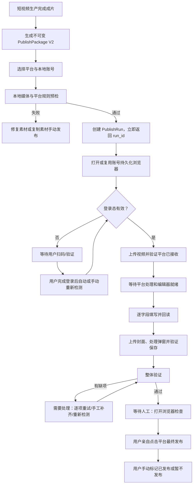
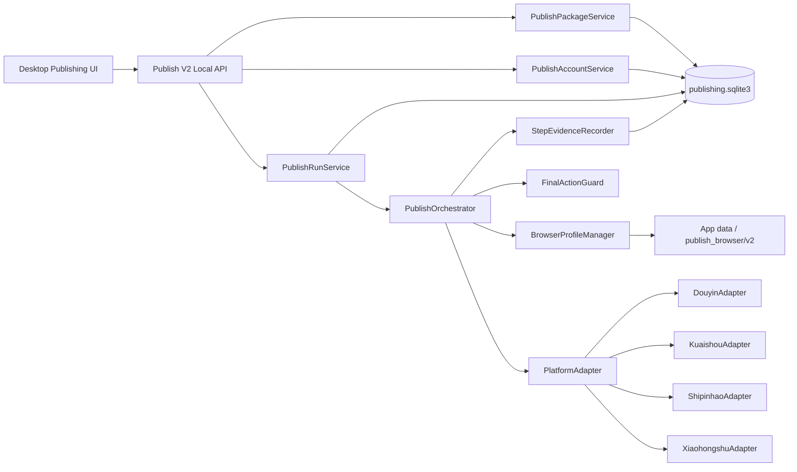

# 桌面端自动发布 V2 重构实施方案

- 日期：2026-07-18
- 修订版本：v1.0（Luna 执行版）
- 交付对象：Luna（产品、前端、后端、自动化、测试均可据此拆任务）
- 方案范围：发布账号管理、登录态持久化、发布中心、短视频生产成片交接、平台自动填充、最终人工发布、任务恢复、监控与回滚
- 首个真实放行平台：抖音
- 后续平台：快手、视频号、小红书，逐平台单独过门禁
- 明确不做：自动点击最终发布、绕过验证码或平台风控、云端同步账号登录态、多人团队账号共享、无人值守批量轰炸

## 0. 结论与实施授权

**Luna 可以按本方案启动阶段 PUB-0。PUB-A 所要求的 ADR、schema、fixture、迁移 dry-run、当前版基线、人工发布安全证明和回滚证据交齐并评审通过后，才允许进入 PUB-1。**

本轮不是给现有 Playwright 脚本继续补几个 selector，也不是只重画一个发布页面。当前问题横跨五个层次：

1. “发布账号”页面使用静态数据把四个平台都标成“可用”，没有真实账号、登录状态或适配器健康度；
2. 浏览器 profile 虽然能够保存 cookie，但路径、锁、生命周期、账号身份、过期检测和重启恢复没有成为正式领域能力；
3. 当前同步接口把一次长浏览器操作塞在 HTTP 请求中，缺少可持久化、可暂停、可恢复的发布运行状态；
4. 当前自动化只证明“调用过 set_input_files/fill”，没有证明平台真正接收视频、字段真实回填或封面已经保存；
5. 短视频生产只输出一份易变 JSON 和本地路径，没有不可变发布包、媒体指纹、账号绑定、幂等和重新生成后的失效规则。

目标产品应满足：

- 首次扫码后，在平台登录态仍有效时，关闭并重开应用不再要求重复扫码；
- 发布中心只展示真实、可解释的账号和平台状态，不展示无法兑现的绿色状态；
- 成片完成后生成不可变、可校验、可追溯的发布包，发布运行只引用 `package_id + account_id`；
- 自动化逐步执行并逐字段核验，任何一步不能证明成功时都停在“需要处理”，绝不冒充“草稿已就绪”；
- 上传、平台处理、字段填写、封面保存、登录等待均可看到进度、错误和恢复动作；
- 自动化最终只到 `waiting_for_human`，桌面端没有调用最终发布的接口或按钮；
- 用户在平台页检查并亲自点击发布，桌面端最多允许用户手动标记结果，不替用户发布；
- 一个账号失败不污染其他账号，一个平台页面变更不拖垮生产、下载和复制素材的安全回退。

## 1. 证据基线与当前实现判定

### 1.1 本轮真实抖音验证

本方案使用当前代码、用户提供的页面截图和 2026-07-18 的真实可见浏览器验证作为事实基线，不以 fake runtime 单测代替真实平台结果。

| 验证项 | 真实结果 | 当前判定 |
| --- | --- | --- |
| 扫码登录 | 用户扫码后，同一 persistent profile 再次打开仍保持登录 | 方向可行，但尚未证明打包版、应用重启和 profile 迁移后的稳定性 |
| 无效 MP4 | 截断/缺少 `moov atom` 的文件被当前逻辑交给 file input 后可能被误报为“已上传” | 失败；必须在浏览器前 ffprobe，并等平台真实接收证据 |
| 有效 MP4 | 真实 H.264/AAC、1080×1920 MP4 经可见“上传视频”入口进入抖音编辑页 | 单点通过；当前生产代码仍未按该证据链实现 |
| 标题 | 当前 selector 在真实编辑页成功填入标题 | 部分通过；仍需回读和页面版本指纹 |
| 描述 | 真实页面使用 contenteditable 类编辑器，当前只找 `textarea`，未填入 | 失败 |
| 话题 | 当前实现把话题拼进描述并可能重写描述，未证明生成平台话题实体 | 失败 |
| 封面 | 图片进入“设置封面”弹窗，但当前实现未点击“保存”却可能返回成功 | 失败；只能算 `needs_attention` |
| 最终发布 | 未点击，当前代码也没有最终发布方法 | 安全边界方向正确，必须固化成不可回归门禁 |

当前页面仍停留在上传入口的用户证据：

`/var/folders/lt/6g5zql0d37g7pvzj7gny8g4r0000gn/T/codex-clipboard-63f51eef-5da1-498b-93e1-a08e41a5be4d.png`


有效视频进入编辑器并打开封面弹窗的本机证据：

`/Volumes/Data/pixelle-live-douyin-after-real-upload.png`


这两个路径只能作为本轮调查线索，不是可交付的长期基线。PUB-0 必须把脱敏截图、录像、测试媒体 manifest 和步骤时间复制到仓库外的正式 QA 证据目录，并在评审文档中记录 SHA-256；不得提交用户 cookie、头像、账号标识或完整第三方页面 DOM。

### 1.2 代码证据

当前关键实现：

- `desktop/src/StudioApp.tsx` 中的 `PublishAccountsView` 是硬编码平台数组，四个平台全部显示“可用”；
- `desktop/src/features/publishing/PublishWorkspace.tsx` 直接同步调用 `/api/publish/{platform}/prepare`，只接收粗粒度状态和 `filled_fields`；
- `desktop/src/StudioApp.tsx` 仍保留一套旧发布工作区逻辑，与独立 `PublishWorkspace` 重复；
- `pixelle_video/services/publish/browser_runtime.py` 使用相对目录 `data/publish_browser`，通过固定等待和宽泛 selector 判断状态；
- `upload_video()` 在 `set_input_files()` 后立即返回，`upload_cover()` 在图片进入 input 后立即返回；
- `fill_description()` 只处理输入框/textarea，真实抖音 contenteditable 未覆盖；
- `fill_hashtags()` 通过重新填写描述实现，字段语义被混合；
- `wait_until_draft_ready()` 只是固定等待 1 秒；
- `pixelle_video/services/publish/platforms/base.py` 对不存在的方法和非 `False` 返回过于乐观，且多平台类只是空子类；
- `api/routers/publish.py` 在单次 HTTP 请求中同步完成浏览器流程，并把 `login_required` 等非失败结果也映射成 generic task completed；
- `api/tasks/persistence.py` 使用相对 SQLite 路径，重启后把 pending/running 统一改成失败，不能表达“等待登录/等待人工”；
- `pixelle_video/services/ip_broadcast_workflow.py` 生成的 `publish_package` 没有 package ID、schema version、媒体 hash、来源 revision 或失效规则；
- `tests/publish_assistant_test.py` 主要验证 fake runtime 调用顺序，无法发现“页面没上传但代码报成功”；
- `tests/desktop_publish_capability_test.py` 主要是源码字符串断言，不是组件交互或真实桌面验收。

### 1.3 当前用户流程健康度

1. **进入发布中心 — 红色**：能找到入口，但账号与平台状态是静态文案，无法做可靠决策。
2. **首次连接账号 — 黄色**：可见浏览器中扫码可成功，但产品没有连接任务、身份回读和可恢复流程。
3. **应用重启后复用登录 — 黄色**：persistent profile 技术方向已证明，同机发布版路径和重启门禁未证明。
4. **成片交给发布 — 黄色**：生产步骤能产出视频、封面和文案，但发布包不是不可变契约。
5. **视频上传 — 红色**：有效文件人工触发可进入编辑器；当前实现存在无效文件和未完成上传的假成功。
6. **填写标题/描述/话题 — 红色**：标题单点成功，描述失败，话题没有平台实体证据。
7. **上传并保存封面 — 红色**：只打开裁切弹窗，没有保存和回读。
8. **等待人工发布 — 绿色**：当前未执行最终发布；这一边界需要代码级 guard、测试和审计持续保护。
9. **失败恢复与历史追踪 — 红色**：无逐步重试、幂等、恢复点和真实账号/运行历史。

## 2. 产品范围与确定边界

### 2.1 本轮默认账号模型

本方案按以下边界实施：

- 本机单用户；
- 每个平台允许建立多个本地账号 profile；
- 每个账号有独立 Chromium profile 和独立登录态；
- 每个平台可设置一个默认账号，运行前仍必须明确显示本次使用的账号；
- 首版可以只展示一个已创建账号，但 schema、API 和锁必须支持多账号；
- 不把 cookie、token 或 browser storage 同步到服务端；
- 不做团队成员、角色权限、审批流或跨设备接力。

如果未来产品只保留单账号，前端可以收敛“添加账号”入口，但不得把底层 profile 重新改成按平台唯一目录。

### 2.2 浏览器形态

目标形态是：**由桌面端管理并打开一个独立、可见、持久化的 Chromium 窗口**。

它不是用户系统默认 Chrome 的任意现有标签页，也不是嵌在 Tauri 页面里的第三方 WebView。原因是第三方创作者后台的登录、文件选择、弹窗、跨域和页面生命周期在独立 persistent context 中更可控。桌面端负责账号状态、任务进度和恢复动作；真实登录与最终发布仍发生在这个可见浏览器窗口中。

### 2.3 支持平台的真实语义

| 平台 | 方案开始时状态 | 允许展示的能力 |
| --- | --- | --- |
| 抖音 | `pilot / 部分验证` | 可连接账号；V2 过 PUB-D 后才能显示“自动填充可用” |
| 快手 | `unverified / 待验证` | 仅显示规划中与复制素材回退；过独立 live gate 后开放自动填充 |
| 视频号 | `unverified / 待验证` | 同上 |
| 小红书 | `unverified / 待验证` | 同上 |
| B站 | 本轮不接入 | 只保留 adapter 扩展点，不在 UI 承诺 |

禁止用“代码里有类”“页面里有按钮”“fake runtime 测试通过”作为平台可用依据。每个平台都必须有有效媒体、登录复用、字段回读、封面流程、失败恢复和最终停手的真实证据。

### 2.4 最终发布安全边界

必须遵守：

- 不提供 `publish() / submit_final() / click_publish()` 一类最终动作；
- 不调用含“发布、确认发布、立即发布”等最终语义按钮；
- 封面弹窗的“保存”、话题选择和普通表单确认可以自动执行，但要在平台 allowlist 中明确列出；
- 遇到验证码、滑块、人脸验证、短信验证或风控挑战时转为 `waiting_for_user`，不得绕过；
- 平台页面指纹不匹配时停止，不用坐标或模糊文本盲点；
- 自动化达到 `waiting_for_human` 后停止输入，仅保留浏览器窗口；
- 用户在平台页亲自点击最终发布；桌面端允许“我已发布 / 暂不发布”作为人工记录，不把页面跳转推断成权威发布成功；
- 任何平台最终发布能力若未来要增加，必须另立方案、授权和安全评审，不属于本方案的“优化”。

## 3. 不可违背的设计原则

### 3.1 证据先于绿色状态

状态必须来自可解释 probe：登录身份、视频文件名或编辑器状态、字段回读、话题 chip、封面应用状态。没有证据就是 `unknown`、`needs_attention` 或 `failed`，不能用固定等待换成绿色结果。

### 3.2 账号、发布包、发布运行三者分离

- 账号回答“用哪个本地登录态”；
- 发布包回答“这次要发什么不可变内容”；
- 发布运行回答“某个账号把某个发布包准备到哪一步”。

禁止继续把 session 的当前字段、本地 profile 目录和一次 HTTP 请求混成一个过程。

### 3.3 异步、可暂停、可恢复

创建发布运行必须快速返回 `202 + run_id`。浏览器工作由本地 orchestrator 执行，UI 读取持久化状态。等待扫码、人工处理封面、平台慢处理和最终人工发布都不是 HTTP 超时，也不是任务失败。

### 3.4 失败隔离和安全回退

平台自动化失败时仍应提供：

- 打开平台后台；
- 下载/定位最终视频与封面；
- 一键复制标题、描述和话题；
- 显示具体未完成字段；
- 仅重试失败步骤或由用户手工补齐后重新检测。

生产、资产、下载和其他平台账号不能因一个 adapter 失败而不可用。

### 3.5 性能看端到端任务，不看一个函数耗时

外部平台网络和视频处理耗时不可控，系统必须分别记录：

- 本地预检耗时；
- 浏览器启动/复用耗时；
- 等待登录耗时；
- 文件上传耗时；
- 平台处理耗时；
- 每个字段填写与核验耗时；
- 等待人工耗时。

只对可控的本地开销设硬门禁，对平台耗时采用基线、p50/p95 和超时分层，不用一个总 timeout 粗暴失败。

## 4. 目标信息架构与主流程

### 4.1 发布中心信息架构

左侧只保留一个“发布中心”入口，页面内分为三个明确区域：

1. `准备发布`：发布包、目标平台、账号选择、预检、运行进度和人工接管；
2. `发布账号`：连接、登录状态、默认账号、打开浏览器、重新检测、清除本地登录数据；
3. `发布记录`：自动化运行状态、步骤证据、耗时、错误、人工标记结果和安全回退。

短视频生产第 6 步仍可直接显示发布素材，但点击“准备发布”后进入同一个发布中心并带入 `package_id`；不得在 `StudioApp.tsx` 和 `PublishWorkspace.tsx` 各维护一套发布编排。

### 4.2 目标用户流程



### 4.3 三类用户试用任务

#### 用户 A：门店老板，首次发布

- 从成片结果进入发布；
- 选择抖音，发现没有账号；
- 点击“连接账号”，可见浏览器打开二维码；
- 扫码后账号页自动变成“已登录”，继续原发布运行；
- 自动准备到平台编辑页；
- 用户核对视频、封面和文案后亲自发布。

成功标准：用户不需要理解 profile、cookie、selector、任务 ID；登录完成后不用重新开始发布。

#### 用户 B：日常运营，重复发布

- 应用重启后进入发布中心；
- 已登录账号显示最近验证时间和默认账号；
- 从新成片一键创建发布运行；
- 无扫码，直接进入上传和填写；
- 可看到每一步耗时与字段核验。

成功标准：在平台 cookie 未过期时连续 10 次应用重启/发布不重复扫码；重复点击“准备发布”不重复上传。

#### 用户 C：运营负责人，故障恢复

- 发布中遇到登录过期、页面改版、无效视频或封面弹窗异常；
- 系统说明失败步骤，不显示“草稿已就绪”；
- 用户重新登录、手工补字段或只重试失败步骤；
- 若 adapter 暂不可用，可打开平台并复制全部素材手工完成。

成功标准：成功步骤不被重做，视频不因盲重试重复上传，错误可定位，最终发布安全边界不被突破。

## 5. 目标技术架构



### 5.1 组件职责

| 组件 | 唯一职责 | 禁止承担 |
| --- | --- | --- |
| `PublishPackageService` | 从生产 session/资产 revision 生成不可变发布包，探测媒体并计算指纹 | 打开浏览器、持有登录态 |
| `PublishAccountService` | 账号元数据、默认账号、登录健康缓存、连接/清理动作 | 读取或导出 cookie 内容 |
| `BrowserProfileManager` | profile 路径、进程/窗口、锁、上下文复用和关闭 | 决定平台 DOM selector |
| `PublishRunService` | 创建运行、幂等、状态查询、人工结果和恢复命令 | 在 HTTP 请求内跑完整自动化 |
| `PublishOrchestrator` | 执行有状态步骤、持久化 checkpoint、取消和恢复 | 平台特有 DOM 细节 |
| `PlatformAdapter` | 平台页面指纹、登录 probe、上传/字段/封面/核验 | 最终发布点击、跨平台通用乐观实现 |
| `FinalActionGuard` | 阻止最终发布语义动作，审计允许点击 | 业务字段填写 |
| `StepEvidenceRecorder` | 记录 probe、耗时、脱敏证据和错误码 | 保存 cookie、token、用户隐私 DOM |

### 5.2 建议目录

```text
pixelle_video/services/publish/
├── models.py
├── package_service.py
├── account_service.py
├── account_repository.py
├── run_service.py
├── run_repository.py
├── state_machine.py
├── orchestrator.py
├── browser_profiles.py
├── browser_runtime.py
├── media_preflight.py
├── evidence.py
├── errors.py
├── safety.py
├── migrations/
└── adapters/
    ├── base.py
    ├── douyin.py
    ├── kuaishou.py
    ├── shipinhao.py
    └── xiaohongshu.py

api/routers/
├── publish.py                 # V1 兼容/feature flag 路由
├── publish_accounts.py
├── publish_packages.py
└── publish_runs.py

desktop/src/features/publishing/
├── PublishingCenterPage.tsx
├── PublishPreparation.tsx
├── PublishAccountList.tsx
├── PublishAccountCard.tsx
├── PublishRunDetail.tsx
├── PublishRunTimeline.tsx
├── PublishFieldChecklist.tsx
├── PublishHistory.tsx
├── PublishingSafetyNotice.tsx
├── api.ts
├── model.ts
└── publishing.css
```

拆分时先建立契约和 adapter，再移动 UI。不得在 `StudioApp.tsx` 中继续增加发布状态或平台 selector。

## 6. 状态模型

### 6.1 账号登录状态与平台能力状态分离

账号 `login_state`：

```text
unknown
checking
signed_out
signed_in
expired
identity_changed
challenge_required
profile_locked
error
```

平台 adapter `release_state`：

```text
unverified
pilot
available
degraded
disabled
```

“账号已登录”不等于“该平台自动化可用”；“adapter available”也不等于某个账号当前已登录。UI 必须分别表达。

### 6.2 发布运行状态机

```text
created
  -> preflight_running
  -> preflight_failed | queued
queued
  -> browser_starting
browser_starting
  -> waiting_for_login | uploading | failed
waiting_for_login
  -> browser_starting | cancelled
uploading
  -> platform_processing | needs_attention | failed | interrupted
platform_processing
  -> filling_fields | needs_attention | failed | interrupted
filling_fields
  -> verifying | needs_attention | failed | interrupted
verifying
  -> waiting_for_human | needs_attention | failed
needs_attention
  -> verifying | uploading | filling_fields | cancelled
waiting_for_human
  -> completed_by_user | abandoned_by_user
```

约束：

- `waiting_for_login`、`needs_attention`、`waiting_for_human` 不是失败；
- `waiting_for_human` 只表示自动化交付完成，不表示平台已发布；
- `completed_by_user` 只由用户在桌面端手动标记，字段名和 UI 必须体现“用户标记”；
- 进程崩溃或应用退出产生 `interrupted`，重启后通过页面 probe 决定恢复点；
- 状态转换由一个集中 state machine 校验，repository 不允许任意字符串更新；
- 每次转换保存 `state_version`，使用 optimistic lock 防止双击和并发 worker 覆盖。

### 6.3 字段状态

每个发布运行至少追踪 `video/title/description/hashtags/cover`：

```text
not_requested
pending
applying
applied
verified
needs_attention
failed
skipped_by_user
```

`filled_fields: string[]` 被以下结构替代：

```json
{
  "field": "description",
  "required": true,
  "status": "verified",
  "attempt": 1,
  "expected_fingerprint": "sha256:...",
  "probe": "contenteditable.innerText",
  "verified_at": "2026-07-18T12:00:00+08:00",
  "error_code": null,
  "message": "描述已填写并回读一致"
}
```

证据默认保存 hash、长度、locator 策略名和布尔结果，不在通用日志重复保存完整文案。

### 6.4 Generic task 映射

发布运行以 `publish_runs` 为事实源，任务中心只是投影：

- active 状态 → `running`；
- `waiting_for_login / needs_attention / waiting_for_human` → 新增 `waiting_user`；
- `waiting_for_human` 的显示文案为“自动填充完成，等待人工发布”，不能显示“已发布”；
- `completed_by_user` → `completed`，附注“用户标记已发布”；
- `interrupted` → 新增 `interrupted` 或明确可恢复失败态；
- `login_required` 不再映射为 `completed`。

如果 Luna 评审决定不扩展 generic `TaskStatus`，任务中心也必须使用 publish run 的专属状态组件，不能继续用 completed 掩盖等待状态。

## 7. 数据模型与存储契约

### 7.1 存储位置

所有路径必须由 `get_data_path()` 或显式 app-data root 解析：

```text
<PIXELLE_VIDEO_ROOT>/data/publishing/publishing.sqlite3
<PIXELLE_VIDEO_ROOT>/data/publish_browser/v2/<platform>/<profile_key>/
<PIXELLE_VIDEO_ROOT>/data/publishing/evidence/<run_id>/
```

禁止在默认参数中继续使用相对 `data/...`。Tauri debug 和 release 必须通过同一根目录契约测试；数据库、profile 和 evidence 路径在 API 中不得回传给普通前端视图。

### 7.2 SQLite schema

PUB-0 必须交付正式 migration 和以下等价 schema；字段名可在 ADR 评审中微调，语义不得弱化。

```sql
CREATE TABLE publish_accounts (
  account_id TEXT PRIMARY KEY,
  platform TEXT NOT NULL,
  display_name TEXT NOT NULL,
  profile_key TEXT NOT NULL,
  runtime TEXT NOT NULL DEFAULT 'playwright',
  is_default INTEGER NOT NULL DEFAULT 0,
  login_state TEXT NOT NULL DEFAULT 'unknown',
  login_subject_hint TEXT,
  health_reason TEXT,
  last_verified_at TEXT,
  last_login_at TEXT,
  last_used_at TEXT,
  created_at TEXT NOT NULL,
  updated_at TEXT NOT NULL,
  archived_at TEXT,
  UNIQUE(platform, profile_key)
);

CREATE UNIQUE INDEX ux_publish_account_default
ON publish_accounts(platform)
WHERE is_default = 1 AND archived_at IS NULL;

CREATE TABLE publish_packages (
  package_id TEXT PRIMARY KEY,
  schema_version INTEGER NOT NULL,
  source_session_id TEXT NOT NULL,
  source_revision TEXT NOT NULL,
  package_fingerprint TEXT NOT NULL,
  video_manifest_json TEXT NOT NULL,
  cover_manifest_json TEXT,
  platform_copy_json TEXT NOT NULL,
  policy_json TEXT NOT NULL,
  created_at TEXT NOT NULL,
  invalidated_at TEXT,
  invalidation_reason TEXT
);

CREATE TABLE publish_runs (
  run_id TEXT PRIMARY KEY,
  package_id TEXT NOT NULL REFERENCES publish_packages(package_id),
  account_id TEXT NOT NULL REFERENCES publish_accounts(account_id),
  platform TEXT NOT NULL,
  idempotency_key TEXT NOT NULL UNIQUE,
  state TEXT NOT NULL,
  state_version INTEGER NOT NULL DEFAULT 0,
  current_step TEXT,
  attempt INTEGER NOT NULL DEFAULT 1,
  editor_url TEXT,
  error_code TEXT,
  error_message TEXT,
  requires_human_confirmation INTEGER NOT NULL DEFAULT 1,
  user_marked_outcome TEXT,
  created_at TEXT NOT NULL,
  updated_at TEXT NOT NULL,
  started_at TEXT,
  automation_ready_at TEXT,
  finished_at TEXT
);

CREATE TABLE publish_run_steps (
  step_id TEXT PRIMARY KEY,
  run_id TEXT NOT NULL REFERENCES publish_runs(run_id),
  step_key TEXT NOT NULL,
  status TEXT NOT NULL,
  attempt INTEGER NOT NULL,
  started_at TEXT,
  finished_at TEXT,
  duration_ms INTEGER,
  probe_name TEXT,
  evidence_json TEXT,
  error_code TEXT,
  error_message TEXT,
  UNIQUE(run_id, step_key, attempt)
);

CREATE TABLE publish_events (
  event_id INTEGER PRIMARY KEY AUTOINCREMENT,
  run_id TEXT NOT NULL REFERENCES publish_runs(run_id),
  event_type TEXT NOT NULL,
  payload_json TEXT,
  created_at TEXT NOT NULL
);

CREATE INDEX ix_publish_runs_account_created
ON publish_runs(account_id, created_at DESC);

CREATE INDEX ix_publish_runs_state_updated
ON publish_runs(state, updated_at DESC);

CREATE INDEX ix_publish_events_run_id
ON publish_events(run_id, event_id);
```

约束：

- cookie、localStorage、refresh token、二维码内容不写 SQLite；
- `login_subject_hint` 只保存脱敏账号提示，例如平台返回的昵称或尾号，禁止保存可复用凭证；
- profile 目录权限收紧为当前 OS 用户可读写；
- evidence 有 TTL，默认 7 天；失败截图可配置保留，日志长期保留时必须脱敏；
- migration 必须带 schema version、事务、备份和重复执行测试。

### 7.3 PublishPackage V2

```json
{
  "schema_version": 2,
  "package_id": "pkg_...",
  "source": {
    "session_id": "...",
    "source_revision": "...",
    "generated_at": "..."
  },
  "video": {
    "managed_path": "...",
    "sha256": "...",
    "size_bytes": 123,
    "mime": "video/mp4",
    "codec": "h264",
    "audio_codec": "aac",
    "duration_ms": 1200,
    "width": 1080,
    "height": 1920
  },
  "cover": {
    "managed_path": "...",
    "sha256": "...",
    "size_bytes": 123,
    "mime": "image/png",
    "width": 1080,
    "height": 1920
  },
  "copy": {
    "default": {
      "title": "...",
      "description": "...",
      "hashtags": ["..."]
    },
    "platforms": {
      "douyin": {
        "title": "...",
        "description": "...",
        "hashtags": ["..."]
      }
    }
  },
  "policy": {
    "final_action": "human_only",
    "cover_required": false
  },
  "package_fingerprint": "sha256:..."
}
```

规则：

- package 创建后不可原地修改；文案或成片变化产生新 package；
- 生产步骤的依赖失效时，旧 package 标记 invalidated，新运行不得使用；已存在运行保留其快照以便追溯；
- `source_revision` 由生产 session revision、最终视频/封面 hash 和文案 hash 共同确定；
- 前端不再把任意本地路径提交给 publish API；后端从可信 session/artifact 创建 package；
- 文件使用前再次 `resolve()` 并校验仍位于受管 output/temp/data 根目录，拒绝 symlink 逃逸；
- 运行创建时校验文件 hash/size，避免成片被覆盖后继续发布旧描述；
- 导出的 JSON 可以保留业务字段，但内部绝对路径应标注为本机路径，不作为跨机发布包承诺。

## 8. API 契约

统一使用 `/api/publish/v2`。PUB-0 输出 OpenAPI snapshot、TypeScript 类型和成功/失败 fixture。

### 8.1 账号

```text
GET    /api/publish/v2/accounts
POST   /api/publish/v2/accounts
GET    /api/publish/v2/accounts/{account_id}
POST   /api/publish/v2/accounts/{account_id}/connect
POST   /api/publish/v2/accounts/{account_id}/verify
POST   /api/publish/v2/accounts/{account_id}/open
POST   /api/publish/v2/accounts/{account_id}/make-default
POST   /api/publish/v2/accounts/{account_id}/archive
POST   /api/publish/v2/accounts/{account_id}/clear-profile
```

- `connect` 快速返回账号操作 ID，打开可见浏览器并进入等待登录；
- `verify` 可复用已打开窗口，也可按需启动 profile；不同时启动四个平台浏览器做全量检查；
- `clear-profile` 是破坏性操作，必须二次确认、profile 未被运行占用、先关闭 context，再删除本地登录数据；
- 普通“退出账号”优先引导用户在平台页面退出，不静默删除 profile；
- 列表返回缓存健康状态、最近验证时间和 adapter release state，不能为了渲染列表阻塞逐平台网络请求。

### 8.2 发布包

```text
POST /api/publish/v2/packages/from-session
GET  /api/publish/v2/packages/{package_id}
POST /api/publish/v2/packages/{package_id}/preflight
```

`from-session` 只接受 `session_id` 和可选目标平台，不接受浏览器传来的文件路径。若 session 未完成成片或 package 已失效，返回稳定业务错误码。

### 8.3 发布运行

```text
POST /api/publish/v2/runs
GET  /api/publish/v2/runs/{run_id}
GET  /api/publish/v2/runs/{run_id}/events?after=<event_id>
POST /api/publish/v2/runs/{run_id}/resume
POST /api/publish/v2/runs/{run_id}/verify
POST /api/publish/v2/runs/{run_id}/retry-step
POST /api/publish/v2/runs/{run_id}/cancel
POST /api/publish/v2/runs/{run_id}/mark-outcome
```

创建请求：

```json
{
  "package_id": "pkg_...",
  "account_id": "acct_...",
  "platform": "douyin",
  "idempotency_key": "client-generated-or-derived"
}
```

创建必须在 300ms 本地 p95 目标内返回：

```json
{
  "run_id": "run_...",
  "state": "queued",
  "requires_human_confirmation": true
}
```

规则：

- 同一个 `package_fingerprint + account_id + platform` 已有 active run 时返回该 run，不创建第二次上传；
- `retry-step` 只接受当前状态允许的步骤，并先 probe 页面，不能盲目重放前置步骤；
- `mark-outcome` 只接受 `published_by_user` 或 `abandoned_by_user`，响应始终说明这是人工记录；
- API 中不存在最终发布 endpoint；
- active run 由 UI 轮询事件增量，前台活跃时建议 1 秒、等待人工时 3–5 秒，不返回重复大对象；
- 所有变更接口只在 desktop local mode 可用，并使用 Tauri 启动时生成的本地 capability token 与严格 origin allowlist；仅依赖 `PIXELLE_DESKTOP_MODE=true` 不足以构成安全边界。

### 8.4 稳定错误码

至少包含：

```text
PUBLISH_PACKAGE_NOT_READY
PUBLISH_PACKAGE_STALE
MEDIA_PATH_UNTRUSTED
MEDIA_MISSING
MEDIA_HASH_MISMATCH
MEDIA_PROBE_FAILED
MEDIA_PLATFORM_UNSUPPORTED
ACCOUNT_NOT_FOUND
ACCOUNT_LOGIN_REQUIRED
ACCOUNT_LOGIN_EXPIRED
ACCOUNT_IDENTITY_CHANGED
ACCOUNT_CHALLENGE_REQUIRED
PROFILE_LOCKED
PLATFORM_ADAPTER_UNVERIFIED
PLATFORM_PAGE_CHANGED
VIDEO_UPLOAD_REJECTED
VIDEO_PROCESSING_TIMEOUT
FIELD_LOCATOR_NOT_FOUND
FIELD_VALUE_MISMATCH
COVER_REQUIRES_MANUAL_CROP
COVER_NOT_SAVED
RUN_STATE_CONFLICT
RUN_INTERRUPTED
FINAL_ACTION_BLOCKED
```

用户文案与技术诊断分离。UI 默认显示业务动作，诊断区显示 error code、run ID、adapter version 和脱敏 probe。

## 9. 账号与浏览器 profile 管理

### 9.1 路径与身份

- 新账号生成随机 `account_id` 和不含昵称的 `profile_key`；
- profile 路径为 app-data 下稳定绝对路径，不依赖 cwd；
- 账号昵称可后续通过平台安全 DOM probe 回读，回读失败仍可使用用户自定义名称；
- 首次成功登录时保存不可逆的身份指纹；同一 profile 后续检测到另一个平台身份时进入 `identity_changed`，要求用户确认“更新此账号”或新建账号，不能静默串号；
- 不通过复制系统 Chrome 用户目录来“免登录”；
- 不导入或导出 cookie；
- profile 目录加入 `.gitignore`、备份排除建议和诊断脱敏规则。

### 9.2 锁与生命周期

- 一个 profile 同时只允许一个自动化 run；
- 使用跨进程文件锁 + 内存 ownership，锁文件不含凭证；
- 同账号重复打开优先聚焦已有窗口；
- 不同账号可并行，但默认全局最大 2 个浏览器 context，避免桌面内存失控；
- `waiting_for_human` 时保留窗口并释放自动化输入权，不释放 profile ownership；
- 用户关闭窗口时 run 转为 `needs_attention` 或 `interrupted`，不直接重开并继续点击；
- 应用正常退出关闭 context 但保留 profile；异常退出后下次启动清理 stale lock，并通过页面 probe 恢复；
- profile 清理必须确认没有 active run，并提供目录大小和“将需要重新扫码”的影响说明。

### 9.3 登录检测

禁止使用“URL 不包含 login + 页面没有登录文字”的宽泛判断。每个平台 adapter 提供：

```text
probe_login_state()
  -> signed_in(subject_hint, evidence)
  -> signed_out(evidence)
  -> identity_changed(previous_fingerprint, current_fingerprint, evidence)
  -> challenge_required(evidence)
  -> unknown(reason)
```

登录成功至少满足一个平台身份元素和一个创作者页面能力元素；页面加载中、骨架屏、网络错误、风控页均不能算登录成功。检测采用条件等待和总超时，不用固定 1500ms。

连接流程：

1. 打开该账号 profile 的平台创作者页；
2. probe 为 signed_out 时显示“等待扫码/验证”；
3. 后台低频重新检测，用户也可点击“我已登录，重新检测”；
4. signed_in 后保存时间和脱敏身份提示；
5. 若由发布运行触发，原 run 自动从 checkpoint 继续，不要求用户再次点击开始；
6. 遇到 challenge 时明确等待用户，禁止自动解决。

### 9.4 登录持久化验收

PUB-B 至少证明：

- 首次扫码成功；
- 关闭浏览器 context 后重新打开仍登录；
- 关闭并重开桌面应用仍登录；
- 重启 sidecar 后仍登录；
- 连续 10 次打开同一账号不要求重复扫码；
- cookie 正常过期后能检测为 expired，并在重新登录后恢复原 run；
- 账号 A/B profile 不串号；
- 同一 profile 被用户手工切换成另一个平台账号时能检测身份变化并暂停；
- debug 和打包版均使用预期 app-data 目录；
- profile 被占用时返回可理解错误，不启动第二个冲突 Chromium。

## 10. 平台 adapter 与证据驱动自动化

### 10.1 Adapter 协议

禁止空子类继承一个乐观通用流程。通用 orchestrator 只编排状态，平台 adapter 必须显式实现：

```python
class PlatformAdapter(Protocol):
    platform: str
    adapter_version: str

    def capabilities(self) -> PlatformCapabilities: ...
    async def page_fingerprint(self, page) -> ProbeResult: ...
    async def probe_login_state(self, page) -> LoginProbe: ...
    async def open_upload_entry(self, page) -> StepResult: ...
    async def upload_video(self, page, media) -> StepResult: ...
    async def wait_video_ready(self, page, media) -> StepResult: ...
    async def apply_title(self, page, value) -> StepResult: ...
    async def apply_description(self, page, value) -> StepResult: ...
    async def apply_hashtags(self, page, values) -> StepResult: ...
    async def apply_cover(self, page, media) -> StepResult: ...
    async def verify_draft(self, page, expected) -> DraftVerification: ...
```

协议中不得出现最终 publish 方法。

### 10.2 Selector 和页面版本策略

优先级：

1. 可访问性 role、label、placeholder、稳定 form 语义；
2. 平台稳定属性和与 label 的结构关系；
3. adapter 内版本化 fallback；
4. 精确页面 fingerprint 与失败停手。

禁止：

- 用 `textarea` 第一个元素或 `input[type=file]` 第一个元素代表业务字段；
- 用屏幕坐标点击；
- 用“页面里出现某个常见词”判断成功；
- 页面指纹不匹配后继续逐个试所有按钮；
- 把 selector 写回通用 browser runtime。

每个平台维护最小化 DOM fixture，不保存完整第三方页面和用户数据。fixture 要覆盖已登录、未登录、上传入口、上传中、编辑器就绪、字段、封面弹窗、平台错误和页面改版未知态。

### 10.3 视频预检与上传

浏览器前执行：

- 文件存在、可读、非 symlink 逃逸；
- SHA-256、大小；
- ffprobe 可解析容器；
- 视频 codec、音频 codec、时长、分辨率、帧率、旋转信息；
- 平台能力 manifest 的格式/大小/时长/比例约束；
- 可选快速 decode 首尾关键帧，防止只有 metadata 可读但媒体损坏。

无效 MP4 必须在打开上传页前失败。测试中固定加入缺少 `moov atom`、0 字节、扩展名伪装和 hash 变化 fixture。

上传证据链：

1. 定位并点击可见“上传视频”入口；
2. 监听 file chooser 或定位与该入口关联的 file input；
3. 选择文件；
4. 等到页面出现匹配的文件名/时长/预览或明确上传进度；
5. 等上传完成和平台处理完成；
6. 等编辑器必需字段可交互；
7. 检查平台拒绝、格式错误、版权/审核提示；
8. 只有 4–7 有确定证据后 `video=verified`。

`set_input_files()` 本身只能产生 `applied`，不能产生 `verified`。

### 10.4 标题、描述和话题

- 标题填写后从控件 value/innerText 回读，按平台字符规范化后比较；
- 描述支持 `contenteditable`、富文本或 textarea，但 selector 必须由平台 adapter 决定；
- 填写富文本时正确触发 input/change/blur，不只改 DOM property；
- 描述和话题分开处理，禁止为加话题重新覆盖描述；
- 若平台把话题表现为 chip，验证 chip 文本和数量；若平台只接受正文 hashtag，adapter capability 必须明确 `hashtags_mode=inline_text`；
- 字数截断必须在 package 预览中提前展示，不能在自动化中静默截断；
- 回读不一致时进入 `needs_attention`，展示期望长度、实际长度和手工复制按钮。

### 10.5 封面

- 先验证平台是否支持独立封面及要求；
- 图片进入 input 仅为 `applied`；
- 若出现裁切/设置封面弹窗，等待预览加载；
- 默认裁切可满足规则时，允许点击 adapter allowlist 中的“保存”；
- 需要用户移动裁切框、选帧或平台未给稳定确认元素时，转为 `COVER_REQUIRES_MANUAL_CROP`；
- 保存后必须回到编辑页并验证封面缩略图/状态发生预期变化；
- 未验证保存不能把 cover 放进 `verified`，也不能把整单标为 ready。

### 10.6 整体验证和停手

`waiting_for_human` 的最低条件：

- video `verified`；
- 平台要求的 title/description 已 `verified`；
- requested hashtags 按 adapter 能力 `verified`，或由用户明确跳过可选项；
- requested cover `verified`，或由用户明确接管；
- 当前页面 fingerprint 是已知编辑器；
- FinalActionGuard 本运行没有触发违规；
- 页面中最终发布按钮存在与否都不点击。

准备完成后 UI 显示逐项清单和“打开浏览器检查”，不显示桌面端“发布”主按钮。

## 11. FinalActionGuard

这是独立安全组件，不是提示文案。

### 11.1 运行规则

- 所有 adapter click 通过受控 action executor；
- action 声明平台、页面指纹、动作 ID、允许的目标语义；
- adapter 维护 allowlist，例如上传入口、话题选择、封面保存；
- guard 拒绝最终发布语义、未知按钮和页面指纹外动作；
- 拒绝时写入 `FINAL_ACTION_BLOCKED` 并停止运行；
- 禁止 adapter 直接调用裸 `page.click()` 绕过 executor；lint/AST 测试检查；
- PR 评审必须展示新增 click action 的业务用途和 fixture。

### 11.2 安全门禁

PUB-A 和每个平台 live gate 必须证明：

- 代码搜索不存在最终 submit 方法；
- 对“发布、确认发布、立即发布”等 fixture 按钮调用会被拒绝；
- 封面“保存”允许且不会误匹配最终发布；
- 模糊 selector、坐标点击和 `nth(0)` 关键动作被静态检查禁止；
- 可见 live 测试始终停在最终发布前；
- 测试账号页面没有真实平台发布副作用。

## 12. 生产链路与发布包集成

### 12.1 生产步骤职责

`_run_publish()` 只负责整理并固化发布包，不直接调用平台：

1. 确认最终视频 artifact 存在；
2. 对视频/封面执行媒体 probe 和 hash；
3. 读取生产 session revision、品牌发布字段和平台建议；
4. 生成 `PublishPackage V2` 并持久化；
5. 把 `package_id` 写回 session state/artifact；
6. 在第 6 步展示预览、复制、下载和“进入发布中心”；
7. 用户选择账号后才创建 run。

### 12.2 失效与重新生成

以下变化使旧 package invalidated：

- 最终视频或封面变化；
- 标题、描述、话题变化；
- 平台建议变化；
- 品牌发布字段变化；
- production source revision 变化。

旧运行继续保留旧 package 快照，不被新 session 字段静默覆盖。用户从旧 package 再发时必须明确“这是旧版本”，active run 不允许热替换媒体。

### 12.3 资产中心 V2 关系

- 若最终视频/封面已有稳定 asset/revision，package 同时记录资源引用和受管路径；
- 若只是本次生产临时输出，先记录 artifact manifest，不强迫用户先入资产库；
- 发布运行不得改变资产 revision；
- 发布成功的人工标记可以记录 usage，但不能把平台发布 ID 冒充资产 revision；
- 资产中心 UX-A 与发布 PUB-A 是独立门禁，二者通过稳定 artifact/revision 接口集成，不互相越权。

### 12.4 RunningHub 边界

发布核心测试使用仓库内可重复生成的有效本地 MP4/PNG fixture，不依赖 RunningHub 余额。完整生产链路门禁另加一条真实成片来源测试：RunningHub 可用时用真实成片；外部余额不足时可先标记该证据阻塞，但不得把本地 fixture 测试伪称为“云生产链路已通过”。

## 13. 发布中心 UX 规格

### 13.1 发布账号

账号卡必须显示：

- 平台名称和 adapter 状态；
- 账号名称/脱敏身份提示；
- `已登录 / 登录过期 / 账号身份变化 / 未连接 / 检测中 / 需要验证 / 浏览器占用 / 未知`；
- 最近检测时间、最近成功使用时间；
- 是否默认账号；
- 主动作：连接、继续登录、打开浏览器、重新检测；
- 次动作：设为默认、重命名、归档；
- 危险动作：清除本机登录数据，二次确认。

禁止：

- 四个平台静态绿色“可用”；
- 只写“本机登录态”但不给真实检测；
- 进入账号页就同时拉起四个浏览器；
- 把“平台 adapter 可用”和“账号已登录”合成一个标签。

### 13.2 准备发布

页面从上到下：

1. 发布包摘要：视频预览、封面、版本、生成时间、是否失效；
2. 平台与账号：只允许选择 release_state 达标的 adapter；未验证平台保留复制素材；
3. 预检：媒体、文案长度、封面和账号状态；
4. 运行时间线：登录、上传、处理、标题、描述、话题、封面、验证；
5. 字段清单：期望、实际状态、错误和逐项动作；
6. 人工接管：打开/聚焦浏览器、复制未填字段、停止自动化；
7. 安全说明：最终发布由用户在平台页面点击。

运行中离开页面不丢状态；重新进入按 `run_id` 恢复。按钮不能用一个长 loading 覆盖全部过程。

### 13.3 等待登录

- 桌面端显示“浏览器已打开，请扫码或完成平台验证”；
- 显示当前账号，不要求用户猜是哪一个窗口；
- 提供“打开/聚焦浏览器”和“我已登录，重新检测”；
- 自动低频检测，但不得高频刷新二维码页；
- 登录成功后继续原 run；
- 用户取消时保留 package，不删除账号 profile。

### 13.4 需要处理

按字段给动作：

- 视频失败：查看平台错误、重新选择由 package 校验的原视频、重试上传；
- 描述失败：复制描述、在浏览器手工粘贴、重新检测；
- 话题失败：复制话题或逐个手工添加、重新检测；
- 封面需裁切：聚焦封面弹窗，用户处理后重新检测；
- 页面改版：停止自动化，只允许手工回退并生成诊断包。

不得用“重新打开发布助手再试”作为所有错误的唯一动作。

### 13.5 等待人工发布

- 显示绿色“自动填充已完成”，而不是“发布成功”；
- 展示每项 verified/用户接管状态；
- 唯一主动作是“打开浏览器检查”；
- 次动作是复制素材和下载文件；
- 用户回到桌面后可点“我已发布”或“暂不发布”；
- 不自动关闭浏览器，不自动清空文案，不把人工等待计入自动化耗时。

### 13.6 发布记录

列表字段：平台、账号、发布包标题、自动化状态、人工结果、开始时间、自动化耗时、失败步骤。详情显示时间线、字段证据、error code、adapter version 和回退动作。

默认不展示 cookie、完整本地 profile 路径、完整用户账号标识或第三方敏感 DOM。

## 14. 恢复、幂等和并发

### 14.1 幂等

- run idempotency key 默认由 `package_fingerprint + account_id + platform` 派生；
- 同键 active run 返回原 run；
- 已 `completed_by_user` 后再次准备必须要求用户创建新运行；
- step 写入使用 `(run_id, step_key, attempt)` 唯一键；
- API 重试和 UI 双击不得创建两个 browser context 或两次上传。

### 14.2 恢复策略

重启后按 checkpoint + 页面 probe：

- 尚未选择文件：从 upload step 继续；
- 平台已显示上传中：恢复观察，不再次 set file；
- 编辑器已就绪且视频证据一致：跳过上传，从未验证字段继续；
- 页面在封面弹窗：恢复 cover step 或等待用户；
- 页面身份无法证明属于该 run：进入 `needs_attention`，禁止猜测并重传；
- profile 窗口已关闭：重新打开后 probe，不能只按 DB state 继续；
- package 文件 hash 变化：停止并要求创建新 package。

### 14.3 并发

- 同一 profile 串行；
- 同一 package 可针对不同平台/账号创建不同 run；
- 全局默认最多 2 个自动化 run，超出进入 queued；
- waiting_for_login/waiting_for_human 是否占并发槽由 orchestrator 释放 worker，但 profile 锁仍保留；
- 用户手工操作页面时 adapter 不持续覆盖输入；每个 step 完成后停止，检测到值变化时提示冲突。

## 15. 性能、监控与隐私

### 15.1 性能目标

PUB-0 先测当前基线，PUB-A 冻结口径。以下是不能下调的本地目标：

| 指标 | 目标 |
| --- | --- |
| 创建 run API | 本机 p95 ≤ 300ms，浏览器任务异步执行 |
| 账号列表读取缓存状态 | 本机 p95 ≤ 200ms，不启动浏览器 |
| active run UI 状态可见延迟 | p95 ≤ 1.5s |
| 小型标准 fixture 媒体预检 | p95 ≤ 3s |
| 重复点击创建的额外上传数 | 0 |
| 有效登录态下重复扫码次数 | 10 次应用重启中 0 次 |
| 自动化额外固定等待 | 0 个无条件 sleep；全部改为条件等待 |
| profile 冲突启动数 | 0 |

外部平台上传和处理不设虚假绝对秒数。PUB-0 记录同一网络、同一 1 秒/15 秒/60 秒 fixture 的 p50/p95，分别冻结“本地开销”和“平台等待”目标。新版相对当前可验证基线至少减少 30% 的重复点击，并消除重复扫码和整单重试。

### 15.2 事件与指标

记录：

```text
publish.account.verify.started/completed
publish.account.login_required/signed_in/expired
publish.run.created/state_changed/interrupted
publish.step.started/verified/needs_attention/failed
publish.guard.final_action_blocked
publish.run.waiting_for_human
publish.run.user_marked_outcome
```

维度只含 platform、adapter_version、step、error_code、duration bucket、app version。默认不含标题、描述、话题、账号昵称、cookie、二维码、完整 URL query 或本地绝对路径。

### 15.3 诊断包

用户主动点击“导出诊断”时生成本地 zip：

- run 状态和事件；
- adapter/app/schema version；
- 媒体 manifest（hash、codec、尺寸，不含视频文件）；
- selector strategy 名称和 probe 结果；
- 可选脱敏截图；
- 已自动移除 cookie、authorization、二维码、账号 ID 和 query token。

诊断包生成前显示内容范围，默认不上传到任何服务器。

## 16. 迁移与兼容

### 16.1 现有 profile 迁移

当前可能存在：

```text
<cwd>/data/publish_browser/<platform>/
<PIXELLE_VIDEO_ROOT>/data/publish_browser/<platform>/
```

PUB-0 先实现只读 discovery + dry-run，输出：候选目录、平台、目录大小、最后修改时间、锁状态和可迁移结论；禁止读取或输出 cookie 内容。

迁移策略：

1. 浏览器全部关闭并取得 profile lock；
2. 每个旧平台目录创建一个“默认账号（迁移）”；
3. 灰度期优先原地登记旧可信目录，避免复制导致登录态丢失；
4. fresh account 使用 V2 canonical path；
5. 若后续搬迁，采用 copy → 文件清单/hash 校验 → 新 profile 实际登录验证 → 保留旧目录观察窗口 → 再清理；
6. V1/V2 不允许同时打开同一目录；
7. rollback 时旧目录仍可由 V1 使用，不做 cookie down-migration。

### 16.2 任务和发布包兼容

- 旧 generic publish tasks 只作为历史展示，不强行转换成可恢复 run；
- V1 `publish_package` 通过只读 adapter 可生成 V2 package，缺少 hash 时重新 probe；
- 新生产步骤只写 V2 package ID，同时保留导出 JSON；
- V1 `/api/publish/{platform}/prepare` 在 feature flag 关闭前保留，但 UI 默认不再调用；
- V1 结果必须明确标记 legacy，不允许和 V2 verified 状态混用。

### 16.3 数据库迁移 dry-run

dry-run 必须证明：

- 新装、已有 tasks DB、已有 profile、无 profile、profile 被锁五种情况；
- migration 可重复执行；
- 中途失败不留下半个默认账号；
- 不删除、移动或修改 profile；
- backup 路径、schema version 和 rollback 命令可复现；
- V2 关闭后当前 V1 页面仍可打开旧 profile；
- 敏感文件名和 cookie 内容不进入报告。

## 17. Luna 实施阶段与门禁

### 阶段 PUB-0：契约、基线和迁移证据（1–2 人日）

交付：

- `ADR-PublishV2-Boundaries`：账号/发布包/运行边界、独立可见浏览器、最终人工发布；
- `ADR-PublishAccountProfile`：app-data 路径、多账号、锁、登录探测、清理和隐私；
- `ADR-PublishRunStateMachine`：状态、checkpoint、幂等、恢复、generic task 投影；
- `ADR-PublishPackageV2`：schema、媒体 manifest、失效、可信路径和生产集成；
- `ADR-PlatformAdapterEvidence`：adapter 协议、selector/page fingerprint、StepResult 和 FinalActionGuard；
- SQLite schema/migration、JSON schema、OpenAPI snapshot 和 TypeScript contract；
- 有效/无效媒体 fixture 生成脚本与 manifest；
- 最小平台 DOM fixtures，不含账号隐私；
- 当前版 9 项任务的点击数、耗时、结果和截图/录像基线；
- profile discovery 和 migration dry-run；
- V1 feature flag 与回滚 smoke 设计。

基线任务：

1. 首次连接抖音并扫码；
2. 关闭浏览器、重开账号；
3. 重启应用、验证免扫码；
4. 无效 MP4 上传；
5. 有效 MP4 进入编辑器；
6. 标题、描述和话题填写；
7. 封面上传、裁切弹窗和保存；
8. 中途关闭窗口后恢复；
9. 最终停在人工发布前。

**门禁 PUB-A：**以下证据缺一不可；未通过不得进入账号和自动化代码重构：

1. 五份 ADR 经评审，明确本轮多账号/单机/人工最终发布边界；
2. PublishPackage、PublishRun、Account、StepResult JSON schema 的有效/无效 fixtures 通过；
3. SQLite migration 在空库、旧库、重复执行和故障注入下通过，rollback 方案不删除 profile；
4. profile migration dry-run 对当前本机目录输出脱敏报告；
5. 有效 MP4、缺 `moov atom`、0 字节、伪扩展名、合法/非法封面 fixtures 可重复生成并有 SHA manifest；
6. 当前 9 项任务的截图/录像、点击数、自动化时间和人工等待时间分离记录；
7. FinalActionGuard 的允许/禁止动作表和测试 fixture 通过；
8. V1 回滚开关、旧 profile 可打开和旧发布素材复制回退 smoke 通过；
9. 四个平台 UI 初始 release state 固定为抖音 pilot、其余 unverified，不再全部显示可用。

### 阶段 PUB-1：账号领域与 BrowserProfileManager（2–4 人日）

工作：

- 建立 publishing SQLite repository 和 migration；
- 实现 account API、默认账号、归档和 clear-profile；
- 使用 app-data canonical path；
- 实现 profile lock、context registry、聚焦已有窗口和 stale lock 恢复；
- 实现抖音 login probe 与连接状态机；
- 发布中心账号 tab 接真实 API；
- 移除静态绿色账号卡。

**门禁 PUB-B：**抖音首次扫码、浏览器重开、应用重启、sidecar 重启、连续 10 次复用、过期重登、A/B 账号隔离、profile 锁冲突和打包版 app-data 路径全部通过。任何登录失败不得清空现有 profile。

### 阶段 PUB-2：发布包、异步运行与恢复骨架（3–5 人日）

工作：

- PublishPackage V2 builder、媒体 probe、hash 和失效；
- run/event/step repository；
- orchestrator、状态机、异步 worker、取消、resume、idempotency；
- generic task `waiting_user` 投影或专属 publish run UI；
- V2 API 与前端轮询；
- Tauri local capability token、origin allowlist 和 path hardening；
- V1 兼容 adapter 和 feature flag。

**门禁 PUB-C：**run 创建快速返回；重启后状态可恢复；双击不重复 run；同 profile 不并发；任意路径/symlink 被拒；无效媒体不打开浏览器；login_required 不再 completed；关闭 V2 后 V1 回退可用。

### 阶段 PUB-3：抖音 adapter 真实加固（4–7 人日）

工作：

- 版本化 page fingerprints 和 DOM fixtures；
- 可见上传入口 + file chooser；
- 上传进度、平台处理、编辑器就绪和平台错误 probe；
- title 回读；
- contenteditable description；
- 平台话题语义；
- cover 弹窗、保存和回读；
- verify_draft；
- FinalActionGuard；
- 失败截图与脱敏诊断。

**门禁 PUB-D：**至少用 1 秒、15 秒和 60 秒三个有效 MP4 完成可见 live smoke；无效 MP4 在本地失败；视频、标题、描述、话题、封面逐项有 verified 证据；页面慢加载、登录过期、封面需人工、关闭窗口、页面指纹未知均正确停手；最终发布从未被点击。只有通过后抖音 adapter 从 pilot 升为 available。

### 阶段 PUB-4：发布中心与生产链路整合（3–5 人日）

工作：

- 建立“准备发布 / 发布账号 / 发布记录”统一页面；
- `PublishWorkspace` 只做发布包摘要和跳转；
- 删除 `StudioApp.tsx` 中重复发布编排；
- 接入账号选择、package 预检、run timeline、字段清单和人工接管；
- 接入生产 package invalidation；
- 接入复制/下载安全回退；
- 增加组件测试、键盘操作和窄窗口检查。

**门禁 PUB-E：**门店老板首次发布、运营重复发布、负责人故障恢复三个任务通过；刷新/离开页面不丢 run；UI 不出现“已发布”假状态；生产字段变化能使旧 package 失效；复制/下载在 adapter 失败时仍可用；源码字符串测试被组件/交互测试替代。

### 阶段 PUB-5：完整成片到人工发布前 E2E（2–3 人日）

工作：

- 从短视频生产创建真实 package；
- 选择真实抖音账号并运行；
- 自动上传成片、填写、封面保存；
- 用户检查但不点击最终发布的自动测试终点；
- 单独安排人工最终点击的业务验收，由用户决定是否使用测试账号发布；自动化证据不要求真实发出内容；
- 记录操作体验、运行效率和验收成果。

**门禁 PUB-F：**生产 session → package → run → 抖音编辑器 `waiting_for_human` 全链路通过；package 媒体 hash 与平台上传证据一致；同一发布包不重复上传；应用重启后登录复用；最终按钮未自动点击；若 RunningHub 因余额不可用，云生产来源证据明确标阻塞，不能用本地 fixture 冒充。

### 阶段 PUB-6：逐平台扩展（每个平台 3–7 人日）

顺序：

1. 快手；
2. 视频号；
3. 小红书。

每个平台单独完成：账号登录 probe、profile 重启复用、能力 manifest、有效/无效媒体、字段语义、封面、页面错误、人工停手、DOM fixture、live smoke 和回滚。一个平台通过不自动放行其他平台；未通过平台继续提供复制素材手动发布。

**门禁 PUB-G-<platform>：**与 PUB-D 等价的全套真实证据通过后，该平台才从 unverified/pilot 升为 available。

### 阶段 PUB-7：灰度、性能与发布证据（2–3 人日）

工作：

- 打包版 macOS 完整测试；
- 10 次应用重启、10 次连续 run、崩溃恢复和 profile 锁 soak；
- 1 秒/15 秒/60 秒媒体性能；
- 诊断脱敏审计；
- feature flag 灰度；
- V1 回滚和数据前向兼容；
- 发布帮助、账号清理和隐私说明。

**门禁 PUB-H：**所有平台按各自 release state 展示；抖音稳定性、性能、安全、打包、迁移和回滚证据齐全后才能默认开启 V2。V1 代码和旧 profile 清理另开变更，至少保留一个稳定观察窗口。

## 18. 测试矩阵

### 18.1 单元与契约测试

- PublishPackage hash、失效和 immutable；
- 媒体探测：有效、0 字节、缺 moov、伪扩展、无音轨、旋转、超规格；
- 账号状态转换和 identity 隔离；
- run 全状态合法/非法转换；
- idempotency 和 optimistic lock；
- error code 到用户文案；
- path root、symlink 和 local capability token；
- FinalActionGuard allowlist/denylist；
- evidence 脱敏；
- migration up、重复执行、故障回滚。

### 18.2 Adapter DOM fixture 测试

- 已登录/未登录/验证码/加载中/网络错误；
- 上传首页、file chooser、上传进度、平台处理、编辑器就绪；
- title input；
- description contenteditable；
- hashtags chip 或 inline 模式；
- cover input、裁切弹窗、保存、保存失败；
- 最终发布按钮存在但 guard 禁止；
- 页面结构变化返回 PLATFORM_PAGE_CHANGED。

fixture 测试必须断言 probe 证据和状态，不只断言某方法被调用。

### 18.3 Repository/API 集成测试

- account CRUD/default/archive/clear-profile 约束；
- package from-session 不接收任意路径；
- create run 202；
- active run 双击返回同 run；
- polling event 游标无重复/遗漏；
- retry-step 的状态约束；
- restart 后 interrupted/resume；
- generic task waiting_user 映射；
- V1 flag rollback。

### 18.4 前端组件测试

- 账号状态和 adapter 状态分开展示；
- 未验证平台不能触发自动化；
- 等待登录、需要处理、等待人工三个非失败态；
- 逐字段清单与局部重试；
- package stale；
- 复制/下载回退；
- 刷新后恢复 run；
- 最终页面没有桌面端“发布”动作；
- clear-profile 二次确认；
- 键盘焦点、aria-live、颜色非唯一状态；
- 1280×800 最小桌面窗口无核心操作遮挡。

禁止继续只用 `assert "某段文案" in SOURCE` 证明功能存在。

### 18.5 本地浏览器 harness

建立受控本地模拟创作者页，测试：

- 1%、50%、100% 上传进度；
- 平台处理 1/10/60 秒；
- 字段延迟出现；
- contenteditable 事件；
- cover modal；
- 用户手工修改字段与自动化冲突；
- 页面关闭/崩溃/重开；
- 绝不触发最终发布按钮。

### 18.6 真实平台 smoke

真实 smoke 必须：

- visible/headful；
- 使用独立测试 profile；
- 用户自行登录或扫码；
- 使用无敏感内容的测试媒体；
- 记录 app/adapter/platform page fingerprint 版本；
- 自动化停在最终发布前；
- 截图和日志脱敏；
- 每次平台页面变化后重跑，不允许 fixture 通过就直接恢复 available。

## 19. 三维验收指标

### 19.1 操作体验

- 首次用户从成片到看到登录二维码不超过 3 个明确动作；
- 登录后自动回到原运行，不重新选择视频、账号或平台；
- 重复用户在有效登录态下不扫码；
- 任一失败都指出平台、步骤、原因和下一步；
- 字段状态逐项可见，不能只显示一个总成功；
- 自动化失败仍可在同页复制/下载并手工完成；
- 最终人工发布边界在准备页、等待页和记录页一致表达。

### 19.2 运行效率

- HTTP 不等待浏览器长任务；
- 不使用固定 sleep 代表完成；
- 不重复启动已打开 profile；
- 不重复 probe/hash 未变化的 package；
- 不因单字段失败整单重传视频；
- active run 双击和网络重试不重复上传；
- 外部等待和本地耗时分开，能识别瓶颈来自浏览器、网络还是平台处理；
- 浏览器 context 和锁在取消、退出、崩溃后可预测回收。

### 19.3 验收成果

- 登录持久化有应用重启与打包版证据；
- 有效视频成功进入编辑器，无效视频不出现假成功；
- 标题、描述、话题、封面逐项回读；
- `waiting_for_human` 不等于 published；
- 最终发布按钮从未被自动点击；
- 生产成片、package hash、run 和平台上传证据可追溯；
- live smoke、fixture、迁移、性能、诊断脱敏和回滚证据齐全；
- 只有通过平台 gate 的 adapter 才显示 available。

## 20. Feature flags、灰度与回滚

建议开关：

```text
PIXELLE_PUBLISH_V2_ENABLED
VITE_PUBLISH_V2_ENABLED
PIXELLE_PUBLISH_PLATFORM_DOUYIN
PIXELLE_PUBLISH_PLATFORM_KUAISHOU
PIXELLE_PUBLISH_PLATFORM_SHIPINHAO
PIXELLE_PUBLISH_PLATFORM_XIAOHONGSHU
PIXELLE_PUBLISH_EVIDENCE_SCREENSHOTS
```

规则：

- 总开关关闭后回到 V1 发布素材复制/打开平台能力，不删除 V2 DB 或 profile；
- 平台开关独立，某 adapter 降级不影响其他平台；
- adapter 页面指纹异常可运行时标记 degraded，并立即停止新自动化 run；
- rollback 不回退 Chromium profile 内容，不清 cookie；
- 新 package/run 数据保持只读可查看；
- V1/V2 不能同时控制同一 profile；
- 每个门禁都保留一条打包版 rollback smoke；
- V1 清理必须在 V2 默认开启并稳定观察至少一个版本窗口后单独审批。

回滚 smoke：

1. 创建 V2 账号并验证登录；
2. 创建但不完成一个 V2 run；
3. 关闭 V2 flag；
4. 应用可启动、生产可用、素材可复制/下载；
5. 旧 profile 可打开且登录态未被删除；
6. 重新开启 V2，账号和 run 历史仍可读取；
7. 不发生重复上传或自动发布。

## 21. Luna 文件级实施清单

### 21.1 阶段 0 文档与 fixture

建议新增：

```text
docs/adr/ADR-PublishV2-Boundaries.md
docs/adr/ADR-PublishAccountProfile.md
docs/adr/ADR-PublishRunStateMachine.md
docs/adr/ADR-PublishPackageV2.md
docs/adr/ADR-PlatformAdapterEvidence.md
docs/contracts/publishing/publish-package-v2.schema.json
docs/contracts/publishing/publish-run.schema.json
docs/contracts/publishing/publish-account.schema.json
docs/contracts/publishing/step-result.schema.json
docs/migrations/publish-v2-profile-migration.md
docs/reviews/publish-v2-pub0-baseline.md
tests/fixtures/publishing/manifest.json
tests/fixtures/publishing/dom/douyin/*.html
scripts/publish_v2_fixture_media.py
scripts/publish_v2_migration_dry_run.py
scripts/publish_v2_gate.py
```

### 21.2 后端主要修改

```text
pixelle_video/services/publish/models.py
pixelle_video/services/publish/browser_runtime.py
pixelle_video/services/publish/platforms/*      # 迁移到 adapters 后删除空子类
pixelle_video/services/ip_broadcast_workflow.py
api/routers/publish.py
api/routers/tasks.py
api/tasks/models.py
api/tasks/manager.py
api/tasks/persistence.py
api/app.py
```

新增 repository、orchestrator、account、package、adapter、safety、evidence 和 migrations 模块，避免继续把逻辑塞入 router 或 runtime。

### 21.3 前端主要修改

```text
desktop/src/features/publishing/PublishWorkspace.tsx
desktop/src/StudioApp.tsx
desktop/src/api.ts
desktop/src/features/publishing/*
desktop/src/styles.css
desktop/src/featureFlags.ts
```

先让新组件接入现有主题 token 和 Ant Design，不另造一套发布主题。删除重复逻辑前先用组件测试证明行为迁移完成。

### 21.4 测试替换

```text
tests/publish_assistant_test.py
tests/desktop_publish_capability_test.py
tests/desktop_task_ui_test.py
tests/ip_broadcast_productization_test.py
```

保留必要契约单测，新增 state machine、repository、migration、security、adapter fixtures、前端组件、本地 harness 和真实 smoke gate。源码字符串断言只可用于极少量安全静态规则，不能作为用户能力验收。

## 22. Luna 提交顺序

建议每个提交都可独立评审和回滚：

1. `test(publish): capture PUB-0 baselines and deterministic media fixtures`
2. `docs(publish): lock account package run adapter and safety ADRs`
3. `feat(publish): add publishing sqlite schema and migration dry-run`
4. `feat(publish): add account repository and browser profile manager`
5. `feat(publish): add login probes and persistent account APIs`
6. `feat(publish): add immutable package v2 and media preflight`
7. `feat(publish): add run state machine events and async orchestrator`
8. `security(publish): add local capability token path guards and final action guard`
9. `feat(publish): harden douyin upload and processing evidence`
10. `feat(publish): verify douyin title description hashtags and cover`
11. `refactor(desktop): build unified publishing center and remove duplicate flow`
12. `feat(production): hand off immutable package from final video workflow`
13. `test(publish): add desktop e2e live gate restart and rollback evidence`
14. `feat(publish): add kuaishou adapter behind unverified flag`
15. `feat(publish): add shipinhao adapter behind unverified flag`
16. `feat(publish): add xiaohongshu adapter behind unverified flag`

每个提交必须：

- 只覆盖一个清晰边界；
- 附新增/更新测试；
- 不修改或清理用户现有 profile；
- 不把未过 gate 的平台标为 available；
- 不新增最终发布动作；
- 更新对应门禁证据和回滚说明。

## 23. Definition of Done

以下全部满足，才可称“桌面自动发布 V2 完成”：

- 发布账号来自真实持久化数据，状态来自 login probe；
- 同平台支持独立多账号 profile，默认账号明确，账号不串号；
- 平台登录态有效时，应用/sidecar/浏览器重启不重复扫码；
- profile 使用 app-data 绝对路径，有锁、清理、迁移和回滚；
- 生产链路生成不可变 PublishPackage V2，媒体 hash、规格和来源 revision 可追溯；
- 发布 API 异步返回，运行状态、步骤、事件和恢复点持久化；
- 无效 MP4 在本地失败，不再出现 set_input_files 假成功；
- 抖音视频、标题、描述、话题和封面均有真实页面回读证据；
- 单字段失败不重传整单，双击不重复上传；
- 页面改版、登录过期、验证码、窗口关闭和进程重启均安全停手并可恢复；
- 发布中心、生产步骤和任务记录共用 package/run/account 事实源；
- 自动化最终状态是 `waiting_for_human`，不冒充 published；
- 代码、测试和 live evidence 证明最终发布从未被自动点击；
- 未通过 live gate 的平台只显示待验证或手工回退；
- 组件、契约、迁移、性能、隐私、打包和回滚门禁全部通过；
- V1 保留一个稳定观察窗口，清理另行审批。

## 24. Luna 启动指令

Luna 从 PUB-0 开始，只交付基线、五份 ADR、schema/OpenAPI/TypeScript 契约、媒体与 DOM fixtures、profile 与数据库迁移 dry-run、FinalActionGuard 规则、feature flag 和回滚 smoke。**在 PUB-A 九项证据正式评审通过前，不进入账号 UI 重构，不改平台 selector，不把任何平台标成 available。**

PUB-A 通过后严格按 PUB-1 → PUB-2 → PUB-3 → PUB-4 → PUB-5 推进；先让抖音完成真实证据闭环，再逐个平台复制架构而不是复制 selector。每个阶段提交证据、耗时、失败样例和回滚结果。任何无法回读证明的动作都停在 `needs_attention`，任何最终发布语义动作都由 guard 拒绝。
