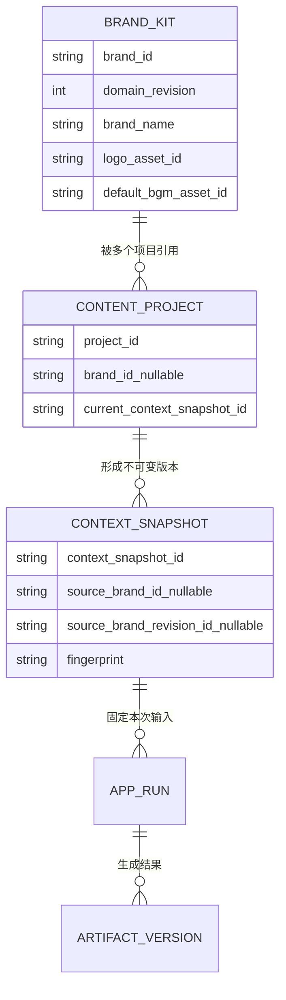

# 品牌包—我的项目领域边界与实施收口方案

- 文档日期：2026-07-29
- Change Request：`CR-BRAND-PROJECT-BOUNDARY-001`
- 文档状态：`completed_with_boundary`
- 实际协调范围：`BRAND-PROJECT-0` 至 `BRAND-PROJECT-5`
- 最终 Gate：`PG-BP-F_passed_with_boundary`（2026-07-30 独立六维终验 P0/P1/实质性 P2=0）
- 上位入口：已恢复 `PROGRAM-ROLLOUT/PG-L_waiting_user`
- 适用范围：企业资产库品牌包、ContentProject、ContextSnapshot、应用工作台项目选择/创建/编辑、所有应用的上下文消费
- 不在本方案范围：账户/组织/RBAC/套餐/支付、多租户 SaaS、最终发布自动点击、品牌包影响系统 UI 皮肤

## 1. 结论

品牌包与“我的项目”不是重复对象，必须同时保留，但要建立清晰的主从关系：

```text
企业资产库中的一个品牌包
  ├── 我的项目 A（本月下午茶推广）
  ├── 我的项目 B（七夕套餐）
  └── 我的项目 C（新店开业）
```

- 品牌包是企业长期复用的资料唯一来源，继续留在“企业资产库”。
- “我的项目”是一次营销工作的容器，属于工作流，不进入资产库，也不作为一种资产。
- 一个品牌包可以关联多个项目；一个项目最多关联一个品牌包，也允许暂不关联。
- 项目默认继承品牌资料，不重复维护品牌名称、Logo、地址、电话、品牌色、默认 BGM 等字段。
- 项目只维护本次营销任务特有的信息。
- 项目允许临时覆盖品牌字段，但所有覆盖都必须明确标记“仅本项目使用”，不得反向修改品牌包。
- 每次生成固定使用一个不可变的项目上下文快照；快照同时固定品牌 domain revision 和 Logo/BGM 等媒体 revision。
- 品牌包更新后不得静默改变当前项目或历史产物；用户只能通过明确的“同步最新品牌资料”动作创建新快照。
- 单品牌自动选择只发生在新建项目的显式写流程中；任何查询、页面打开、刷新或重启都不得静默补写 `brand_id` 或创建快照。

## 2. 用户已批准的产品原则

本方案冻结以下原则，实施过程中不得重新解释：

1. 品牌包继续保留在“企业资产库”，作为企业资料唯一来源。
2. “我的项目”属于工作流，不放进资产库，也不作为一种资产。
3. 新建项目时只需选择品牌包；如果只有一个可用品牌包，自动选中，不增加一次用户操作。
4. 项目自动继承品牌名称、Logo、地址、电话、品牌色、默认 BGM 等信息，不再重复展示整套品牌表单。
5. 项目只填写本次业务特有的信息：推广对象、营销目标、卖点、受众、活动和素材。
6. 允许项目临时覆盖品牌资料，但明确标记“仅本项目使用”。
7. 项目生成时固定品牌包版本；品牌包以后修改不会悄悄改变历史生成结果；需要时提供“同步最新品牌资料”。

## 3. 当前实现证据与问题

### 3.1 已有正确基础

| 证据 | 当前能力 | 结论 |
| --- | --- | --- |
| `pixelle_video/app_center/models.py` 的 `ContentProject.brand_id` | 项目已预留品牌关联 | 不需要另造“项目品牌”对象 |
| `ContextSnapshot.source_brand_id/source_brand_revision_id` | 快照已预留品牌来源和版本 | 可用于可复现生成 |
| `pixelle_video/app_center/repository.py::save_context_snapshot` | 快照不可变，并以指纹记录完整输入 | 历史快照不应被更新 |
| `brand_kits_v2` | 已保存名称、Logo、BGM、颜色、字体、字幕、结尾卡、地址、电话、优惠话术 | 品牌包已具备企业长期资料的主体能力 |
| `domain_revisions` | 品牌创建、修改、归档均追加 domain revision | 已有品牌版本基础，不需要覆盖旧版本 |
| `domain_snapshot_metadata("brand", ...)` | 服务层可得到品牌数据和最新 `domain_revision` | 可作为项目绑定/同步的服务端事实源 |
| ContextSnapshot v2 的事实 `source` | 已支持 `user/brand_revision/asset_metadata/artifact_version` 来源 | 可保留字段来源和审计语义 |

### 3.2 当前断点

1. `ContentProjectCreateRequest` 和桌面 API 类型虽然支持 `brand_id`，但现有应用入口创建项目时主要只传 `name` 与 `primary_goal`，没有真正绑定品牌包。
2. `ContentProjectUpdateRequest` 目前不支持安全地变更品牌关系；也没有“绑定品牌”“同步最新品牌”的事务 API。
3. `ProjectBriefEditor` 仍要求填写“门店/品牌名称、地址、联系方式”，和品牌包发生重复维护。
4. 当前 UI 仍可能暴露 `brand_revision_ref`、`source_brand_id`、`source_brand_revision_id`、asset revision 等技术概念；这些不是普通用户应操作的字段。
5. 保存 ContextSnapshot 时，品牌来源列仍由客户端原样回传；服务端没有强制以品牌库 domain revision 为唯一事实源。
6. 当前品牌 domain revision 的 payload 引用 `logo_asset_id/default_bgm_asset_id`，但项目生成还必须进一步固定对应媒体的 revision，否则媒体内容更新仍会改变结果。
7. 没有显式同步差异预览、并发保护、无变化幂等、品牌归档后的项目行为和旧项目 `brand_id=null` 兼容约束。

### 3.3 根因

当前不是两个领域对象本身重复，而是：

- 数据模型预留了关系；
- UI 没有把关系建立起来；
- 项目表单继续承担了品牌维护职责；
- 快照来源字段没有由服务端统一解析；
- 版本固定和同步动作没有形成闭环。

本轮收口只解决这些断点，不把“我的项目”改成资产，也不把品牌包改成项目模板。

## 4. 非重复领域定义

### 4.1 品牌包（Brand Kit）

品牌包是企业级、长期、跨项目复用的复合配置，负责回答：

> “这家企业/门店是谁，默认使用什么品牌表达和视觉资产？”

生命周期由企业资产库管理：创建、编辑、版本、归档、使用情况。品牌包不能保存某次活动的目标、某个项目的受众或某次生成结果。

### 4.2 我的项目（ContentProject）

项目是一次营销目标的工作容器，负责回答：

> “这一次要推广什么、面向谁、达成什么目标，并产生了哪些文案、标题、图文和视频？”

项目保存本次任务、上下文快照、AppRun 和 Artifact 的关系。项目不是图片、视频、音频、模板或品牌包，因此不得出现在资产库类型导航里。

### 4.3 项目上下文快照（ContextSnapshot）

快照是某次生成使用的不可变事实，负责回答：

> “这次生成当时准确使用了哪一版品牌资料、哪些项目资料和哪些素材版本？”

品牌包是来源，项目是工作容器，快照是一次生成事实；三者不能互相替代。

## 5. 关系和不变量

### 5.1 基数



业务基数：

- `BrandKit 1 -> N ContentProject`
- `ContentProject 0..1 -> 1 BrandKit`
- `ContentProject 1 -> N ContextSnapshot`
- `AppRun -> 1 ContextSnapshot`，进入队列后不得漂移到新快照

### 5.2 强制不变量

1. 读取品牌列表、读取项目、打开应用、刷新页面、恢复桌面端均为纯读，不得修改项目或创建快照。
2. `content_projects.brand_id` 只可在新建项目或显式绑定/更换/解除绑定命令中修改。
3. 新建项目只有一个可用品牌时，前端可以自动选中；点击“创建项目”后 POST 明确携带该 `brand_id`。自动选中不是后台静默补写。
4. 快照的 `source_brand_id/source_brand_revision_id` 只能由服务端从品牌库解析，客户端不得指定可信版本。
5. ContextSnapshot 只追加、不更新、不删除；`current_context_snapshot_id` 只移动到新快照。
6. 已创建 AppRun 固定其 `context_snapshot_id`；同步品牌不会改变运行中、失败、完成或历史 AppRun。
7. 项目覆盖字段只存在于项目快照，不回写品牌包。
8. 品牌归档不破坏历史项目和历史生成；归档品牌不能用于新绑定或同步到最新版本。
9. 删除不作为品牌包和项目的正常能力；使用归档确保历史引用仍可解析。

## 6. 字段归属矩阵

### 6.1 品牌包字段

| 字段 | 事实源 | 项目默认行为 | 普通用户展示 |
| --- | --- | --- | --- |
| 品牌/门店名称 | 品牌包 | 自动继承 | 项目页显示品牌摘要，不重复输入 |
| Logo | 品牌包引用的图片资产 | 自动继承并固定媒体 revision | 显示缩略图 |
| 门店地址 | 品牌包 | 自动继承 | 摘要显示，可在项目高级设置覆盖 |
| 联系电话 | 品牌包 | 自动继承 | 摘要显示，可在项目高级设置覆盖 |
| 品牌主色/辅色 | 品牌包 | 自动继承 | 仅显示色块，不显示内部 token |
| 默认字体 | 品牌包 | 自动继承 | 显示业务名称，不显示 font id |
| 默认字幕样式 | 品牌包 | 自动继承 | 显示样式名称 |
| 默认 BGM | 品牌包引用的音频资产 | 自动继承并固定媒体 revision | 显示音频名称，可试听 |
| 默认结尾卡文案 | 品牌包 | 自动继承 | 摘要/高级设置 |
| 默认优惠/团购话术 | 品牌包 | 自动继承 | 摘要/高级设置 |
| 状态、创建/更新时间 | 品牌包 | 只用于可选性判断 | 业务化状态；时间按需展示 |
| `brand_id`、domain revision、asset revision | 系统 | 用于引用和复现 | 普通用户不显示 |

品牌包中不得加入：某次营销目标、某次活动、某个项目受众、项目卖点、项目产物、AppRun 状态。

### 6.2 项目字段

| 字段 | 说明 | 是否项目独有 | 默认展示 |
| --- | --- | --- | --- |
| 项目名称 | 让用户识别一次营销工作 | 是 | 是 |
| 推广对象 | 本次商品、服务或活动对象 | 是 | 是 |
| 营销目标 | 引流、到店、转化、介绍新品等 | 是 | 是 |
| 商品/服务品类 | 本次推广对象的业务类别 | 是 | 是 |
| 卖点 | 本次需要表达的重点 | 是 | 是 |
| 证明事实/必带事实 | 可核验的信息和必须出现内容 | 是 | 需要时展开 |
| 目标受众 | 本次内容面向的人群 | 是 | 是 |
| 使用场景 | 本次内容要覆盖的消费/观看场景 | 是 | 需要时展开 |
| 活动/价格/促销事实 | 本次营销活动信息 | 是 | 是或按需展开 |
| 禁用表达 | 本次项目额外禁用内容 | 是 | 高级设置 |
| 项目素材 | 本次使用的图片、视频、音频及固定 revision | 是 | 轻量素材选择器 |
| 当前品牌关联 | 指向企业资产库品牌包 | 关系字段 | 品牌摘要卡 |
| 当前上下文快照 | 当前工作版本 | 系统字段 | 不显示技术 ID |
| AppRun/Artifact | 应用执行与结果 | 项目子对象 | 在结果/历史中业务化展示 |

项目中不得重复维护一套默认品牌资料。

### 6.3 “仅本项目使用”覆盖字段

项目覆盖不是新的品牌包，默认折叠在“本项目品牌设置”中：

| 可覆盖字段 | 合理场景 | UI 规则 |
| --- | --- | --- |
| 展示名称 | 本次活动使用门店分店名 | 字段旁固定显示“仅本项目使用” |
| Logo | 本次联名/活动 Logo | 显示来源和恢复品牌默认值动作 |
| 地址/电话 | 分店或临时联系方式 | 不影响品牌包 |
| 主色/辅色 | 节日活动视觉 | 色块旁显示项目覆盖标记 |
| 默认字体/字幕样式 | 本次视频特殊表达 | 明确仅影响本项目后续生成 |
| 默认 BGM | 本次活动音乐 | 固定选择时的媒体 revision |
| 结尾卡文案 | 本次活动落地语 | 不回写品牌包 |
| 优惠/团购话术 | 本次临时优惠 | 不回写品牌包 |

每个覆盖字段必须支持单项“恢复品牌默认值”；全部覆盖支持“一键恢复品牌默认值”。取消覆盖要创建新快照，不能修改旧快照。

## 7. 目标数据契约

### 7.1 ContentProject

沿用现有字段：

```text
project_id
schema_version
name
status
primary_goal
brand_id NULL
current_context_snapshot_id NULL
created_at
updated_at
```

本轮不将项目复制进资产库，也不创建 `project_assets` 或万能资源表。建议补充索引：

```sql
CREATE INDEX IF NOT EXISTS idx_content_projects_brand_status
ON content_projects(brand_id, status, updated_at DESC);
```

品牌库和应用中心可能位于不同 SQLite 存储，不能依赖跨库外键；由领域服务在写命令中验证品牌存在和状态。

### 7.2 ContextSnapshot v3

v1/v2 保持只读兼容；新的品牌绑定闭环写入 v3。v3 保存“解析后的最终值 + 覆盖字段集合 + 品牌/媒体版本”，而不是运行时再读取最新品牌。

```json
{
  "schema_version": 3,
  "brand_context": {
    "brand_id": "brand-abc",
    "domain_revision": 4,
    "values": {
      "display_name": "街角咖啡",
      "logo_ref": {"asset_id": "asset-logo", "asset_revision": "rev-logo-2"},
      "store_address": "上海市……",
      "phone": "021-……",
      "primary_color": "#6C5CE7",
      "secondary_color": "#F2EEFF",
      "font_family": "noto-sans-sc-bold",
      "default_subtitle_style": "clean",
      "default_bgm_ref": {"asset_id": "asset-bgm", "asset_revision": "rev-bgm-3"},
      "ending_card_text": "到店尝一杯",
      "coupon_phrase": "工作日下午茶套餐"
    },
    "overridden_fields": ["ending_card_text", "coupon_phrase"]
  },
  "project_brief": {
    "subject_type": "campaign",
    "offer": {
      "name": "工作日下午茶套餐",
      "category": "咖啡餐饮",
      "price_facts": [],
      "promotion_facts": []
    },
    "marketing_goal": "吸引附近上班族到店",
    "audience": {
      "primary": "门店三公里内上班族",
      "scenes": ["工作日下午茶"]
    },
    "selling_points": [],
    "proof_points": [],
    "required_facts": [],
    "forbidden_claims": [],
    "asset_refs": []
  }
}
```

无品牌项目使用 `"brand_context": null`，不得伪造默认品牌。

数据不变量：

- `ContextSnapshot.source_brand_id == payload.brand_context.brand_id`
- `int(ContextSnapshot.source_brand_revision_id) == payload.brand_context.domain_revision`
- Logo、BGM 和项目素材均使用明确的媒体 revision
- `fingerprint` 覆盖 schema version、完整 payload、source brand id/revision
- 普通用户界面不显示上述 ID、revision、fingerprint

### 7.3 统一解析器

新增领域服务 `ProjectContextResolver`，所有应用通过它取得业务上下文，不再各自解释原始 snapshot：

```text
resolve_for_run(project_id, requested_snapshot_id?)
  -> validated immutable ApplicationContext
```

职责：

1. v1/v2/v3 双读和兼容投影；
2. 校验快照属于项目；
3. 固定品牌 domain revision；
4. 固定品牌媒体和项目素材 revision；
5. 合并品牌值与项目覆盖；
6. 输出不含 API key、provider、文件绝对路径的业务 DTO；
7. AppRun 写入确定的 `context_snapshot_id` 后不再解析“最新”。

## 8. 品牌绑定和同步算法

### 8.1 新建项目

品牌列表只读取 `ready` 品牌：

- 0 个品牌：显示“暂不关联品牌”，允许创建项目；提示可稍后在企业资产库建立品牌。
- 1 个品牌：UI 自动选中并显示品牌摘要；用户点击“创建项目”时 POST 明确携带该 `brand_id`。
- 2 个及以上：显示轻量品牌选择器，默认最近使用项或不预选；不得未经用户动作猜选。

服务端在同一事务/领域命令中：

1. 校验品牌存在且可用；
2. 读取最新 domain revision；
3. 解析 Logo/BGM 当前媒体 revision；
4. 创建 ContentProject；
5. 创建初始 ContextSnapshot v3；
6. 设置 `current_context_snapshot_id`；
7. 返回项目和普通用户可读的品牌摘要。

如果任何一步失败，项目和快照均不写入。

### 8.2 显式绑定或更换品牌

对旧项目或无品牌项目提供“关联品牌”；对已关联项目提供“更换品牌”。更换前显示影响：

- 品牌名称、Logo、地址、电话和默认视觉将切换；
- 项目业务资料、素材和历史结果保持；
- 当前项目覆盖默认保留，但对新品牌无意义的覆盖必须让用户确认；
- 历史快照和历史产物保持不变。

确认后创建新快照并更新 `brand_id/current_context_snapshot_id`，不得更新旧快照。

### 8.3 同步最新品牌资料

只有以下条件同时成立才显示非阻断提示：

- 项目已关联品牌；
- 品牌仍可用；
- 最新 domain revision 大于当前快照固定 revision。

用户点击“同步最新品牌资料”后先展示业务差异，不展示 revision number：

```text
Logo 已更新
品牌主色已更新
地址未变化
本项目的“活动结尾卡”将继续保留
```

确认同步后：

1. 以 `expected_context_snapshot_id` 做并发保护；
2. 读取最新品牌 domain revision；
3. 对非覆盖字段采用最新品牌值；
4. 对 `overridden_fields` 保留项目值；
5. 重新固定 Logo/BGM 媒体 revision；
6. 复制项目业务资料；
7. 追加 ContextSnapshot；
8. 更新 `current_context_snapshot_id`；
9. 返回新摘要和同步结果。

如果已是最新版本，返回 `no_change`，不得创建重复快照。

### 8.4 历史不变

同步前创建的 AppRun 和 ArtifactVersion 继续引用旧快照。历史结果页显示业务化说明：

```text
使用当时保存的品牌资料生成
```

不得显示：

```text
brand_revision=4
context_snapshot_id=context_xxx
```

技术值仅允许出现在开发者诊断/导出证据中。

## 9. API 收口

### 9.1 品牌只读 API

新增或补齐：

```http
GET /api/v2/domain/brands?status=ready
GET /api/v2/domain/brands/{brand_id}/project-summary
GET /api/v2/domain/brands/{brand_id}/revisions/{revision}
```

`project-summary` 只返回项目创建所需的用户安全字段和内部服务使用的 revision 元数据；桌面普通视图不渲染技术字段。

具体 revision 查询必须能读取历史 domain revision，而不是总返回当前 `brand_kits_v2` 行。

### 9.2 项目写 API

沿用：

```http
POST /api/content-projects
```

请求继续支持 `brand_id`，但创建逻辑升级为服务端解析品牌 revision 和初始化快照。

新增命令式 API：

```http
POST /api/content-projects/{project_id}/brand-binding
POST /api/content-projects/{project_id}/brand-sync
POST /api/content-projects/{project_id}/brand-overrides
```

建议请求：

```json
{
  "brand_id": "brand-abc",
  "expected_context_snapshot_id": "context-current",
  "idempotency_key": "client-generated"
}
```

普通项目更新接口只更新项目名称和营销目标，不直接 PATCH `brand_id`，防止品牌关系与快照分离。

### 9.3 ContextSnapshot 写入

v3 请求不再接受客户端自称的 `source_brand_id/source_brand_revision_id`。服务端根据项目关联和品牌库解析并写入。保留旧字段只用于 v1/v2 兼容，服务端必须校验其与实际品牌关系一致。

错误码冻结：

| 错误码 | 用户文案 |
| --- | --- |
| `PROJECT_BRAND_NOT_FOUND` | 这个品牌已不存在，请重新选择 |
| `PROJECT_BRAND_NOT_AVAILABLE` | 这个品牌当前不可用于新项目 |
| `PROJECT_BRAND_REVISION_NOT_FOUND` | 品牌历史版本无法读取，请保留当前项目资料并联系支持 |
| `PROJECT_CONTEXT_CONFLICT` | 项目信息已在其他位置更新，请刷新后重试 |
| `PROJECT_BRAND_ASSET_REVISION_MISSING` | 品牌素材版本不完整，请到企业资产库检查 |
| `PROJECT_BRAND_SYNC_NO_CHANGE` | 已是最新品牌资料 |

用户错误信息不得泄露数据库路径、SQL、内部 ID、provider 或调用栈。

## 10. 迁移和兼容

### 10.1 迁移原则

- 只做加法迁移，不删除 v1/v2 快照，不批量重写项目。
- 不将 `brand_id=null` 的旧项目自动绑定到唯一品牌。
- 不在应用启动、项目读取、列表读取或页面渲染期间执行隐式数据迁移。
- 旧项目第一次显式编辑时可以继续按旧模式保存，或由用户主动选择品牌后升级为 v3。
- v3 写入前先交付 v3 双读和 v2 兼容投影，确保 feature flag 回滚后仍能读取新快照。

### 10.2 `brand_id=null` 旧项目

旧项目保持完全可访问：

- 项目列表、AppRun、Artifact 和历史快照照常读取；
- UI 显示轻量提示“尚未关联品牌”，不显示报错；
- 不因系统只有一个品牌而在读取时自动绑定；
- 用户点击“关联品牌”后才创建新的 v3 快照；
- 旧 AppRun 继续使用旧快照；
- 未关联品牌也允许使用项目业务字段生成中性结果。

### 10.3 v1/v2 快照

- 读取：统一解析器映射为 ApplicationContext。
- 编辑：先展示已有业务值；用户保存时可生成 v3 新快照，旧快照保留。
- 回滚 UI：即使新 UX flag 关闭，也必须能将 v3 投影成旧编辑器需要的 v2 视图；不得出现空项目资料。
- 技术字段：兼容层内部可见，普通 UI 不显示。

### 10.4 品牌媒体 revision

迁移不修改旧品牌 revision。创建 v3 快照时：

- 根据 `logo_asset_id` 固定其当前 `asset_revision`；
- 根据 `default_bgm_asset_id` 固定其当前 `asset_revision`；
- 解析失败时阻止新同步/新生成，不破坏原快照；
- 归档媒体的历史 revision 仍可用于历史复现，但不可作为新选择。

## 11. UI/UX 收口

### 11.1 信息架构

- 企业资产库：继续显示图片、视频、音频、音色、数字人、模板、品牌包。
- 我的项目：放在工作台/应用工作流的全局项目选择器或项目管理入口。
- 应用详情页：只显示当前项目的轻量摘要，不提供“归档项目”等全局生命周期操作。
- 项目归档、恢复、筛选和历史统一放在“我的项目”管理视图。

### 11.2 新建项目

首屏只包含：

1. 项目名称；
2. 营销目标；
3. 品牌包选择（单品牌自动选中）；
4. 创建项目。

品牌选择卡显示 Logo、名称和必要摘要；不显示 `brand_id`、revision、资产 ID。

### 11.3 项目编辑

默认轻量结构：

```text
关联品牌
[Logo] 街角咖啡    来自企业资产库    [更换]

本次推广
推广对象 / 营销目标 / 卖点 / 目标受众 / 活动 / 素材

更多设置
本项目品牌设置（默认折叠）
```

品牌卡只读展示继承值。普通用户不需要再次输入品牌名称、地址、电话、颜色和 BGM。

### 11.4 覆盖体验

用户展开“本项目品牌设置”并修改字段后：

- 字段标题旁显示 `仅本项目使用`；
- 顶部摘要显示“2 项使用项目设置”；
- 每项支持“恢复品牌默认值”；
- 保存前说明“不会修改企业资产库中的品牌包”；
- 不使用 revision、snapshot、override 等技术术语。

### 11.5 同步体验

品牌有更新时，在品牌摘要卡上显示轻量提示：

```text
品牌资料有更新  [查看变化]
```

用户查看差异并确认后才同步。不能在页面打开时自动同步，不能用 Toast 掩盖写操作。

### 11.6 所有应用统一

门店营销文案、爆款标题、抖音图文、数字人等应用统一使用同一个 ProjectContextSelector 和品牌摘要组件。应用页不得重复出现：

- 内容来源/文案产物/固定内容版本等内部链路字段；
- 项目 ID、快照 ID、品牌 revision；
- 保存项目、归档项目等项目生命周期按钮；
- 完整品牌资料表单。

## 12. 应用生成与结果传递

1. 用户选择项目后，应用只读取项目当前快照的业务投影。
2. 点击生成时服务端锁定具体 `context_snapshot_id`。
3. 生成排队后，即使用户同步品牌，当前运行仍使用原快照。
4. 新一次生成默认使用项目最新快照。
5. 文案到标题、标题到图文、图文到数字人的 handoff 继续携带 ArtifactVersion，同时固定相同项目和明确 ContextSnapshot。
6. 跨项目 handoff 仍禁止；品牌相同也不代表项目相同。
7. 结果页只显示“来自：街角咖啡 / 本月下午茶推广”等业务信息，不显示内部版本号。

## 13. 测试矩阵

### 13.1 后端领域测试

- 创建项目：0、1、2+ 品牌分支。
- 单品牌 UI 自动选择后 POST 明确携带 brand_id。
- 品牌不存在、已归档、并发归档。
- 创建项目和初始快照原子成功/失败回滚。
- 品牌创建/修改产生连续 domain revision。
- 按指定 revision 读取历史品牌 payload。
- Logo/BGM 固定具体媒体 revision。
- 覆盖字段合并，不覆盖字段继承。
- 同步保留覆盖字段。
- 同步已是最新返回 no_change 且不新增快照。
- `expected_context_snapshot_id` 冲突。
- AppRun 在同步前后仍固定原 snapshot。
- 品牌归档后历史项目可读、历史运行可恢复。
- v1/v2/v3 双读和 v2 兼容投影。
- `brand_id=null` 旧项目读写兼容。
- 客户端伪造 source brand revision 被拒绝。

### 13.2 “读不静默写”强制测试

对以下操作分别记录前后数据库：

- GET 品牌列表；
- GET 项目列表和项目详情；
- GET 当前快照；
- 打开/关闭/重开桌面端；
- 进入四个应用并切换项目；
- 只有一个品牌时打开旧项目。

断言：

```text
content_projects.brand_id 不变
content_projects.updated_at 不变
context_snapshots 行数不变
current_context_snapshot_id 不变
domain_revisions 行数不变
```

这是阻断 Gate，不得用组件 mock 代替数据库断言。

### 13.3 前端交互测试

- 0 个品牌显示“暂不关联”与资产库入口。
- 1 个品牌自动选中，不增加点击。
- 多品牌可搜索、选择、更换和取消。
- 品牌摘要不暴露技术字段。
- 项目主表单只含本次业务字段。
- 覆盖字段清晰显示“仅本项目使用”。
- 单项/全部恢复品牌默认值。
- 同步差异预览、取消、确认、并发冲突恢复。
- 品牌归档后的业务化提示。
- 不在应用页显示项目归档/保存生命周期按钮。
- 1440/1280/900/390 视口无错位、横向溢出和按钮拥挤。
- 键盘、焦点顺序、屏幕阅读器名称和 disabled 对比度。

### 13.4 跨应用测试

- 一个项目在文案、标题、图文、数字人中读取同一品牌摘要。
- 项目覆盖在所有应用中一致生效。
- 品牌同步后旧运行不变，新运行使用新快照。
- 图文/数字人成品实际使用固定 Logo、颜色、BGM revision。
- typed handoff 不丢失 project/context/artifact 关系。

### 13.5 构建和实际运行

- Python 定向测试与 App Center/Asset Library 聚合回归；
- Ruff/format/diff check；
- Vitest 定向测试和 desktop build；
- Tauri + sidecar 启动、关闭、重启；
- SQLite 真实迁移副本；
- feature flag 开/关各一轮；
- 真实可视化录屏/截图，覆盖新建、覆盖、同步、历史不变。

## 14. 回滚方案

新增 feature flag：

```text
brandProjectBoundaryV1
```

规则：

- 默认关闭，完成 Gate 后再受控开启；
- flag 关闭只切回旧交互，不回滚数据库、不删除 v3 快照；
- v3 双读属于永久兼容能力，不受 flag 控制；
- API 新命令可受 flag 限制写入，但历史读取始终可用；
- 回滚后旧 UI 通过兼容投影读取 v3，不得显示空资料；
- 品牌包、项目、快照和产物均不做破坏性删除；
- 如果同步事务失败，保持原 `brand_id/current_context_snapshot_id`；
- 如发现应用上下文消费异常，可关闭新写入并继续使用已固定旧快照。

回滚验证：

1. 开启 flag 创建品牌关联项目并生成结果；
2. 关闭 flag；
3. 重启桌面与 sidecar；
4. 项目、历史结果、v3 快照兼容投影可读；
5. 不发生静默写入；
6. 再开启 flag 可继续同步和生成。

## 15. 分阶段实施清单与 Gate

本方案不得绕过总协调台账。协调层登记 `CR-BRAND-PROJECT-BOUNDARY-001` 后，才可把 `current_stage` 切到 `BRAND-PROJECT`。原 `PROGRAM-ROLLOUT/PG-L` 外部等待保持 suspended checkpoint；本子计划结束后原样恢复，不得借本轮关闭 Windows 实机、产品签字或真实 rollback/WebView SLA。

### BRAND-PROJECT-0：Entry、契约和基线

交付：

- 冻结本文领域边界和字段矩阵；
- 冻结 ContextSnapshot v3 schema、fixture 和 v2 projection；
- 冻结错误码、feature flag 和回滚契约；
- 建立当前重复录入和技术字段暴露的视觉基线；
- 建立读不写数据库基线。

Gate `PG-BP-A`：

- schema/fixture/错误码评审通过；
- P0/P1=0；
- 没有业务代码写入；
- 不改变总协调外部 Gate。

### BRAND-PROJECT-1：服务端品牌绑定与版本固定

交付：

- 按 revision 读取品牌历史 payload；
- ProjectContextResolver；
- 创建项目绑定品牌并初始化 v3 快照；
- Logo/BGM 媒体 revision 固定；
- 显式绑定/更换/解除绑定；
- 服务端不信任客户端 source revision。

Gate `PG-BP-B`：

- 原子性、并发、品牌归档、版本丢失、媒体 revision 测试通过；
- 读不写数据库测试通过；
- v1/v2 回归通过；
- 独立六维复审 P0/P1=0。

### BRAND-PROJECT-2：同步、迁移与兼容

交付：

- 显式差异计算和同步；
- 保留覆盖字段；
- no_change 幂等；
- `brand_id=null` 旧项目兼容；
- v3 双读、v2 兼容投影；
- feature flag 回滚闭环。

Gate `PG-BP-C`：

- 同步前后历史快照、AppRun、Artifact 不变证据；
- 旧数据库副本迁移和重启恢复；
- flag 开/关回滚；
- 独立六维复审 P0/P1=0。

### BRAND-PROJECT-3：轻量项目 UI

交付：

- 新建项目品牌选择；
- 单品牌自动选择；
- 品牌摘要卡；
- 仅显示项目业务字段；
- “仅本项目使用”覆盖；
- “查看变化/同步最新品牌资料”；
- 我的项目全局管理边界；
- 删除应用页项目生命周期按钮和普通用户技术字段。

Gate `PG-BP-D`：

- 0/1/多品牌交互测试；
- 1440/1280/900/390 视觉证据；
- 键盘/焦点/对比度；
- 与当前主题 tokens 一致；
- 独立六维复审 P0/P1=0。

### BRAND-PROJECT-4：全应用消费与交付

交付：

- 文案、标题、图文、数字人统一消费 ProjectContextResolver；
- 品牌和项目覆盖实际进入生成、渲染和交付；
- 跨应用 handoff 固定项目/快照/ArtifactVersion；
- 新旧运行版本隔离。

Gate `PG-BP-E`：

- 四应用定向测试与真实可视化验证；
- 至少一个品牌同步前后双运行证据；
- Logo、颜色、BGM 等实际产物验证；
- 构建和 sidecar 重启通过；
- 独立六维复审 P0/P1=0。

### BRAND-PROJECT-5：灰度和收口

交付：

- flag 受控开启；
- 完整回归、性能和回滚；
- 更新总协调台账与实施证据；
- 明确仍保留的外部边界。

Gate `PG-BP-F`：

- 需求完整性、逻辑正确性、边界情况、代码质量、测试覆盖、实际运行结果六维终审通过；
- P0/P1/实质性 P2=0；
- 无静默数据迁移或读写混用；
- 不暴露技术字段；
- Gate 通过后恢复 `PROGRAM-ROLLOUT/PG-L` 原状态。

## 16. 实施顺序和文件范围建议

建议按以下顺序修改，禁止先做 UI 假闭环：

1. `docs/contracts/app-center/`：v3 schema、fixture、错误码和兼容样例；
2. `pixelle_video/services/assets_v2/repository.py`：指定品牌 domain revision 读取；
3. `pixelle_video/app_center/`：resolver、原子品牌绑定/同步、v3 校验；
4. `api/schemas/app_center.py`、`api/routers/app_center.py`：命令 API；
5. `desktop/src/api.ts`：业务 DTO，技术字段不进入普通组件 props；
6. `desktop/src/features/app-workbench/`：ProjectContextSelector、项目摘要、覆盖和同步；
7. 四个应用工作台：统一消费 resolver/共享组件；
8. 测试、视觉证据、迁移副本、Tauri 重启和回滚；
9. 独立六维复审和 Gate 更新。

禁止：

- 在读取接口中顺便绑定唯一品牌；
- 让前端决定可信 brand revision；
- 修改旧 ContextSnapshot；
- 把项目卡片加入企业资产库；
- 在每个应用复制一套品牌/项目表单；
- 用“高级模式”作为向普通用户暴露 ID/revision 的理由；
- 只做 UI 自动填充而不固定后端版本；
- 将品牌包更新直接传播到历史 AppRun。

## 17. 验收场景

### 场景 A：只有一个品牌的新用户

1. 用户打开新建项目；
2. 唯一品牌自动选中，无需点击；
3. 用户填写项目名称和营销目标；
4. 创建后看到品牌摘要和本次推广字段；
5. Logo、地址、电话、颜色和 BGM 不重复输入；
6. 生成结果使用已固定的品牌/媒体 revision。

### 场景 B：品牌更新

1. 项目当前使用品牌旧版资料；
2. 用户在企业资产库修改 Logo 和主色；
3. 打开项目只看到“品牌资料有更新”，数据不自动变化；
4. 用户查看差异并取消，数据库不写入；
5. 用户再次确认同步，创建新快照；
6. 老结果保持，下一次生成使用新资料。

### 场景 C：项目临时活动视觉

1. 项目继承默认品牌资料；
2. 用户将结尾卡和 BGM改为活动版本；
3. 两个字段显示“仅本项目使用”；
4. 企业资产库品牌包保持不变；
5. 品牌同步时保留这两个覆盖；
6. 用户可单项恢复品牌默认值。

### 场景 D：旧项目

1. 旧项目 `brand_id=null`；
2. 打开、刷新、重启均不自动绑定；
3. 历史内容正常可见；
4. 用户明确点击“关联品牌”；
5. 系统创建新 v3 快照，旧快照和旧产物保持。

## 18. 完成定义

只有同时满足以下条件，才能称为“实施收口”：

- 品牌包和项目的领域/页面入口清晰分离；
- 一个品牌可关联多个项目；
- 单品牌新建项目无需额外点击；
- 所有读操作均无静默写入；
- 项目不再重复展示品牌完整表单；
- 项目只要求填写本次营销任务字段；
- 项目覆盖有清晰“仅本项目使用”标记；
- 生成固定品牌 domain revision 和媒体 revision；
- 品牌更新必须显式同步；
- 同步不改变历史快照、AppRun 和 Artifact；
- `brand_id=null` 旧项目完整兼容；
- 四个应用统一消费相同上下文；
- 普通用户不见 ID、revision、snapshot、fingerprint 等技术字段；
- feature flag 回滚、桌面重启和数据库迁移副本均通过；
- 最终独立六维复审 P0/P1/实质性 P2=0。

## 19. 本方案自审

| 维度 | 结论 |
| --- | --- |
| 需求完整性 | 覆盖用户批准的七条原则，并包含现状、字段、关系、版本、同步、兼容、API、UI、测试、回滚和 Gate |
| 逻辑正确性 | 品牌包为事实源、项目为工作流、快照为不可变生成事实；无对象职责重叠 |
| 边界情况 | 覆盖 0/1/多品牌、品牌归档、媒体 revision 丢失、并发、旧项目、no_change 和回滚 |
| 代码质量约束 | 统一 resolver 和命令式 API，禁止各应用重复合并逻辑 |
| 测试覆盖 | 明确后端、数据库无写、前端、跨应用、迁移、构建、真实运行矩阵 |
| 实际运行 | 要求 Tauri/sidecar、真实 SQLite 副本、可视化和 flag 回滚证据，不以 mock 代替 |

自审结论：`plan_ready_with_no_known_p0_p1`。本文件只完成方案落盘，未修改业务代码、未修改总协调台账、未提交 Git。
