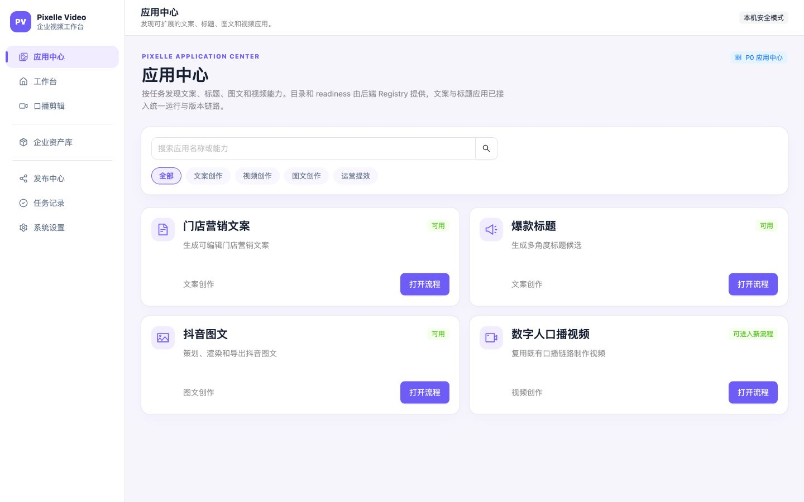
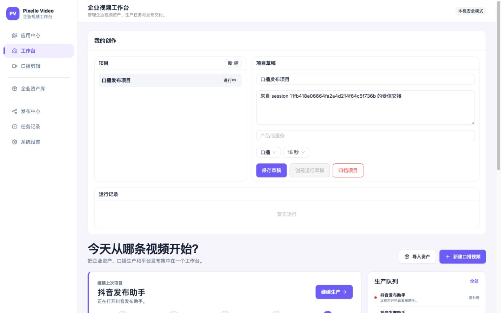
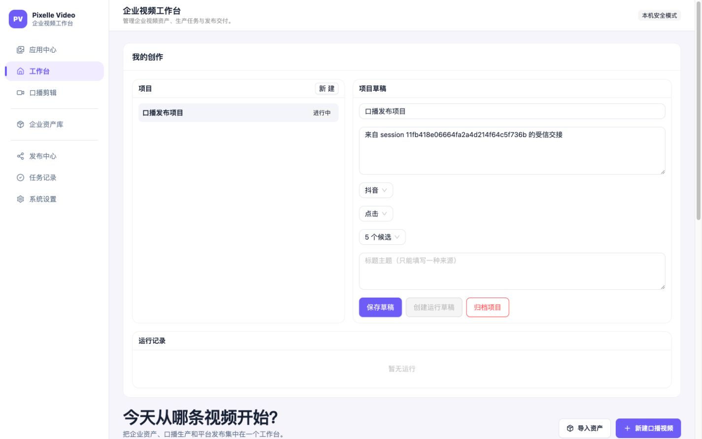
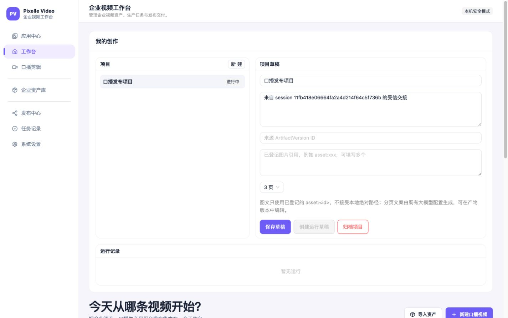
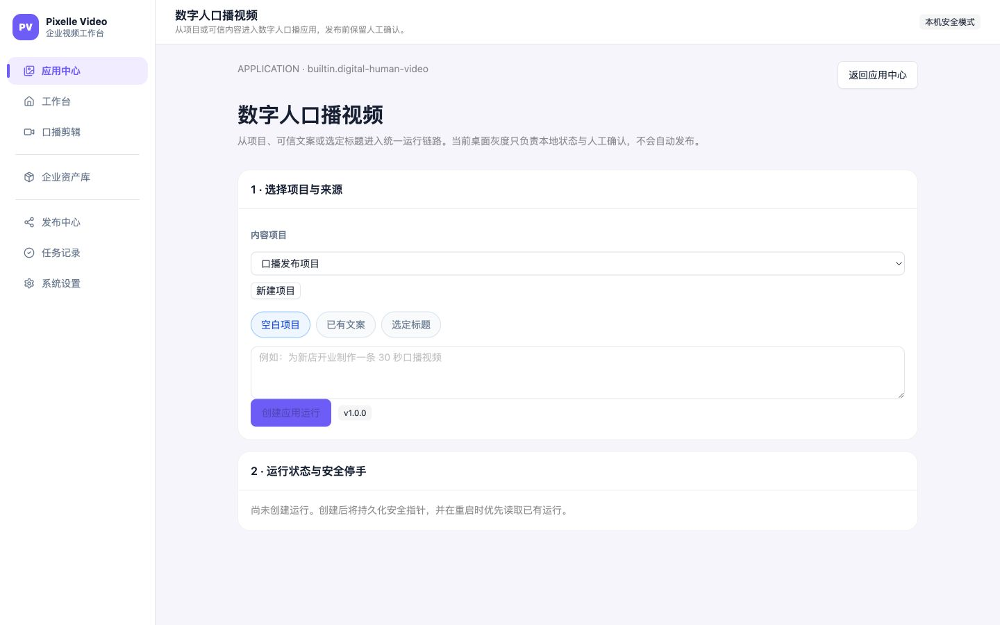

# 应用中心能力与用户体验快速审计（2026-07-23）

## 结论

本文件的截图和首轮结论记录于 2026-07-23 修复前。随后已完成入口路由、状态标签、图文资产选择器和数字人 provider 执行闭环的代码修复；下表是修复后的当前成熟度：

| 应用 | 当前真实能力 | 结论 | 体验 |
| --- | --- | --- | --- |
| 门店营销文案 | 结构化 LLM 生成 3 个可编辑变体，校验、版本保存、交给标题/图文/数字人 | 已实现（依赖 LLM 配置） | 2.5/5 |
| 爆款标题 | 基于主题或文案生成 5–10 个候选，校验、版本保存、交给图文/数字人 | 已实现（依赖 LLM 配置） | 2.5/5 |
| 抖音图文 | LLM 规划页面，本地渲染 3/5/8 页 PNG，导出 ZIP、发布文案 | 已实现为本地 pilot；不含平台发布 | 2/5 |
| 数字人口播视频 | AppRun、来源选择、数字人形象选择、TTS→数字人→后期真实媒体执行、恢复/取消/重试/人工接收 | 真实 TTS→RunningHub→后期成片闭环已通过一次有目的 live smoke；不含自动平台发布 | 4/5（独立页清晰，生成后停在人工审核） |

## 证据截图

1. 应用中心能展示 4 个应用、搜索和分类：

   

2. 以下三张截图是修复前的基线：文案、标题、图文当时都会进入同一个工作台，且下面仍有旧的“今天从哪条视频开始？”区域。修复后已改为独立应用流程路由：

   
   
   

3. 数字人独立流程页（截图为修复前版本）已保留，并补上真实生成 CTA 和数字人资产选择：

   

## 实现核验

### 1. 门店营销文案

- Registry manifest：`structured_llm`，输入 `brief`，输出 `copywriting`，支持交给标题、图文和数字人。
- `structured_apps.py` 对目标、产品/服务、格式、时长做校验，输出 3 个变体，检查敏感词/虚构价格日期功效，并允许一次修复调用。
- 前端支持草稿、创建运行、运行记录、查看/编辑版本、保存新版本、交给爆款标题。
- 通过测试：`tests/app_center_registry_test.py`、`tests/app_center_structured_apps_test.py`、`tests/app_center_api_test.py` 覆盖其合同和 API；本轮专项结果 46 passed（与同批 App Center 测试合计）。
- 本次浏览器检查只验证页面入口，没有触发真实 LLM 供应商调用，因此不能把“页面可用”当成生产模型验收。

### 2. 爆款标题

- Registry manifest：`structured_llm`，接受文案，产出 `title_set`/`selected_title`。
- 后端要求平台、目标、数量和唯一来源，限制 5–10 条、标题长度和重复，并支持版本化编辑。
- 前端有平台、目标、数量、主题输入，也能从文案结果交接；现已通过 `/apps/viral-titles` 定向进入专注工作区，应用身份明确。
- 同一批 Registry/structured/API 测试通过；未执行真实 LLM 供应商调用。

### 3. 抖音图文

- Registry manifest 标记为 `pilot`，执行器为 `document_render`，需要 `llm` 与 `template`。
- `DouyinCarouselExecutor` 负责页面规划和本地渲染；渲染器固定 1080×1440、3/5/8 页，生成 PNG、manifest 和 ZIP，并提供发布文案复制。
- 当前没有抖音浏览器上传/发布动作，符合“最终发布自动点击默认关闭”的范围。
- 修复后使用“图文来源产物 / 图文来源版本”下拉和图片资产选择器；内部 Artifact/asset ID 不再要求用户手填，仍保留可编辑产物版本。
- 渲染器/API 合同测试通过；本轮没有上传到抖音的 live smoke。

### 4. 数字人口播视频

- Registry manifest 标记为 `pilot`，声明需要 `llm`、`runninghub`、`digital_human`，产出视频/封面/发布文案。
- 当前页面真实支持：项目和文案/标题来源选择、数字人形象/场景选择、创建持久化 AppRun、重启恢复、状态刷新、取消、失败重试、生成数字人视频和人工接收。
- 重启恢复会校验 pinned source artifact/version；来源被归档或删除时清理本地指针并隐藏旧运行操作，必须显式重新选择来源后才能继续。
- `execute_provider` 已串接既有 `run_ip_broadcast_step` 的 TTS、数字人和后期步骤，执行完成后停在 `needs_review`，不会自动触发平台发布。2026-07-24 余额恢复后的唯一一次有目的 retry 中，Edge TTS、RunningHub 音频/人物上传、RunningHub 任务创建与成功回收、后期合成均通过；视频、封面、发布文案三类 generated Artifact 已登记，重启后状态与 Artifact IDs 保持，人工 accept 后进入 `completed`。
- 生产路径仍受 Registry readiness、数字人资产和模型/RunningHub 配置约束；没有这些配置时会明确返回不可用或失败状态，不伪造成功。

## 用户体验判断

优点：

- 应用中心视觉层次、卡片、分类和搜索已经统一，首屏能看懂四类能力。
- 文案和标题拥有统一的运行记录、Artifact 版本和交接机制，不是静态 demo。
- 数字人独立页的“选择来源 → 运行状态与安全停手”比通用工作台清楚，并把人工确认边界写在页面上。

主要问题（按优先级）：

1. 入口路由已改为 `/apps/marketing-copy`、`/apps/viral-titles`、`/apps/douyin-carousel`，并在专注工作区显示应用身份。
2. 状态标签已拆分为“可试用 / 本地可导出 / 需先配置 / 灰度中 / 未开启”，不再用单一“可用”掩盖交付边界。
3. 图文已改为产物、版本和企业图片选择器，内部 ID 不再是用户输入项。
4. 数字人已提供真实生成 CTA；生成失败、缺配置、缺形象都会停在可诊断状态，成功结果先进入人工审核。
5. 已在双开关和真实配置环境执行一次 live smoke；当前唯一阻塞是 RunningHub 企业版余额不足。余额恢复后只补一次有目的的真实成片复验；平台自动点击仍按范围关闭。

## 后续建议（修复后）

1. 保留一次真实成片证据作为回归基线；后续 provider 升级或 workflow 变更时再按同样的单次、有边界方式复验。
2. 图文资产选择器继续补充缩略图、尺寸/格式提示和“从上一应用交接”快捷入口；当前已不再要求用户输入内部 ID。
3. 在卡片上进一步展示“真实生成 / 可导出 / 可发布”能力矩阵，避免把“可试用”理解为平台自动发布。
4. 后续按整体协调方案推进账号、组织、RBAC、套餐和运营后台，不把管理后台提前混入本轮桌面应用中心。

## 证据边界

- 代码合同、API、渲染器和 provider 边界专项测试：本轮相关 Python 测试 76 个通过；全量桌面前端 11 个测试文件、60 个测试通过；桌面构建通过。
- provider 边界测试验证了真实 TTS→数字人→后期调用链的 Artifact 产出和 `needs_review` 停手；2026-07-24 余额恢复后的 live smoke 真实生成并登记了视频、封面和发布文案，重启恢复与人工接收通过；没有进行抖音/快手/小红书发布。
- 截图能验证可见层级、导航和表单认知负担；完整键盘、屏幕阅读器、网络抖动和真实模型质量仍需单独验收。
