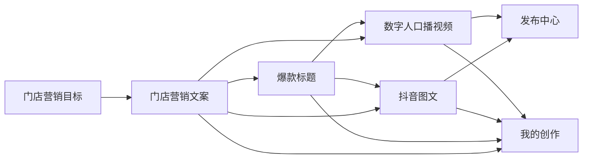
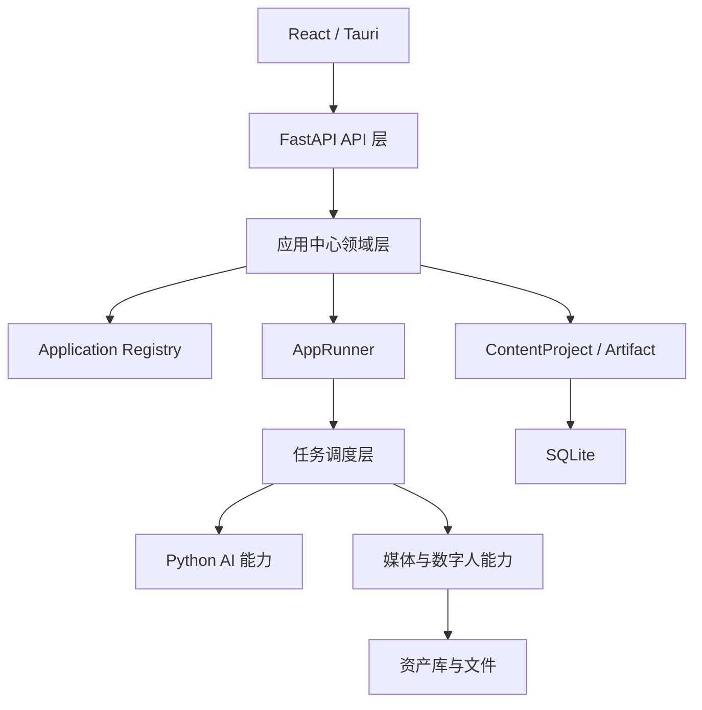
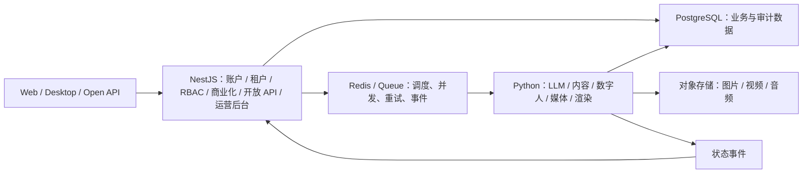
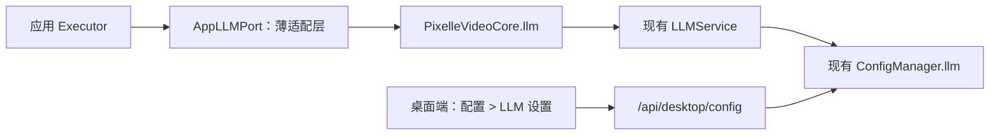
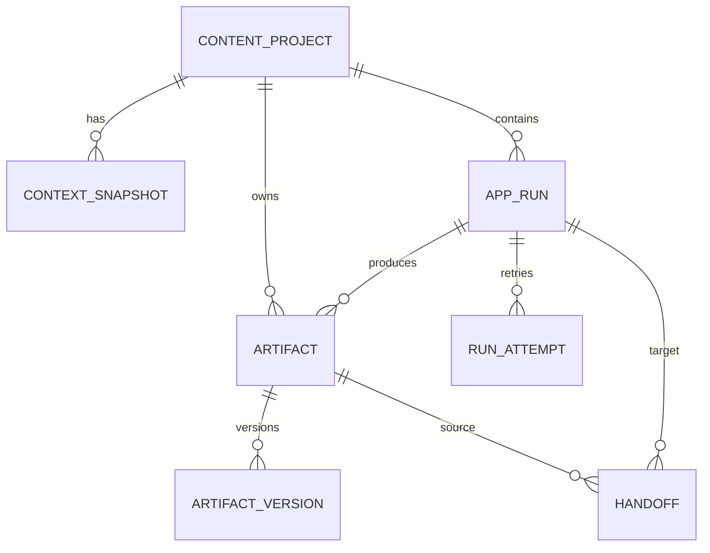

# Pixelle Video 应用中心产品规划与实施落地方案

- 日期：2026-07-18
- 版本：v1.4（正式登记管理后台 P1/P2 Deferred Capability 与启动条件）
- 交付对象：Luna（产品、前端、后端、测试可直接据此执行）
- 实施主端：React/Tauri 桌面端
- 上位协调方案：`docs/superpowers/specs/2026-07-18-application-center-publishing-program-master-plan.md`
- 执行约束：本方案的 AC 阶段必须按上位方案的严格串行队列和 Program Gate 推进
- 参考：用户提供的“应用中心”截图、当前 `StudioApp`、企业资产库 V2、5 步口播生产链路、任务与发布中心
- 首期目标：把 Pixelle Video 从“数字人口播工具”升级为“中小门店短视频内容生产工作台”

## 0. 执行结论

应用中心不能只做成参考图那样的工具卡片集合。卡片陈列能解决“找到工具”，但解决不了门店老板真正的连续工作：同一份门店信息要反复填写、文案和标题不能继续用于成片、生成结果容易丢、任务记录与可编辑内容混在一起。

本方案确定采用以下产品结构：

```text
应用中心负责发现和启动能力
创作项目负责承接一次营销目标
应用运行负责执行和重试
创作产物负责保存、编辑、版本和跨应用流转
企业资产库负责复用品牌、人物、声音、图片、视频和模板
发布中心负责最终平台交付
```

首期只上线四个高频应用：

1. 门店营销文案；
2. 爆款标题；
3. 抖音图文；
4. 数字人口播视频（迁入已有能力，不重写生产内核）。

必须先建立统一的应用协议、创作上下文、运行记录和产物模型，再继续加应用。禁止为每个新工具各写一套页面、接口、提示词调用和历史记录。

## 0.1 默认产品决策

以下决策用于让 Luna 无需等待即可开工；任何一项与业务现状不符时，产品负责人只需修改对应决策，不需要推翻整体架构。

| 决策项 | 本方案默认值 | 原因 |
| --- | --- | --- |
| 主要客户端 | React/Tauri 桌面端 | 当前桌面端已具备工作台、资产、任务、发布和安全模式；Streamlit 只保留旧版兼容 |
| 首期用户模型 | 单机、单用户、可管理多个品牌/门店 | 符合现有本地桌面架构，同时为未来 `workspace_id` 留字段 |
| 当前后台 | 保留 FastAPI + Python 模块化单体 | 最大化复用已跑通的 LLM、数字人、媒体、渲染、任务和资产能力；不迁移 Express |
| P0 模型管理 | 复用现有 `ConfigManager + LLMService + 桌面配置页` | 当前已有单一默认模型配置、脱敏读写、热更新和结构化输出能力，不重复建设模型配置库 |
| P0 应用管理 | 不建设管理员控制台 | 使用内置 Registry、版本化 manifest、feature flag 和 Program Gate 控制上线；管理员动态上下架与可视化模型策略延期 |
| 未来 SaaS | NestJS 控制面 + Python 执行面 | 正式建设账户/组织/RBAC/商业化/开放能力或升级云端多租户时，按 ADR-007 启动混合架构 |
| 首发平台 | 抖音优先 | 用户明确提出抖音图文，现有发布中心也已支持抖音准备流程 |
| 首发语言 | 简体中文 | 目标用户是国内中小企业主和门店老板 |
| 内容生成方式 | 结构化 LLM 输出 + 人工确认 | 保证结果可编辑、可验证、可继续流转，不直接把自由文本当最终数据 |
| 数据存储 | 新增独立 SQLite 领域库 | 不迁移或破坏现有任务库、资产库与口播 session，降低上线风险 |
| 上线方式 | feature flag 分阶段开启 | 当前工作区已有大量资产库改动，必须支持并行开发与快速回滚 |
| 商业化 | 首期只记录能力用量和成本估算，不做套餐扣费 | 先验证使用频率和价值，再决定计费单位 |

## 1. 现状判断与参考图取舍

### 1.1 当前代码中可直接复用的基础

本方案基于真实代码，不按全新项目推演：

- `desktop/src/StudioApp.tsx` 已有工作台、口播剪辑、企业资产库、发布中心、任务记录、系统设置和启动自检；
- `desktop/src/features/dashboard/DashboardView.tsx` 已有首页项目、队列、资产和就绪状态区；
- `desktop/src/features/assets/` 已建立统一资产模型、选择器、稳定 ID、预览和领域资源；
- `api/tasks/` 已有异步任务、取消、重试、进度和 SQLite 持久化；
- `api/routers/ip_broadcast.py` 和 `pixelle_video/services/ip_broadcast_workflow.py` 已承载可用的数字人口播链路；
- `pixelle_video/services/llm_service.py` 支持 Pydantic 结构化输出；
- `pixelle_video/config/manager.py`、`pixelle_video/config/schema.py` 与 `/api/desktop/config` 已统一管理默认 LLM 的 `api_key/base_url/model`，桌面配置页已有密钥脱敏读写；
- `desktop/src/theme.ts`、`desktop/src/styles.css` 与 Ant Design 已形成现有主题体系；
- `desktop/src/featureFlags.ts` 已有灰度开关模式；
- 现有发布中心可以继续承接视频、标题、描述和平台发布准备。

### 1.2 当前阻碍扩展的问题

1. `StudioApp.tsx` 已超过 5,000 行，导航、会话、资产和生产步骤仍高度集中；继续把新工具塞入其中会快速失控。
2. 当前 `View` 是硬编码联合类型，应用数量增加后会形成大段条件渲染和回调传递。
3. 现有任务是“执行日志”，不是用户可持续编辑的“创作项目”。任务过期或清理后不能承担内容库职责。
4. 现有 LLM `/api/llm/chat` 只返回自由文本，无法支撑稳定的文案卡片、标题候选、图文页和后续流转。
5. 品牌包已经包含颜色、Logo、地址、电话和优惠话术，但内容生成还没有统一消费这些上下文。
6. 数字人口播已有完整流程，新应用不应复制它的 session 和 task 实现，也不能要求它一次性改写成通用引擎。

### 1.3 参考图中应该采用的部分

- 独立的一级“应用中心”入口；
- 搜索、分类、应用卡片和清晰的一句话说明；
- 视频创作、文案创作、图文创作、运营工具的类别心智；
- 新应用可以持续加入而不改首页主结构。

### 1.4 参考图中不能照搬的部分

- 不做几十个同权重工具的平铺市场；
- 不用“AI 一键成片”等重叠应用制造选择困难；
- 不让每个应用重复填写门店、产品、优惠、受众和语气；
- 不把“任务记录”当“我的作品”；
- 不在首期上线需要实时外部数据的热点、同行监控等应用；
- 不承诺“爆款”，产品文案必须说明结果是候选与优化建议，不保证流量。

## 2. 产品定位、用户任务与指标

### 2.1 产品定位

Pixelle Video 是给中小企业主、门店老板和轻量运营人员使用的 AI 内容生产工作台：围绕一次经营目标，快速产出可编辑、可复用、可继续成片、可准备发布的短视频与图文内容。

不是：

- 专业剪辑软件；
- 通用 AI 聊天机器人；
- 工具数量越多越好的 AI 导航站；
- 首期就覆盖 CRM、投放、舆情、团队审批的企业营销平台。

### 2.2 核心用户任务

| 用户任务 | 用户真实问题 | 应用中心应提供的结果 |
| --- | --- | --- |
| 今天发什么 | 没有选题、不会从经营目标变成内容 | 从活动/产品/案例生成可执行文案 |
| 怎么写得有人看 | 开头弱、卖点散、行动引导不清 | 多版本文案、结构说明和可编辑结果 |
| 标题怎么起 | 不会提炼冲突、利益和好奇点 | 多角度标题候选与风险提示 |
| 怎么做抖音图文 | 不会拆页、排版和准备发布文案 | 封面、分页文案、图片组、标题描述标签 |
| 怎么快速成视频 | 不会录制、配音和剪辑 | 复用已有数字人口播链路完成成片 |
| 同一内容怎么继续用 | 每个工具都要重新复制粘贴 | 产物一键流转到标题、图文、口播和发布 |

### 2.3 北极星指标

北极星指标：**每周完成并保存的“可发布内容包”数量**。

“可发布内容包”至少包含一种可交付主产物和对应平台文案：

- 视频 + 标题/描述/标签；或
- 图文图片组 + 标题/描述/标签。

首期观测指标：

| 指标 | 建议目标 | 说明 |
| --- | --- | --- |
| 应用中心到首次运行转化率 | ≥ 45% | 打开应用中心后启动任一应用 |
| 文本应用首次可用结果时间 | P50 < 60 秒 | 从打开应用到得到可编辑结果 |
| 文本应用运行成功率 | ≥ 97% | 排除用户主动取消 |
| 结果保存率 | ≥ 50% | 运行成功后保存为项目产物 |
| 跨应用继续创作率 | ≥ 20% | 例如文案继续生成标题或口播 |
| 抖音图文完整导出率 | ≥ 70% | 已进入生成阶段的运行中完成图片组导出 |
| 原口播流程成功率 | 不低于上线前基线 | 应用中心迁移不能伤害已有能力 |

首期不设置“生成次数”为北极星指标。生成很多但没有保存、导出或发布准备，不代表给老板提效。

### 2.4 产品原则

1. 按经营任务说话，不按模型能力说话。
2. 默认路径只问必要信息，高级参数渐进展开。
3. 每个应用只有一个主动作。
4. 所有 AI 结果先可编辑，再继续创作或导出。
5. 同一项目内复用品牌、门店、产品、受众和活动上下文。
6. 应用定义与执行解耦，新增应用不改全局导航和任务内核。
7. 内容项目、执行任务和资产必须是三个不同概念。
8. 失败可重试、输入不丢失、成功结果有版本。
9. 技术配置、模型名、workflow ID 和内部路径默认不暴露给业务用户。
10. 不自动对外发布；仍由用户在发布中心最终确认。

### 2.5 首期明确不做

- 第三方应用市场和用户自定义插件；
- 多人组织、权限、审核流；
- 应用管理员控制台、无发版动态上下架、远程灰度和管理操作审计；
- 按应用、用户、租户或套餐配置不同模型的可视化管理；
- 云端账户同步；
- 自动抓取实时热点、同行数据；
- 承诺式的标题流量评分；
- 全自动平台发布；
- 重写已有数字人口播后端；
- 为每个应用制作独立视觉系统；
- 将旧 Streamlit 页面同步改造成应用中心。

## 3. 目标信息架构

### 3.1 一级导航

最终导航顺序：

```text
工作台
应用中心
我的创作
----------------
企业资产库
发布中心
任务记录
----------------
系统设置
```

说明：

- “应用中心”负责找能力、开始创作；
- “我的创作”负责找回可编辑项目和结果；
- “任务记录”只负责查看运行状态、失败、耗时、取消和重试；
- “口播剪辑”在迁移完成后不再作为一级入口，改为应用中心里的“数字人口播视频”；
- 灰度期间旧“口播剪辑”入口保留，只有 `digitalHumanInAppCenter` 门禁通过后才移除；
- “工作台”保留继续项目、生产队列、系统就绪和最近结果，不变成第二个应用中心。

### 3.2 应用中心首页

页面标题建议：`今天想做什么内容？`

页面从上到下分为：

1. 搜索：按应用名、任务描述和业务关键词搜索，例如“标题”“开业”“图文”；
2. 继续创作：最近 3 个未完成项目或最近产物的下一步建议；
3. 为你推荐：首次按高频应用排序，后续按最近使用和项目上下文排序；
4. 分类标签：全部、文案创作、视频创作、图文创作、运营提效；
5. 应用网格：桌面宽度默认 3 列，宽屏最多 4 列，窄屏降为 2/1 列；
6. 即将上线：最多展示 3 个已明确排期的应用，禁止堆满概念卡片。

推荐区的首期排序：

```text
门店营销文案 -> 爆款标题 -> 抖音图文 -> 数字人口播视频
```

如果用户有未完成口播 session，则“继续上次口播”优先于推荐应用。

### 3.3 应用卡片规范

每张卡片必须包含：

- Lucide 图标，不使用 emoji 或自绘 SVG；
- 应用名称；
- 一句话结果说明，最多两行；
- 1 至 2 个业务标签，例如“门店活动”“抖音”；
- 状态：可用、Beta、即将上线；
- 唯一主动作：`开始创作` 或 `继续`；
- 最近使用时间仅在确有运行记录时展示。

卡片不能展示：

- 模型名、供应商、workflow ID；
- 模糊的“强大”“智能”“全能”；
- 无依据的节省百分比和流量承诺；
- 首期尚未实现但看似可点击的能力。

### 3.4 应用工作区统一骨架

所有新应用使用同一工作区外壳：

```text
顶部：返回应用中心 / 应用名 / 项目名 / 保存状态
上下文条：当前品牌门店 + 本次营销目标 + 可切换入口
左侧 360-400px：输入与必要设置
右侧自适应：生成结果、版本、编辑与导出
底部或结果顶部：唯一主动作
```

文本应用在窄屏时改为上下布局。数字人口播继续使用已有 5 步工作区，但外层接入统一的项目、上下文和产物协议。

统一状态：

- 未填写；
- 可以生成；
- 生成中；
- 已生成未保存；
- 已保存；
- 生成失败；
- 已取消。

用户离开“已生成未保存”的页面时必须提示保存或放弃；输入草稿则自动保存，不弹窗打扰。

### 3.5 我的创作

“我的创作”不是任务表，而是内容项目列表。

默认字段：

- 项目名称；
- 品牌/门店；
- 本次目标；
- 已包含的产物类型；
- 最近编辑时间；
- 下一步建议；
- 打开、归档。

项目详情包含：

- 项目上下文；
- 文案、标题、图文、视频等产物卡片；
- 每个产物的版本；
- 由哪个应用、哪个输入、哪个 prompt 版本生成；
- 继续生成标题、转图文、制作口播、准备发布等动作；
- 相关运行记录，只作为详情的次级信息。

### 3.6 工作台调整

工作台主按钮从固定的“新建口播视频”调整为：

- 有未完成项目：`继续创作`；
- 无未完成项目：`开始创作`，进入应用中心；
- 保留一个快捷次动作：`新建口播视频`，直到用户习惯迁移完成。

最近项目展示业务项目，不再只显示任务 ID 和执行步骤。生产队列仍来自现有 TaskManager。

### 3.7 可访问性和低门槛要求

- 正文最小 14px，辅助文字最小 12px；
- 主按钮高度至少 40px；
- 卡片、Tab、输入、候选标题全部支持键盘访问和可见 focus；
- 不能只用颜色表达状态；
- 生成进度使用文字和进度状态，不只显示转圈；
- 长文案编辑器必须保留撤销、复制和字符数；
- 错误使用业务语言，技术详情放入“复制诊断信息”；
- 所有删除在首期均实现为可恢复归档。

## 4. 应用组合与优先级

### 4.1 路线图

| 优先级 | 应用 | 类别 | 主要产物 | 依赖 | 决策 |
| --- | --- | --- | --- | --- | --- |
| P0 | 门店营销文案 | 文案创作 | 结构化营销文案、多版本 | LLM、品牌上下文 | 首发 |
| P0 | 爆款标题 | 文案创作 | 多角度标题候选 | LLM、文案产物 | 首发 |
| P0 | 抖音图文 | 图文创作 | 图片组、标题、描述、标签 | LLM、模板、图片、品牌 | 首发 |
| P0 | 数字人口播视频 | 视频创作 | 视频、封面、发布素材 | 现有口播全链路 | 首发迁移 |
| P1 | 一稿多平台 | 运营提效 | 抖音/小红书/视频号适配文案 | P0 文案协议 | 第二批 |
| P1 | 朋友圈营销 | 文案创作 | 朋友圈短文案与配图建议 | LLM、品牌 | 第二批 |
| P1 | 活动日历文案 | 运营提效 | 节点计划和系列文案 | 内容项目 | 第二批 |
| P1 | 视频拆解 | 运营提效 | 结构、开头、卖点、CTA 分析 | 现有提取能力 | 第二批 |
| P2 | 评论回复助手 | 运营提效 | 批量回复候选 | 平台内容导入 | 数据来源明确后 |
| P2 | 热点选题 | 运营提效 | 行业热点与选题 | 实时合规数据源 | 暂不上线 |
| P2 | 同行监控 | 运营提效 | 账号/内容观察 | 外部平台数据与授权 | 暂不上线 |

P1/P2 只是路线图，不得在 P0 应用中心中以可用卡片出现。

### 4.2 P0-1 门店营销文案

用户结果：把一个经营目标转成 2 至 3 个可直接修改的门店营销文案版本。

必要输入：

- 当前品牌/门店；
- 营销目标：团购转化、新品推荐、到店引流、老板人设、客户案例、知识干货、自由创作；
- 主推产品/服务；
- 核心卖点或优惠；
- 目标顾客；
- 内容载体：口播、图文、通用；
- 期望长度：短（约 15 秒）、中（约 30 秒）、长（约 60 秒）。

高级输入：语气、禁用表达、必须出现的信息、参考文案。

结构化输出：

```text
版本名称
创作角度
开头钩子
正文段落
行动引导
完整文案
建议时长
风险/缺失信息提示
```

核心交互：

1. 选择品牌和目标；
2. 自动带入品牌包中的门店地址、电话、优惠话术，但由用户确认是否使用；
3. 生成 3 个角度不同的版本；
4. 用户在结果区直接编辑；
5. 保存选中版本或全部版本；
6. 下一步可选“生成标题”“制作抖音图文”“制作数字人口播”。

验收标准：

- 不配置模型时给出明确引导并保留已填输入；
- 结构化返回失败时自动进行一次修复解析，仍失败则展示可重试的业务错误；
- 三个版本的角度字段不能完全相同；
- 完整文案必须由钩子、正文和行动引导组成，编辑后重新计算字数与估算时长；
- 保存后可在“我的创作”恢复编辑；
- 品牌上下文以快照保存，后续修改品牌包不应悄悄改动旧产物。

### 4.3 P0-2 爆款标题

产品界面可使用“爆款标题”作为用户熟悉的功能名，但副文案必须写明：`从多个传播角度生成高点击标题候选，效果需结合内容与发布测试。`

必要输入：

- 原文、文案产物或主题，三选一；
- 发布平台；
- 目标：点击、到店、咨询、完播、收藏；
- 标题数量，默认 10 条。

高级输入：期望角度、关键词、长度范围、禁用词。

结构化输出：

```text
标题正文
角度：利益 / 好奇 / 冲突 / 数字 / 场景 / 身份
适用目标
使用提示
风险标签：夸大 / 信息不完整 / 可能违规 / 无
```

设计规则：

- 不展示伪精确的“爆款概率 92%”；
- 可以提供基于明确规则的“完整度、清晰度、具体性”检查；
- 默认按角度分组，不用一个不透明总分排序；
- 每条支持复制、收藏、编辑、设为主标题；
- 设为主标题后可送往抖音图文、数字人口播封面或发布中心。

验收标准：

- 输入为空不能生成；
- 标题去重后达到请求数量的 80% 以上，否则自动补生成一次；
- 长度、禁用词和平台规则使用确定性代码校验，不只依赖提示词；
- 任何风险标签都可展开查看原因；
- 编辑和选择主标题后保存为独立 artifact version。

### 4.4 P0-3 抖音图文

用户结果：得到一套可以预览和导出的竖版图文图片组，以及配套标题、描述和标签。

必要输入：

- 品牌/门店；
- 主题、营销文案产物或自由文本；
- 图文目标；
- 图片来源：企业资产库、AI 配图、纯文字模板；
- 模板；
- 页数，默认 5 页，可选 3 至 8 页。

高级输入：页面比例、语气、品牌色覆盖、必须使用的图片。

首期固定产品规格：

- 默认画布 1080 × 1440（3:4）；
- 产物包括 1 张封面 + 2 至 7 张正文页；
- 每页都保存页面角色、标题、正文、配图引用和渲染结果；
- 导出为 PNG 图片组与 ZIP；
- 同时生成发布标题、描述、标签；
- 不直接自动发布。

页面结构建议：

```text
封面：一句核心利益或冲突
第 2 页：问题/场景
第 3-4 页：卖点、方法或证据
倒数第 2 页：总结或套餐信息
最后 1 页：行动引导、门店信息
```

实现必须复用：

- 企业资产库的图片、品牌和模板稳定 ID；
- 现有 HTML 模板渲染与字体注册；
- 品牌包中的 Logo、颜色、地址、电话、优惠话术；
- 现有上传安全与文件服务。

验收标准：

- 用户可以先编辑分页文案，再触发渲染；
- 单页渲染失败可单独重试，不重新生成整套内容；
- 替换图片只重渲染受影响页面；
- 导出顺序稳定，文件名包含两位页码；
- 图片组和发布文案可以一起形成“抖音图文内容包”；
- 字体缺失、文本溢出、图片丢失必须进入可见校验结果；
- 所有已渲染页面在项目恢复后仍可预览。

### 4.5 P0-4 数字人口播视频

数字人口播是已有能力的“应用化接入”，不是重做。

首期改动：

1. 在应用注册表中增加 `builtin.digital-human-video`；
2. 应用卡片启动现有 session；
3. 新建时可接受营销文案、主标题、品牌和项目上下文；
4. 现有 5 步状态仍由 `IpBroadcastWorkflow` 管理；
5. 最终视频、封面和发布素材登记为统一 artifacts；
6. `app_run` 保存 `session_id` 与 `task_id` 的关联；
7. 支持从“我的创作”恢复到原有步骤；
8. 灰度稳定后移除一级“口播剪辑”入口，但保留同一页面组件与回滚开关。

明确禁止：

- 在首期把口播 5 步强行改成通用表单应用；
- 复制一套新的数字人 API；
- 搬迁已有成片文件；
- 修改旧 session 的字段语义；
- 在迁移门禁前删除旧导航路径。

验收标准：

- 从营销文案进入时自动带入完整文案但仍可确认编辑；
- 从主标题进入时带入封面/发布标题候选；
- 原有直接新建口播路径和已有 session 恢复均不回归；
- 生成成功后项目中出现视频与发布素材；
- 旧任务列表仍可查看、取消和重试。

### 4.6 首期核心串联路径



任何跨应用动作都创建明确的 handoff 记录和目标应用草稿，不能直接覆盖来源产物。

## 5. 统一应用架构

### 5.1 分层

推荐的近期目标架构：



其中任务调度层首期复用并补强现有 `TaskManager`；Python AI 能力包括结构化 LLM Executor；媒体与数字人能力包括图文渲染、现有 `IpBroadcastWorkflow`、TTS、数字人和 FFmpeg。各层的详细执行器、存储和适配边界见后续章节。

### 5.1.1 后台技术路线决策

本方案接受并受 `docs/adr/007-fastapi-current-and-saas-hybrid-architecture.md` 约束：

- 应用中心 P0 和本地桌面阶段保留 FastAPI 作为应用中心与 AI/媒体执行后端；
- 当前目标是 Python 模块化单体，不迁移 Node.js/Express，不提前拆微服务；
- FastAPI router 只做协议接线，新增业务进入 `pixelle_video/app_center/` 领域层；
- LLM、内容生成、数字人、媒体处理和渲染继续由 Python 执行；
- 当前 SQLite 与本地文件实现必须通过稳定 ID、版本化 Schema、文件引用和幂等任务为未来迁移留边界；
- 这些兼容性要求不授权 P0 提前引入云端基础设施。

当产品正式建设账户、组织、RBAC、套餐、支付、订单、Webhook、开放 API、运营后台，或升级为云端多租户 SaaS 时，目标架构调整为：



混合架构必须另立 SaaS 架构与迁移 Gate；NestJS 不通过子进程直接运行 Python，也不复制 AI/媒体实现。

### 5.2 应用定义与应用实现分离

“应用”由版本化 manifest 描述，执行器由后端注册。首期 manifest 只允许随代码发布，不能从外部 JSON 动态加载任意 Python 路径，避免安全和兼容问题。

建议 manifest：

```json
{
  "schema_version": 1,
  "app_id": "builtin.marketing-copy",
  "version": "1.0.0",
  "name": "门店营销文案",
  "description": "围绕门店活动、产品和经营目标生成可编辑营销文案",
  "category": "copywriting",
  "status": "stable",
  "icon": "FilePenLine",
  "executor_type": "structured_llm",
  "executor_key": "marketing_copy_v1",
  "input_schema": "marketing-copy-input.v1",
  "output_schema": "marketing-copy-output.v1",
  "required_capabilities": ["llm"],
  "accepted_artifact_types": ["brief", "copywriting"],
  "produced_artifact_types": ["copywriting"],
  "handoff_targets": ["builtin.viral-titles", "builtin.douyin-carousel", "builtin.digital-human-video"],
  "feature_flag": "contentApps",
  "sort_order": 10
}
```

字段规则：

- `app_id` 永久稳定，名称允许变化；
- manifest 修改输入或输出语义时必须升级 schema 或 major version；
- `icon` 只能从前端允许列表映射，不能传任意 SVG/HTML；
- `executor_key` 必须在后端显式注册；
- 前端不根据 `app_id` 拼接任意组件路径；
- 未满足 capability 时应用仍可见，但卡片显示“需要配置”并给出修复入口。

### 5.2.1 P0 应用管理边界

P0 不建设 `/#/admin/apps`、`AppControlPolicy`、管理员账号、RBAC 或远程配置服务，也不增加独立的 `APP-CONTROL` 实施阶段。当前应用是否上线由四层静态门禁共同决定：

```text
受信任的内置 Registry
→ 版本化 manifest
→ feature flag
→ Program Gate / 产品负责人放行
```

这意味着 P0 的应用上下架、排序和版本变化通常需要修改受控配置或随客户端发版，运营人员不能在不发版的情况下远程操作。为避免未来补管理后台时重写应用执行层，当前必须保留：

- 永久稳定的 `app_id` 和版本化 manifest；
- 前端只消费 `/api/apps` 的有效目录，不维护第二份硬编码应用列表；
- AppRunner 服务端校验 Registry、feature flag 和 capability，不能只靠前端隐藏；
- 应用定义、应用可见性和执行器注册保持概念分离；
- 未来可以在 Registry 与 `/api/apps` 之间插入 `AppControlPolicy`，并在 AppRunner 中使用同一有效策略。

#### Deferred Capability：AC-ADMIN-CONTROL（P1/P2）

管理后台正式登记为 `P1/P2 Deferred Capability`，不属于 P0 Definition of Done，也不阻塞 `PG-A` 至 `PG-L`。出现以下任一条件时必须启动该能力的产品评审和独立实施 Program，不能继续只依赖客户端发版与静态 feature flag：

1. 应用数量明显增加，代码级 Registry、排序和发布节奏已经形成持续运营负担；
2. 需要不发版远程上架、下架、维护或紧急停用应用；
3. 出现组织、多人协作或多租户；
4. 套餐、权益或用量决定用户可以使用哪些应用；
5. 需要按客户、渠道或发布批次灰度应用和模型；
6. 引入第三方应用、插件或外部开发者能力；
7. 需要运营审计、配置追踪和远程熔断。

优先级建议：仅涉及应用数量、远程上下架、渠道灰度、运营审计或熔断时，可先作为 P1 轻量控制层建设；涉及组织/多租户、套餐权益、第三方插件或统一云端控制面时，进入 P2/SaaS Program，并按 ADR-007 使用 NestJS 控制面。无论在哪一阶段启动，NestJS/管理后台拥有策略写模型，Python AppRunner 只消费已授权的有效策略。

### 5.3 三类执行器

| 执行器类型 | 适用应用 | 特征 | 首期实现 |
| --- | --- | --- | --- |
| `structured_llm` | 文案、标题、分页策划 | 结构化输入输出、秒级到分钟级 | 新建通用执行器 |
| `document_render` | 抖音图文渲染与导出 | 多页、可局部重试、文件产物 | 复用 HTML 渲染能力 |
| `workflow_adapter` | 数字人口播 | 多步骤、人机确认、长任务 | 适配现有 `IpBroadcastWorkflow` |

后续可以增加 `analysis`、`batch_transform` 等执行器，但不能为单个应用随意增加特殊生命周期。

### 5.3.1 应用中心 LLM 复用边界

P0 四个应用的内容理解、策划或文案生成都复用现有默认 LLM 能力：文案和标题直接使用结构化 LLM；抖音图文的分页策划使用 LLM、渲染仍由 document renderer 完成；数字人口播的脚本和发布文案使用 LLM、数字人与媒体生成仍由既有 workflow 执行。不得因此为每个应用创建新的 provider client 或模型配置。



`AppLLMPort` 不是第二套模型管理器，也不保存 provider、模型或密钥；它只把应用中心统一的结构化调用、错误码和非敏感调用元数据适配到现有 `PixelleVideoCore.llm/LLMService`。

P0 权威边界：

- `PixelleVideoConfig.llm` 是 `api_key/base_url/model` 的唯一配置事实源；
- `/api/desktop/config` 与现有桌面配置页继续负责脱敏读取、保存和就绪检查；
- `LLMService` 在调用时动态读取 `config_manager.config.llm`，应用中心不得缓存另一份密钥或模型配置；
- 所有需要 LLM 的 manifest 只声明 `required_capabilities: ["llm"]`，不写 `api_key`、`base_url`、具体模型名或任意 provider 代码路径；
- P0 所有应用默认使用同一当前模型，不提供按应用选模型、fallback chain、成本路由或 A/B 模型策略；
- `/api/apps/{app_id}/readiness` 使用 `config_manager.config.is_llm_configured()` 聚合 `llm` readiness；
- 前端执行请求不得提交 model、provider、base URL 或 API key，服务端即使收到也必须忽略；
- AppRun/RunAttempt 只记录 `prompt_version`、非敏感 `model_ref/provider_class`、用量和成本估算，不保存 API key、完整 base URL 或配置正文；
- 日志、Artifact、Handoff、AppEvent 和诊断复制不得包含模型密钥。

未来有管理后台时，在不改变 Executor 和结构化输出协议的前提下增加可视化 `ModelProfile/ModelRoutingPolicy`：管理员配置可用模型、默认模型、按应用/租户/套餐的映射、限额、灰度与回滚；任务只携带版本化 `model_profile_ref`，Python 执行面解析授权后的 profile 并继续完成实际 LLM 调用。现有桌面默认配置作为 `local-default` 兼容 profile 保留，不能要求用户迁移后才能打开旧项目。

### 5.4 运行生命周期

统一状态机：

```text
draft -> queued -> running -> needs_review -> completed
                  |             |
                  v             v
                failed       cancelled
```

规则：

- 文本生成完成后进入 `needs_review`，用户保存选定结果后才是 `completed`；
- 纯渲染步骤可直接 `completed`；
- 用户可从 `failed` 用相同 input/context snapshot 重试；
- 重试创建新的 run attempt，不覆盖原错误证据；
- `cancelled`、`failed` 和 `completed` 均为终态；
- 口播适配器的整体 `app_run` 状态由 session 聚合，子步骤仍使用现有 task。

状态词汇冻结（AC-2 Entry）：`AppRun` 只允许 `draft`、`queued`、`running`、`needs_review`、`completed`、`failed`、`cancelled`。
`succeeded` 是 PublishRun/发布步骤的历史终态，不得写入 AppRun；`waiting_user`/`needs_attention` 是发布与通用 Task 的等待态，不属于 AppRun。
这样 `AppRun.completed` 与 GenericTask.completed 一一对应，不再通过 `succeeded -> completed` 猜测业务含义。

### 5.5 创作上下文

统一 `CreationContext`：

```text
context_id / schema_version
brand_id + brand_revision_id
store_name / industry / address / phone
product_or_service
offer
target_audience
marketing_goal
platform
tone
required_facts[]
forbidden_claims[]
source_artifact_ids[]
```

原则：

- 项目保存 context snapshot，保证旧内容可复现；
- 只保存业务字段，不保存 API key、模型密钥和完整系统配置；
- 应用输入可覆盖项目默认值，但必须在 UI 中可见；
- 品牌包是来源，context snapshot 是本次创作事实，二者不能用同一个对象替代；
- 后续品牌包更新时提示“应用到当前项目”，不得自动污染历史产物。

## 6. 数据模型与持久化

### 6.1 领域对象

| 对象 | 用途 | 是否长期保存 | 与现有系统关系 |
| --- | --- | --- | --- |
| `ContentProject` | 一次营销目标的容器 | 是 | 新增，不等同 task/session |
| `ContextSnapshot` | 本次品牌和业务事实 | 是 | 引用品牌 revision |
| `AppRun` | 一次应用执行 | 是 | 可关联 task/session |
| `RunAttempt` | 运行和重试证据 | 是 | 可关联现有 task_id |
| `Artifact` | 业务产物身份 | 是 | 可引用文件或结构化内容 |
| `ArtifactVersion` | 编辑/再生成版本 | 是 | 不覆盖历史版本 |
| `Handoff` | 跨应用来源与目标 | 是 | 防止复制粘贴丢失来源 |
| `AppEvent` | 无内容的本地产品事件 | 有界保存 | 用于灰度分析 |

### 6.2 关系



### 6.3 首期表字段

`content_projects`

```text
project_id TEXT PRIMARY KEY
schema_version INTEGER
name TEXT
status TEXT: active / archived
primary_goal TEXT
brand_id TEXT NULL
current_context_snapshot_id TEXT NULL
created_at / updated_at TEXT
```

`context_snapshots`

```text
context_snapshot_id TEXT PRIMARY KEY
project_id TEXT
schema_version INTEGER
payload_json TEXT
source_brand_id TEXT NULL
source_brand_revision_id TEXT NULL
fingerprint TEXT
created_at TEXT
```

`app_runs`

```text
app_run_id TEXT PRIMARY KEY
project_id TEXT
app_id TEXT
app_version TEXT
state TEXT: draft / queued / running / needs_review / completed / failed / cancelled
state_version INTEGER
idempotency_key TEXT
input_schema_version INTEGER
input_json TEXT
context_snapshot_id TEXT
prompt_version TEXT NULL
session_id TEXT NULL
output_artifact_ids_json TEXT
error_code TEXT NULL
created_at / updated_at / completed_at TEXT NULL
```

`run_attempts`

```text
attempt_id TEXT PRIMARY KEY
app_run_id TEXT
attempt_number INTEGER
task_id TEXT NULL
state TEXT: queued / running / needs_review / completed / failed / cancelled
context_snapshot_id TEXT NULL
error_code TEXT NULL
error_message TEXT NULL
diagnostic_json TEXT NULL
model_ref TEXT NULL
provider_class TEXT NULL
input_units INTEGER NULL
output_units INTEGER NULL
estimated_cost_micros INTEGER NULL
started_at / completed_at TEXT NULL
duration_ms INTEGER NULL
```

`artifacts`

```text
artifact_id TEXT PRIMARY KEY
project_id TEXT
source_app_run_id TEXT NULL
artifact_type TEXT
name TEXT
status TEXT: draft / ready / archived
current_version_id TEXT NULL
created_at / updated_at TEXT
```

`artifact_versions`

```text
artifact_version_id TEXT PRIMARY KEY
artifact_id TEXT
project_id TEXT
version_number INTEGER
schema_version INTEGER
content_json TEXT NULL
file_refs_json TEXT NULL
source TEXT: generated / edited / imported / rendered
content_fingerprint TEXT
created_at TEXT
```

`artifact_handoffs`

```text
handoff_id TEXT PRIMARY KEY
project_id TEXT
source_app_run_id TEXT NULL
source_artifact_id TEXT
source_artifact_version_id TEXT
target_app_id TEXT
target_app_version TEXT
target_run_id TEXT
mapping_version INTEGER
created_at TEXT
```

### 6.4 存储策略

- 新增 `data/app_center.sqlite`，由 `AppCenterRepository` 独立维护；
- 使用显式 schema migration 表，不在启动时靠零散 `ALTER TABLE` 猜测状态；
- migration runner 必须持有单进程文件锁，在事务前生成数据库备份并记录 migration checksum；实际 schema/seed 在 staging 副本上完成，只有全部校验通过才原子替换可见数据库；检测到未来 schema、checksum 漂移或 SQLite 损坏时只读失败，不自动覆盖或降级；
- 每次 migration 先完成内置 Registry 的幂等 seed，再允许写入引用 `app_registry` 的 AppRun/Handoff；seed 与 schema 迁移同一事务提交；
- 结构化内容放 SQLite，图片/视频/ZIP 继续放受控文件目录；
- 文件引用保存稳定 artifact path/asset ID，不保存临时 Blob URL；
- 数据库事务内先写 version，再更新 `current_version_id`；
- 归档不删除文件；永久清理另做维护命令，不进入首期 UI；
- 现有 `desktop_tasks.sqlite` 保持不变，只通过 `task_id` 关联；
- 现有资产库保持不变，只通过稳定 `resource_id/revision_id` 关联；
- 每个 JSON 字段都带 schema version，并有 Pydantic 模型验证。

### 6.5 产物类型

首期固定：

```text
brief
copywriting
title_set
selected_title
carousel_plan
carousel_page
carousel_package
video
cover
publish_copy
  publish_package_ref
```

前端按 `artifact_type + schema_version` 选择 renderer。未知类型必须显示安全的通用摘要，不能让整个项目页崩溃。

## 7. 后端设计

本节所有 P0 后端文件和接口均在现有 FastAPI/Python 进程内实施，并遵循 ADR-007。不得把本节解释为新建 Express 网关或全量技术栈迁移。

### 7.1 建议目录

```text
api/
  routers/
    apps.py
    content_projects.py
    app_runs.py
    artifacts.py
  schemas/
    apps.py
    content_projects.py
    app_runs.py
    artifacts.py
pixelle_video/
  app_center/
    __init__.py
    registry.py
    manifests/
      marketing_copy.json
      viral_titles.json
      douyin_carousel.json
      digital_human_video.json
    repository.py
    migrations.py
    models.py
    errors.py
    runner.py
    llm_port.py
    context.py
    artifacts.py
    handoffs.py
    executors/
      base.py
      structured_llm.py
      document_render.py
      ip_broadcast_adapter.py
  prompts/
    app_center/
      marketing_copy_v1.py
      viral_titles_v1.py
      douyin_carousel_v1.py
```

路由只做鉴权/校验/序列化；业务逻辑进入 `app_center` 领域层。禁止在 router 内拼大段 prompt 或直接操作 SQLite。

### 7.2 API 契约

应用目录：

```text
GET  /api/apps
GET  /api/apps/{app_id}
GET  /api/apps/{app_id}/readiness
```

项目：

```text
POST /api/content-projects
GET  /api/content-projects?status=active&cursor=...
GET  /api/content-projects/{project_id}
PATCH /api/content-projects/{project_id}
POST /api/content-projects/{project_id}/archive
POST /api/content-projects/{project_id}/context-snapshots
```

运行：

```text
POST /api/app-runs
GET  /api/app-runs/{run_id}
PATCH /api/app-runs/{run_id}/draft
POST /api/app-runs/{run_id}/execute
POST /api/app-runs/{run_id}/cancel
POST /api/app-runs/{run_id}/retry
POST /api/app-runs/{run_id}/complete-review
```

产物：

```text
GET  /api/content-projects/{project_id}/artifacts
GET  /api/artifacts/{artifact_id}
POST /api/artifacts/{artifact_id}/versions
POST /api/artifacts/{artifact_id}/archive
POST /api/artifacts/{artifact_id}/handoffs
GET  /api/artifacts/{artifact_id}/files/{file_key}
```

图文局部渲染：

```text
POST /api/app-runs/{run_id}/carousel/plan
POST /api/app-runs/{run_id}/carousel/pages/{page_id}/render
POST /api/app-runs/{run_id}/carousel/render-all
POST /api/artifacts/{artifact_id}/export
```

### 7.3 创建运行请求

```json
{
  "app_id": "builtin.marketing-copy",
  "app_version": "1.0.0",
  "project_id": "optional-existing-project-id",
  "project_name": "夏季双人套餐推广",
  "context": {
    "brand_id": "brand-id",
    "marketing_goal": "group_buy_conversion",
    "platform": "douyin"
  },
  "inputs": {
    "product_or_service": "双人火锅套餐",
    "offer": "工作日 168 元",
    "target_audience": "附近上班族",
    "duration": "30s"
  },
  "source_artifact_ids": []
}
```

服务端必须忽略前端提交的 executor、prompt 路径、模型密钥和任意文件路径；这些均由注册表和配置决定。

模型相关字段同样不属于执行请求契约。P0 不接受前端提交的 `model`、`provider`、`base_url`、`api_key` 或 `model_profile_ref`；由 `AppLLMPort` 在服务端解析当前 `local-default` 配置。未来只有经过版本化契约和权限校验的控制面才能提供 `model_profile_ref`，仍不得在任务消息中传输明文密钥。

### 7.4 运行与 TaskManager 的关系

- 新增 `TaskType.APP_RUN` 与 `TaskType.DOCUMENT_RENDER`；
- `AppRun` 是业务记录，Task 是一次后台执行；
- 一个 run 可以有多个 attempt/task；
- 文案和标题也走统一异步执行，`POST execute` 返回 `202 + run_id + task_id`；
- 前端优先轮询 `GET /app-runs/{run_id}`，其中聚合 task progress；
- TaskManager 的清理不删除 app run、artifact 和项目；
- 取消调用现有 TaskManager，再更新 attempt/run；
- 重试复用 input/context snapshot，不复用已失败的输出；
- 口播 adapter 不创建重复子任务，只登记现有 session/task 关联。

### 7.5 结构化生成

每个文本应用必须包含：

1. Pydantic input model；
2. Pydantic output model；
3. prompt builder；
4. 确定性 validator；
5. 一次结构修复策略；
6. 可展示的 error code；
7. prompt version；
8. fake LLM 测试 fixture。

所有结构化 LLM Executor 必须依赖 `AppLLMPort`，由它调用现有 `LLMService` 的 `response_type` 能力。Executor 不得导入 OpenAI SDK、读取 `config.yaml`、访问 `config_manager.config.llm.api_key` 或自行构造 provider client。`AppLLMPort` 将现有异常归一化为稳定领域错误，同时保留原异常作为脱敏 diagnostic：

COORD-0 冻结的最小调用签名为 `generate_structured(app_id, prompt_version, input_schema_ref, output_schema_ref, prompt_variables, context, request_id, idempotency_key, timeout_ms, cancel)`；`prompt_variables` 承载门店业务输入，`context` 仅承载项目/Artifact 的稳定引用和必要业务事实，二者均禁止 provider/model/base_url/api_key/model_profile_ref。返回值必须包含结构化输出、非敏感 `local-default:<model>` 引用、usage、request_id 和脱敏 diagnostic；实现契约见 `docs/contracts/coordination/app-llm-port.contract.json`。

```text
LLM_CONFIGURATION_MISSING
LLM_AUTH_FAILED
LLM_RATE_LIMITED
LLM_TIMEOUT
LLM_PROVIDER_FAILED
STRUCTURED_OUTPUT_INVALID
```

禁止继续扩展通用 `/api/llm/chat` 来承载产品功能。该接口可保留为基础服务，但应用只能调用领域 executor。

建议错误码：

```text
APP_NOT_READY
APP_INPUT_INVALID
APP_CONTEXT_INVALID
LLM_PROVIDER_FAILED
STRUCTURED_OUTPUT_INVALID
CONTENT_POLICY_REVIEW_REQUIRED
ASSET_NOT_FOUND
ASSET_INCOMPATIBLE
RENDER_TEXT_OVERFLOW
RENDER_FAILED
EXPORT_FAILED
RUN_CANCELLED
SOURCE_ARTIFACT_CHANGED
```

### 7.6 Prompt 管理

- prompt 随代码版本化，不存到前端；
- system 规则、行业知识、品牌上下文、用户输入分层拼装；
- 用户输入与参考文案使用明确边界标记，视为数据而非指令；
- 品牌事实只能来自 context snapshot，不允许模型编造价格、地址、功效和资质；
- 生成结果必须返回 `missing_facts` 和 `risk_flags`；
- prompt version 写入 run，便于回归与对比；
- 任何 prompt 修改必须用固定 fixtures 做快照/规则回归，不以“肉眼看起来更好”作为唯一门禁。

### 7.7 安全和隐私

- 继续使用桌面端 token middleware 与受控本地 origin；
- 文件 API 继续使用现有上传路径校验与 MIME/大小校验；
- artifact 下载只能通过稳定 ID 解析，禁止接收任意绝对路径；
- 数据库与遥测不保存 API key、Cookie、平台登录信息；
- 模型配置继续由现有桌面配置接口脱敏读写；应用运行、任务 payload、prompt 和诊断不得复制 `api_key` 或包含凭证的 URL；
- 日志中不记录完整营销文案和客户隐私，默认只记录长度、类型、ID 和错误码；
- 品牌电话、地址等业务字段可保存在项目上下文，但“复制诊断信息”必须脱敏；
- 外部平台内容抓取类应用在 P2 前必须另做授权与合规评审。

## 8. 前端设计与迁移

### 8.1 建议目录

```text
desktop/src/
  app/
    AppShell.tsx
    AppRouter.tsx
    navigation.ts
  features/
    app-center/
      api.ts
      model.ts
      telemetry.ts
      components/AppCard.tsx
      components/AppGrid.tsx
      components/AppSearch.tsx
      pages/AppCenterPage.tsx
    creation/
      api.ts
      model.ts
      components/CreationWorkspace.tsx
      components/CreationContextBar.tsx
      components/GenerationState.tsx
      components/ArtifactActions.tsx
      pages/ProjectListPage.tsx
      pages/ProjectDetailPage.tsx
    marketing-copy/
      MarketingCopyWorkspace.tsx
      MarketingCopyForm.tsx
      MarketingCopyResults.tsx
    viral-titles/
      ViralTitlesWorkspace.tsx
      ViralTitlesForm.tsx
      ViralTitleResults.tsx
    douyin-carousel/
      DouyinCarouselWorkspace.tsx
      CarouselPlanEditor.tsx
      CarouselPreview.tsx
    ip-broadcast/
      IpBroadcastAppAdapter.tsx
```

`StudioApp.tsx` 在迁移期仍保留口播编排，但新应用不得继续加入该文件。

### 8.2 路由

引入 `react-router-dom`，桌面端使用 `HashRouter`，避免 Tauri 自定义协议和刷新路径问题。

```text
/#/                         工作台
/#/apps                     应用中心
/#/apps/:appId/new          新建应用运行
/#/projects                 我的创作
/#/projects/:projectId      项目详情
/#/runs/:runId              恢复应用工作区
/#/assets                   企业资产库
/#/publish                  发布中心
/#/tasks                    任务记录
/#/settings                 系统设置
```

迁移顺序：

1. 先用 `AppShell` 包住现有 view；
2. 将旧 view 映射为路由，不改内部页面；
3. 新应用只使用新路由；
4. 口播 adapter 稳定后把旧 `view === "ip"` 迁到路由页；
5. 最后删除旧 `View/NavKey` 条件分发。

### 8.3 前端状态边界

- URL：当前页面、appId、projectId、runId；
- 服务端：项目、运行、产物、应用 readiness；
- localStorage：界面偏好、最近分类、未提交表单草稿索引、无内容遥测；
- 组件 state：当前输入、选中候选、弹窗状态；
- 不在全局 context 中保存大段生成结果；
- 不复制服务端任务和 artifact 为第二份长期 localStorage 数据。

首期可使用现有 `fetch + useEffect` 模式，但必须为 app-center 建立独立 API 模块和统一 `ApiError`。如果随后应用超过 6 个，再评估引入 TanStack Query；P0 不因状态库选型阻塞。

### 8.4 共享组件

必须共享：

- `AppCard`：只展示和导航，无执行副作用；
- `CreationWorkspace`：标题、上下文、保存状态和布局；
- `CreationContextBar`：品牌与营销目标；
- `GenerationState`：空、运行、失败、成功、取消；
- `ArtifactActions`：保存、复制、导出、继续创作；
- `VersionSwitcher`：生成版本和人工编辑版本；
- `CapabilityReadiness`：未配置时的修复入口；
- `UnsavedChangesGuard`；
- `SourceArtifactBadge`：显示来源，不暴露 ID。

不能过度抽象：营销文案结果、标题候选、图文页面和口播步骤仍使用各自领域组件，不做一个由几十个条件控制的“万能结果组件”。

### 8.5 视觉系统

- 继续使用现有 Ant Design、Lucide 与 `createAntdTheme`；
- 继续使用现有 `--app-*` 主题 token，不创建应用中心专属色板；
- 侧栏宽度保持 224px；
- 页面外边距 24px，卡片间距 16px；
- 应用卡片圆角、阴影、边框遵循现有企业工作台；
- 主色只用于当前分类、主动作和焦点；
- 类别不要用五套高饱和颜色制造“AI 工具导航站”感；
- 应用中心首屏不做营销 Hero，保持工作台信息密度；
- 图文预览可以更视觉化，但编辑控件仍沿用同一主题。

## 9. 跨应用流转协议

### 9.1 原则

- 来源 artifact 永不被目标应用覆盖；
- handoff 固定来源 version；
- 目标应用创建 draft run，先显示带入了什么；
- 用户确认后才执行；
- 来源后来更新时，目标页面显示“来源已有新版本”，由用户决定是否更新输入；
- 自动映射必须版本化。

### 9.2 首期映射

| 来源 | 目标 | 自动带入 |
| --- | --- | --- |
| `copywriting` | 爆款标题 | 完整文案、营销目标、品牌上下文、平台 |
| `copywriting` | 抖音图文 | 完整文案、钩子、卖点、CTA、品牌上下文 |
| `copywriting` | 数字人口播 | 完整文案、建议时长、品牌、目标 |
| `selected_title` | 抖音图文 | 封面主标题、平台、来源文案 |
| `selected_title` | 数字人口播 | 发布标题/封面标题候选 |
| `carousel_package` | 发布中心 | 图片组、标题、描述、标签 |
| `video + publish_package_ref` | 发布中心 | 视频、封面、标题、描述、标签 |

### 9.3 下一步建议

建议由确定性规则生成，不在首期额外调用 LLM：

- 只有文案：建议“生成标题 / 做成图文 / 制作口播”；
- 有文案和标题：建议“做成图文 / 制作口播”；
- 有图文未导出：建议“完成图片渲染”；
- 有完整图文包：建议“前往发布中心”；
- 有视频未准备发布素材：建议“生成发布素材”；
- 有发布包：建议“前往发布中心”。

## 10. 质量、遥测与商业化预留

### 10.1 内容质量门禁

文案：

- 必填事实是否缺失；
- 优惠、地址、电话是否来自上下文；
- 是否有开头、正文、CTA；
- 估算时长是否在选择范围内；
- 多版本是否有明显差异；
- 是否出现禁用词或未提供的夸张事实。

标题：

- 长度；
- 去重；
- 禁用词；
- 与正文主题一致性；
- 是否包含无法证实的第一、最好、百分百等绝对化表达。

图文：

- 页数与顺序；
- 单页文字溢出；
- 图片引用有效；
- 品牌对比度和 Logo 安全区；
- 导出完整性；
- 发布标题/描述/标签齐备。

### 10.2 本地产品事件

沿用资产中心“内容无关、本地保存、有界数组”的思路，新增：

```text
app_center_viewed
app_searched
app_opened
app_readiness_blocked
project_created
run_started
run_succeeded
run_failed
run_cancelled
artifact_saved
artifact_edited
handoff_started
handoff_completed
carousel_render_completed
package_exported
publish_center_opened
```

payload 只允许：`app_id`、`artifact_type`、`duration_bucket`、`failure_code`、`entry`、`at`。不得记录搜索原文、营销文案、门店电话、客户数据和 prompt。

首期最多保留 1,000 条，遥测失败不得影响创作。

### 10.3 成本与套餐预留

`RunAttempt` 预留：

```text
model_ref
provider_class
model_class
input_units
output_units
media_seconds
estimated_cost_micros
```

P0 的 `model_ref` 使用不含凭证的 `local-default:<model>` 或等价稳定引用，不保存完整 base URL。以上字段仅用于本地成本分析和问题定位，不在首期展示给业务用户，也不直接扣套餐。未来可能的价值单位：文本运行次数、图文渲染页数、视频分钟数；现在不提前确定价格。

## 11. Luna 实施阶段与门禁

总原则：契约先行、阶段可回滚、旧口播不回归。任何阶段未通过对应 Gate，不得默认开启下一阶段功能。本方案定义领域 Gate；实际进入顺序、共享契约、文件所有权和进度状态以上位 Program 协调方案及其实时台账为准。

### 阶段 AC-0：基线、ADR 与契约

目标：在写业务 UI 前锁定边界和回滚方式。

交付：

1. 当前工作台、口播、资产、任务、发布页面截图和核心任务录像；
2. 接受 ADR-007，并补齐应用注册表、项目/任务/产物边界、独立 SQLite、HashRouter 迁移 ADR；
3. `app-manifest.schema.json`；
4. P0 四个应用 manifest fixture；
5. P0 input/output artifact JSON Schema；
6. 状态机与错误码契约；
7. migration dry-run 与 rollback 说明；
8. feature flag 矩阵；
9. 现有模型配置复用契约：`AppLLMPort -> PixelleVideoCore.llm -> LLMService -> ConfigManager.llm`；
10. P0 不建设应用管理员控制台和按应用模型路由的延期决策。

Gate AC-A：

- schema 能拒绝未知 executor、非法 icon、错误 handoff；
- 四个 fixture 全部通过 schema；
- 架构评审确认 P0 保留 FastAPI/Python，未引入 Express/NestJS 转发层或重复 AI/媒体实现；
- 模型管理评审确认 `PixelleVideoConfig.llm` 是唯一事实源，manifest、AppRun、Artifact 和前端请求均不保存密钥或第二份模型配置；
- `AC-ADMIN-CONTROL（P1/P2 Deferred Capability）` 的七项启动条件已登记，延期不会破坏未来插入 `AppControlPolicy/ModelRoutingPolicy` 的边界，且当前不增加 `APP-CONTROL` 阶段；
- 数据和任务契约已保留稳定 ID、schema version、幂等与文件引用，满足 ADR-007 的未来 SaaS 兼容性要求；
- 领域边界评审确认 task 不是 project、asset 不是 artifact；
- 不修改现有生产数据也能完成 migration dry-run；
- 旧口播、资产、发布入口的基线测试通过。

### 阶段 AC-1：应用目录与路由外壳

目标：上线没有生成能力的应用中心骨架，验证导航和发现体验。

后端：

- 实现 registry、manifest loader 和 `/api/apps`；
- readiness 通过 `config_manager.config.is_llm_configured()` 聚合现有 LLM 配置，并聚合 RunningHub、模板/品牌等其他能力；
- 不执行应用。

前端：

- 引入 HashRouter 与 `AppShell`；
- 现有页面映射到新路由，不改内部业务；
- 实现应用中心搜索、分类、卡片、空状态和未就绪状态；
- 增加 `appCenterShell` flag，默认关闭。

Gate AC-B：

- 原有所有导航可达；
- 浏览器刷新/桌面重启后路由恢复；
- 搜索和分类键盘可用；
- 未配置能力不会启动运行；
- 修改现有桌面 LLM 配置后，应用 readiness 无需维护第二份配置即可反映最新状态；
- `npm run build`、现有桌面测试和新增 registry contract tests 通过；
- 关闭 flag 后 UI 与上线前一致。

### 阶段 AC-2：创作项目、运行与产物内核

目标：建立所有应用共用的领域基础。

后端：

- 实现 migration、repository、projects、runs、attempts、artifacts、versions、handoffs；
- 增加 `TaskType.APP_RUN` 和统一 runner；
- 实现不保存配置的 `AppLLMPort`，通过依赖注入复用现有 `PixelleVideoCore.llm/LLMService`；
- 实现取消、重试、恢复、归档；
- 添加假执行器用于契约测试。

前端：

- 实现“我的创作”列表和项目详情基础；
- 实现 CreationWorkspace、上下文条、生成状态、保存/版本和未保存提示；
- 不上线真实 P0 应用。

Gate AC-C：

- 新建项目、保存草稿、重启恢复、执行、失败、重试、保存 artifact、归档完整闭环；
- Task 被清理后项目和 artifact 仍存在；
- 并发保存 artifact version 不产生重复版本号；
- 数据库损坏/版本过高给出安全错误，不自动覆盖；
- API contract、repository、migration、前端状态组件测试通过；
- fake LLM 测试证明 Executor 只依赖 `AppLLMPort`，执行请求不能覆盖 model/provider/key，attempt 不泄露凭证。

### 阶段 AC-3：门店营销文案与爆款标题

目标：用两款低媒体成本应用验证统一内核。

交付：

- 两个结构化输出模型、prompt、validator、repair 和 fixtures；
- 两个完整工作区；
- 文案到标题 handoff；
- 品牌 context snapshot；
- 文案和标题的编辑版本；
- `contentApps` flag，默认关闭。

Gate AC-D：

- 至少覆盖火锅、美容、民宿、洗衣店、培训、零售 6 类 fixture；
- 缺失价格/地址时模型不得自行补造；
- 标题去重、长度和禁用词确定性测试通过；
- LLM 超时、非法 JSON、空返回、部分字段缺失均有明确恢复；
- 缺少配置、鉴权失败、限流、超时和 provider 失败映射为稳定错误码，输入与项目不丢失；
- 文案、标题和图文策划共享现有 `local-default` 模型配置，修改桌面配置后下一次调用生效且无需重启应用中心；
- 端到端完成“文案 -> 选择版本 -> 标题 -> 保存项目”；
- 10 名目标用户或内部模拟任务中，8 人无需解释完成首条文案。

### 阶段 AC-4：抖音图文

目标：完成第一种图文内容包。

交付：

- carousel plan/page/package schema；
- 分页文案编辑器；
- 资产、品牌、模板选择；
- 单页/全部渲染；
- PNG/ZIP 导出；
- 发布文案产物；
- `douyinCarousel` flag，默认关闭。

Gate AC-E：

- 3、5、8 页三种规格均通过；
- 单页失败和重试不影响其他已成功页；
- 中文长文、英文、数字、电话、emoji 输入不会导致渲染崩溃；
- 文本溢出、缺图、缺字体有可见错误；
- 导出文件顺序、尺寸、命名和 ZIP 完整性测试通过；
- 从文案/标题 handoff 到图文再到发布中心完成桌面 E2E；
- 关闭 flag 不影响原模板和成片渲染。

### 阶段 AC-5：数字人口播应用化

目标：把已有最成熟能力纳入统一项目与产物体系。

交付：

- `IpBroadcastAppAdapter`；
- 现有 session 与 app run/project 关联；
- 文案/标题 handoff；
- 最终视频、封面、发布素材 artifact 登记；
- 旧 session 恢复；
- `digitalHumanInAppCenter` flag。

Gate AC-F：

- 原直接入口全回归；
- 新入口从空白、文案、标题三种来源启动均通过；
- session/task/run 三者状态映射稳定；
- 取消和重试不会创建孤儿项目或重复视频 artifact；
- 应用重启后能恢复到正确口播步骤；
- 新入口连续灰度一个发布周期无严重回归后，才允许隐藏旧一级入口。

### 阶段 AC-6：工作台整合、遥测与正式启用

目标：完成用户入口迁移和效果验证。

交付：

- 工作台使用业务项目替换最近任务主视图；
- “继续创作”和确定性下一步建议；
- 本地遥测汇总/导出；
- 应用中心默认开启；
- 旧口播一级入口按 AC-F 决策隐藏；
- 支持文档、FAQ、回滚手册。

Gate AC-G：

- 北极星与漏斗事件可计算；
- 工作台、应用中心、我的创作、资产、发布、任务之间没有死路；
- 空项目、100 项目、1,000 产物下性能可接受；
- Windows/macOS 桌面构建和升级迁移通过；
- 完整回滚演练不丢项目、资产和旧口播 session；
- 产品负责人签署 P0 正式启用结论；
- 验收确认 P0 未引入应用管理员页面、独立模型配置库或按应用模型选择器，相关能力仍按延期决策处理。

## 12. 测试矩阵

### 12.1 后端

- manifest schema 与 registry 冲突；
- repository CRUD、事务、并发版本号；
- migration 从空库、旧版本、重复执行、版本过高；
- run 状态机非法跳转；
- TaskManager 取消/重试/清理关联；
- input/context snapshot 不变性；
- structured LLM 成功、超时、非法 JSON、修复失败；
- AppLLMPort 复用当前配置、热更新、错误映射、调用元数据脱敏和禁止请求覆盖模型配置；
- handoff 映射与来源版本固定；
- artifact 文件路径越权；
- 图文单页、批量、部分失败和导出；
- 口播 adapter 的幂等 artifact 登记。

### 12.2 前端组件

- 应用搜索、分类、排序和 readiness；
- 表单必填、草稿恢复、离开保护；
- 生成状态与重试；
- 文案版本编辑；
- 标题候选键盘选择和主标题；
- 图文页排序、编辑、换图、单页重渲染；
- 项目列表空态、归档和恢复；
- 来源版本更新提示；
- 所有主流程无鼠标可完成；
- 不同主题和 1280/1440/1920 宽度布局。

建议在新 feature 内正式引入 Vitest + React Testing Library，逐步减少仅依赖 Python 源码字符串断言的做法。现有测试继续保留为构建与兼容门禁。

### 12.3 桌面端 E2E

首期最小 E2E 场景：

1. 首次未配置 -> 应用卡片阻断 -> 去配置 -> 返回可用；
2. 在现有“配置 > LLM 设置”修改默认模型 -> 保存 -> 下一次应用运行使用新配置，旧项目和产物不变；
3. 新建项目 -> 生成文案 -> 人工编辑 -> 保存；
4. 文案 -> 标题 -> 选择主标题；
5. 文案/标题 -> 5 页图文 -> 替换一张图 -> 导出；
6. 文案 -> 数字人口播 -> 恢复已有 session -> 最终视频；
7. 图文/视频 -> 发布中心；
8. 生成中退出应用 -> 重启 -> 恢复状态；
9. 失败 -> 重试 -> 保留失败证据且成功产物不重复；
10. flag 全关 -> 旧工作台和口播完整可用。

### 12.4 发布前命令

Luna 应根据实际新增测试文件执行，最低包括：

```bash
uv run pytest tests/app_center_registry_test.py
uv run pytest tests/app_center_repository_test.py
uv run pytest tests/app_center_api_test.py
uv run pytest tests/app_center_executors_test.py
uv run pytest tests/app_center_ip_broadcast_adapter_test.py
uv run pytest tests/douyin_carousel_render_test.py
cd desktop && npm run test
cd desktop && npm run build
uv run pytest
```

不得只运行新增测试后宣称无回归。

## 13. Feature flag 与回滚

建议开关：

```text
VITE_APP_CENTER_SHELL
VITE_CONTENT_PROJECTS
VITE_CONTENT_APPS
VITE_DOUYIN_CAROUSEL
VITE_DIGITAL_HUMAN_IN_APP_CENTER
VITE_APP_CENTER_NEW_NAV
```

规则：

- 每个阶段独立开启，不能只用一个总开关；
- 后端 API 可以先存在，但前端入口在 Gate 前关闭；
- 关闭新导航时旧 `StudioApp` 路径保持可用；
- 关闭单个应用时既有项目仍可只读查看和导出，不能变成不可访问；
- P0 的 feature flag 是发布与回滚工具，不冒充管理员动态控制面；不开设应用管理 UI，也不允许前端写入 flag；
- 回滚不删除 `app_center.sqlite`；
- 数据 schema 升级必须保证旧版看不懂时安全拒绝写入，不静默降级；
- 数字人口播旧入口至少保留一个完整发布周期的回滚窗口。

## 14. 风险清单

| 风险 | 早期信号 | 控制措施 |
| --- | --- | --- |
| 应用中心变成工具堆 | 卡片快速增加、命名重叠 | P0 只上四个；新增应用必须说明独立 JTBD、输入/输出和 handoff |
| `StudioApp` 继续膨胀 | 新应用改动集中进入同一文件 | 新应用必须在独立 feature；先迁 AppShell/Router |
| 项目、任务、产物混淆 | UI 用同一个“历史记录”承载全部 | 数据模型和导航强制分离，run 只记录执行 |
| AI 输出不稳定 | UI 大量解析字符串和空字段 | Pydantic 结构化输出、一次修复、确定性 validator、fixtures |
| 每个应用各自配置模型 | 出现重复 API key、模型切换不一致、密钥进入 run | P0 统一经 AppLLMPort 复用 ConfigManager/LLMService，禁止请求级覆盖配置 |
| 过早建设管理后台 | 在单用户 P0 引入动态策略、RBAC 和远程配置 | P0 明确延期，只保留 AppControlPolicy/ModelRoutingPolicy 接入边界 |
| 品牌事实被编造 | 文案出现未提供价格/地址/功效 | context snapshot、事实白名单、missing_facts/risk_flags |
| 图文首期范围失控 | 同时做 AI 生图、设计器、全平台模板 | 首期固定 3:4、3-8 页、有限模板；高级设计器后置 |
| 口播迁移回归 | 旧 session 无法继续、任务重复 | adapter 不重写内核、独立 flag、旧入口回滚窗口 |
| 本地数据升级损坏 | 桌面启动失败或旧库被覆盖 | 独立 DB、migration dry-run、备份、版本过高拒写 |
| 用户看不懂应用差异 | 文案/标题/图文卡片描述相似 | 每张卡片只写可交付结果，推荐区按下一步排序 |
| 指标侵犯隐私 | 遥测包含文案和门店信息 | 事件字段白名单、本地有界保存、禁止正文 payload |
| 过早迁移 Node/NestJS | 应用中心开发被框架重写阻塞 | P0 强制遵循 ADR-007；只有 SaaS 控制面 Gate 通过后才启动混合架构 |

## 15. Luna 工作规范

### 15.1 总执行提示词

Luna 每个阶段开始时应使用以下约束：

```text
你正在 pixelle-video 仓库实施《Pixelle Video 应用中心产品规划与实施落地方案》的阶段 AC-X。该阶段受《应用中心与桌面自动发布整体协调实施方案》控制；先读取上位方案和实时进度台账，确认当前 Program Stage 确实映射到 AC-X。

先阅读本方案、CLAUDE.md、当前 git status、相关 ADR/contract、当前实现和上一阶段 Gate 证据。工作区包含用户未提交改动，禁止覆盖、回退或顺手整理不在本阶段范围的文件。

只实施 AC-X 明确范围，不提前实现下一阶段。契约、迁移、失败语义、feature flag、测试和回滚证据属于交付内容，不是可选文档。新应用不得继续加入 StudioApp.tsx；路由只负责接线；业务逻辑不得写在 FastAPI router；所有 LLM 产品能力必须使用结构化 schema、确定性 validator 和 prompt version，并通过 AppLLMPort 复用现有 ConfigManager/PixelleVideoCore.llm/LLMService。不得建立第二套模型配置、在请求或 manifest 中接收模型密钥，也不得提前实现应用管理员控制台或可视化模型路由。遵循 ADR-007：P0 保留 FastAPI/Python，不引入 Express/NestJS；未来 SaaS 混合架构不属于当前阶段授权范围。

完成后：
1. 列出改动文件和产品行为；
2. 执行本阶段测试及相关全量回归；
3. 产出 Gate AC-X 证据文档；
4. 说明已知限制、回滚方式和是否满足进入下一阶段的条件；
5. Gate 未通过时不得默认开启 feature flag。
```

### 15.2 每阶段开始前检查

- `git status --short`，标记已有用户改动；
- 阅读阶段涉及文件，不凭文件名假设；
- 确认上一 Gate 已通过；
- 确认测试 fixture 不含真实客户数据和密钥；
- 写出本阶段允许改动的文件清单；
- 先补失败测试，再实现；
- 对数据库/文件操作先做临时目录测试；
- 对现有口播、资产和发布链路保留兼容测试。

### 15.3 Definition of Done

一个阶段只有同时满足以下条件才算完成：

- 用户可见行为符合本方案；
- API/schema/状态机有自动测试；
- 失败、取消、重试、重启恢复有覆盖；
- 输入不丢、成功产物不重复；
- 没有泄漏技术字段或敏感信息；
- 键盘与窄屏基本可用；
- feature flag 关闭时旧体验不回归；
- 构建、阶段测试和相关全量测试通过；
- 有可复现 Gate 证据；
- 有明确回滚步骤；
- 未提前删除旧实现。

## 16. 产品负责人验收任务

每个 P0 应用至少用以下真实门店任务验收：

1. 火锅店工作日双人套餐引流；
2. 美容院新项目介绍，不能编造功效；
3. 民宿周末房型与周边推荐；
4. 洗衣店衣物护理知识干货；
5. 零售门店新品到店；
6. 培训机构真实学员案例，避免夸大承诺。

观察并记录：

- 用户是否理解应该选哪个应用；
- 是否能在 1 分钟内开始第一次生成；
- 哪些字段需要解释；
- 结果是否需要大量重写；
- 用户是否发现“继续生成标题/图文/口播”；
- 是否能找回昨天的项目；
- 是否把任务记录误当作品库；
- 最终是否成功导出或进入发布中心。

不以“页面好看”“模型能返回内容”作为正式验收结论。

## 17. 最终上线判定

P0 正式上线必须同时满足：

1. AC-A 至 AC-G 全部门禁有证据；
2. 四个应用均使用统一 registry、run、artifact 和 project 协议；
3. 文案可继续到标题、图文和口播；
4. 图文和视频均可进入发布中心；
5. 原数字人口播成功率不低于基线；
6. 关闭全部新 flag 时旧版仍可运行；
7. 新数据库升级与回滚演练通过；
8. 至少一轮目标用户任务验收完成；
9. 没有 P0/P1 级数据丢失、路径越权、密钥泄漏或不可恢复崩溃；
10. 后台实现符合 ADR-007，当前未发生无授权 Node.js 迁移，未来 SaaS 所需稳定 ID、版本化契约、幂等任务和文件引用边界已保留；
11. 四个应用需要 LLM 的步骤全部通过 AppLLMPort 复用现有默认模型配置，未出现第二套密钥、provider client 或按应用配置；
12. 管理员应用控制和可视化模型策略保持延期，但未来 AppControlPolicy/ModelRoutingPolicy 接入点已保留；
13. 产品负责人确认首期数据足以决定 P1 应用优先级。

达到以上条件后，Pixelle Video 才算从单一数字人口播工具完成了第一阶段“应用中心化”，而不是仅增加了一个应用卡片页面。
