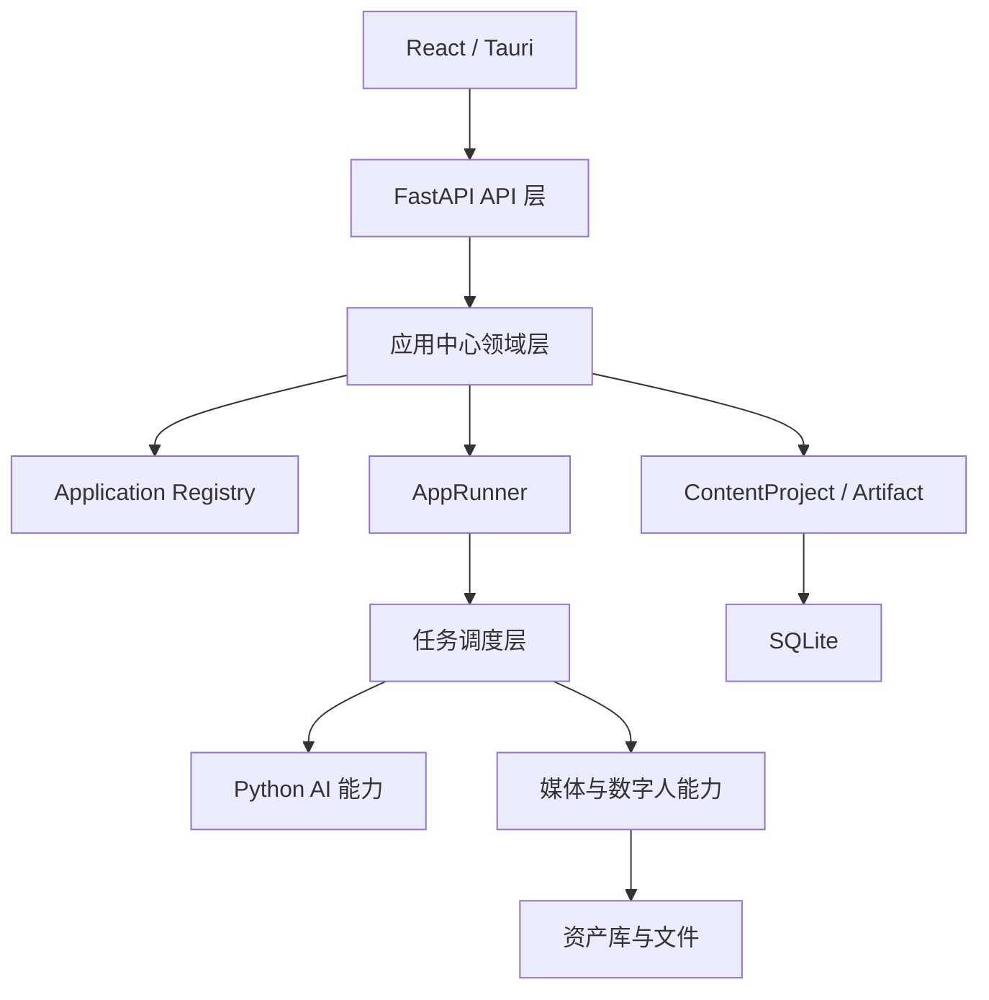
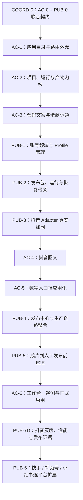

# Pixelle Video 应用中心与桌面自动发布整体协调实施方案

- 日期：2026-07-18
- 版本：v1.3（补充 Program 启动审查、Conditional Go 与 COORD-0 强制收敛项）
- 计划类型：上位 Program Master Plan
- 执行对象：Luna
- 执行模式：单执行者、默认严格串行、阶段门禁推进
- 实施主端：React/Tauri 桌面端 + FastAPI/Python 本地后端
- 实时进度台账：`docs/reviews/2026-07-18-application-center-publishing-program-progress.md`

## 0. 上位计划授权

本文件是以下两份主方案的进度控制与协调层：

1. `docs/superpowers/specs/2026-07-18-application-center-product-architecture-implementation-plan.md`；
2. `docs/reviews/2026-07-18-desktop-auto-publishing-refactor-implementation-plan.md`。

两份领域方案继续负责各自完整产品、技术、测试和 Gate 细节；本文件负责：

- 决定整体执行顺序；
- 冻结跨方案共同契约；
- 规定共享文件的修改所有权；
- 控制阶段进入和退出；
- 维护进度、阻塞、风险与回滚状态；
- 决定何时允许两条领域链路合流；
- 防止 Luna 跳阶段、重复造模型或在共享文件中互相覆盖。

默认严格串行。任何时刻只允许一个 Program Stage 为 `in_progress`。如果需要调整顺序，必须先在进度台账记录原因、影响、回滚点和批准结论，不得由 Luna 自行改变。

## 0.1 决策优先级

发生冲突时按以下顺序执行：

1. 用户最新明确指令与安全边界；
2. 已接受 ADR，特别是 `ADR-007`；
3. 本上位协调方案；
4. 应用中心主方案与桌面自动发布 V2 主方案；
5. 阶段 Gate 证据文档；
6. 代码注释、旧实现和历史测试。

若两份主方案的数据字段、状态或阶段顺序冲突，以本方案的共同边界和串行队列为准；但本方案不降低任何主方案的安全、真实平台证据、测试或回滚要求。

## 0.2 Program 启动审查结论

2026-07-19 快速评审结论为 `Conditional Go`：Luna 可以立即开始 `COORD-0（AC-0 + PUB-0）` 的 Entry、基线、ADR、Schema、fixture、迁移 dry-run 和回滚设计，但这不代表业务实现已放行。

在 `PG-A` 正式通过前，禁止：

- 开始 AC-1、PUB-1 或任一后续 Stage；
- 开发应用中心业务 UI 或真实应用 Executor；
- 重构发布账号 UI、平台 selector 或浏览器自动化；
- 把任一未过 live gate 的平台标记为 available；
- 修改最终人工发布安全边界。

### 启动前版本控制基线

当前规划修订包含已修改和未跟踪文档。Luna 在把进度台账改为 `in_progress` 前必须选择并记录以下一种基线方式：

1. 推荐：将本上位方案、应用中心方案、发布 V2 方案、ADR-007 和进度台账形成独立规划基线提交；
2. 如果暂不提交：在进度台账记录当前 branch、HEAD、`git status --short`、五份规划文档 SHA-256 和已有 diff 范围。

未建立基线不得开始修改业务代码或生成 Stage 提交。工作区已有改动继续视为用户资产，不得覆盖或回退。

### COORD-0 四项强制收敛

以下是启动评审已识别的已知差异，属于 COORD-0 明确交付，不需要 Luna 重新请求产品决策：

1. **发布包命名与事实源**：应用中心主方案中的 `publish_package` 和 `video + publish_package` 必须改为引用型 `publish_package_ref`；PublishPackage V2 只由发布领域持有；
2. **发布包通用来源**：发布 V2 示例 Schema 中 `source_session_id TEXT NOT NULL` 必须改为本方案 2.1 定义的 `source_kind + artifact version IDs + nullable legacy session`；
3. **唯一启动指令**：发布方案开头“可启动 PUB-0”只能解释为参与联合 COORD-0，不得解释为独立启动 PUB-0；本方案和进度台账是唯一日历执行来源；
4. **前端测试工具契约**：当前桌面端没有 `npm run test`、Vitest 或 Testing Library。PG-A 前必须记录测试工具选择、依赖引入 Stage、最小测试脚本和回滚影响；在工具建立前不得把未运行的前端组件测试写成 passed。
5. **旧 UI 可用文案例外**：现有 `StudioApp` 账号区域的四个平台“可用”文案仅作为 legacy V1 current baseline 记录，COORD-0 不修改业务 UI、不新增 V2 available 能力；PUB-1 账号领域首次允许将其修正为抖音 pilot、其余 unverified，并由 Gate-E 验证。该 legacy 文案不构成 V2 release state 或 live gate 通过。

同时修正执行认知：`CLAUDE.md` 中“没有 tests 目录/测试套件”的描述已过期。2026-07-19 基线实际可收集 367 项 Python 测试；Luna 必须以真实仓库、当前测试收集结果和本方案为准，并把文档偏差登记到 COORD-0 基线证据。

### 启动审查验证证据

截至 2026-07-19：

- 五份受控规划/台账文件均存在；
- Markdown 围栏、尾随空格与 `git diff --check` 通过；
- `uv run pytest --collect-only -q` 成功，收集 367 项测试；
- 发布、桌面配置、平台能力、安全和配置日志快速基线共 27 项测试通过；
- `desktop` 的 `npm run build` 通过；
- 现存 Pydantic V2 弃用警告登记为技术债，不阻塞 COORD-0。

以上证据只证明 Program 可以进入 COORD-0，不替代 AC-0、PUB-0 或 PG-A 要求的完整测试和证据。

## 0.3 Program 最终目标

整体交付完成后，用户能够：

1. 从应用中心创建门店营销文案；
2. 将文案继续生成标题、抖音图文或数字人口播视频；
3. 在“我的创作”找回项目和每个产物版本；
4. 将图文或视频产物固化为不可变发布包；
5. 选择真实本地平台账号；
6. 自动准备到抖音编辑器并逐项验证视频、标题、描述、话题和封面；
7. 最终停在 `waiting_for_human`，由用户亲自点击平台发布；
8. 应用重启、失败和重试后不丢项目、不重复上传、不混淆账号；
9. 关闭新版 feature flags 后仍可回到原有口播、复制素材和手工发布路径。

## 1. 受控基线

### 1.1 必须同时阅读的文件

Luna 每次开始 Program Stage 前必须阅读：

- 本上位方案；
- 实时进度台账；
- 当前 Stage 对应的领域主方案章节；
- `docs/adr/007-fastapi-current-and-saas-hybrid-architecture.md`；
- `CLAUDE.md`；
- 上一 Stage 的 Gate 证据；
- 当前 `git status --short`；
- 本 Stage 允许修改的现有实现和测试。

### 1.2 当前架构决策

当前阶段保留 FastAPI/Python 模块化单体：



本 Program 不授权 Express/NestJS 迁移、云端多租户、PostgreSQL、Redis 或对象存储建设。未来 SaaS 混合架构按 ADR-007 另立 Program。

### 1.3 P0 模型与应用管理决策

- P0 不建设应用管理员控制台、`AppControlPolicy` 数据库、RBAC、远程上下架或可视化模型路由，串行队列不增加 `APP-CONTROL` Stage；
- 应用上线继续由受信任 Registry、版本化 manifest、feature flag、领域 Gate 和 Program Gate 控制；
- P0 需要 LLM 的应用统一复用现有 `ConfigManager/PixelleVideoConfig.llm`、桌面配置页、`PixelleVideoCore.llm` 与 `LLMService`；
- 应用中心只增加不持有配置的 `AppLLMPort` 薄适配层，禁止建立第二套 API key/provider/model 配置；
- 未来管理后台增加 `AppControlPolicy` 与可视化 `ModelProfile/ModelRoutingPolicy`，不替换 Python 模型与媒体执行面。

管理后台登记为 `AC-ADMIN-CONTROL（P1/P2 Deferred Capability）`。以下任一条件出现时，必须由用户/产品负责人启动独立评审与 Program：应用数量明显增加；需要不发版远程上下架；出现组织、多人或多租户；套餐决定应用权益；需要按客户或渠道灰度；引入第三方应用或插件；需要运营审计或远程熔断。该触发器登记不改变当前 P0 串行队列，也不授权 Luna 自行提前实施。

## 2. 跨方案共同契约

以下契约必须在 `COORD-0` 冻结。未冻结前不得进入业务代码实现。

### 2.1 创作产物与发布包

职责固定为：

```text
Artifact / ArtifactVersion
    = 应用中心保存的可编辑创作产物及其版本

PublishPackage V2
    = 发布领域从一个或多个确定 ArtifactVersion/legacy session 固化出的不可变交付快照

PublishRun
    = 某个平台账号处理某个 PublishPackage 的一次自动化运行
```

禁止：

- 在应用中心和发布领域各自保存一份可独立修改的“发布包”；
- 发布运行直接读取 session 当前字段或前端临时状态；
- PublishPackage 创建后原地修改；
- Artifact 保存浏览器 profile、账号登录态或平台 DOM 证据；
- PublishRun 反向修改 ArtifactVersion。

应用中心中的 `publish_package` 产物必须收敛为引用型产物 `publish_package_ref`，最小内容：

```json
{
  "schema_version": 1,
  "package_id": "pkg_...",
  "publishing_schema_version": 2,
  "package_fingerprint": "sha256:...",
  "source_artifact_version_ids": ["av_..."],
  "created_at": "..."
}
```

PublishPackage V2 的来源不能继续只允许 `source_session_id NOT NULL`。共同来源契约：

```text
source_kind: artifact_versions | legacy_session
source_project_id: nullable
source_artifact_ids: []
source_artifact_version_ids: []
source_session_id: nullable
source_revision: required
```

规则：

- 新应用默认使用 `artifact_versions`；
- 现有 IP 口播在完成 AC-5 前可使用 `legacy_session` adapter；
- 同一 package 固定所有来源版本和媒体 hash；
- 来源版本变化只会使旧 package 失效或产生新 package，不热更新 active run；
- 发布数据库是 PublishPackage/Account/Run 的事实源；应用中心只保存 package 引用和项目展示关系。

### 2.2 领域运行与通用任务

事实源：

| 对象 | 事实源 | Generic Task 角色 |
| --- | --- | --- |
| `AppRun/RunAttempt` | `app_center.sqlite` | 任务中心进度投影 |
| `PublishRun/PublishRunStep` | `publishing.sqlite3` | 任务中心状态投影 |
| IP 口播步骤 | 现有 session + task | AC-5 后聚合到 AppRun |

共同规则：

- Generic Task 不是业务项目、产物或发布运行事实源；
- Task 清理不得删除 AppRun、PublishRun、Artifact 或 PublishPackage；
- AppRun 状态与 PublishRun 状态不强行使用同一个状态机；
- Task 投影必须表达 `waiting_user`，或使用明确的领域状态展示组件；
- `waiting_for_login`、`needs_attention`、`waiting_for_human` 不得映射为成功；
- TaskManager 的并发、取消和重试修改必须在单一共享提交中完成，不能由两条方案分别改写；
- 所有长任务支持 idempotency key、attempt、取消和重启后的确定状态。

### 2.3 数据库存储边界

| 数据库 | 负责 | 不负责 |
| --- | --- | --- |
| `app_center.sqlite` | 项目、上下文、AppRun、Artifact、Version、Handoff | 平台账号、Cookie、浏览器步骤 |
| `publishing.sqlite3` | PublishAccount、PublishPackage、PublishRun、Step、Event | 可编辑文案项目、应用定义 |
| `desktop_tasks.sqlite` | 通用任务投影与短期执行信息 | 长期项目和发布事实 |
| `asset_library.sqlite3` | 媒体与领域资产、revision、usage、snapshot | 创作版本和平台发布状态 |

数据库之间只通过稳定 ID 和 API/Repository 连接，不直接创建 SQLite 跨库外键。

### 2.4 路由与页面所有权

最终路由：

```text
/#/apps                    应用中心
/#/projects                我的创作
/#/projects/:projectId     项目详情
/#/runs/:runId             应用运行恢复
/#/publish                 统一发布中心
/#/publish/accounts        发布账号
/#/publish/runs/:runId     发布运行
```

共同规则：

- AC-1 建立 `AppShell/HashRouter` 后，后续页面只能注册路由，不再增加 `View` 条件分发；
- `/#/publish` 及其子路由由 publishing feature 唯一拥有；
- 应用中心只通过 `package_id` 或 `artifact_id` 导航到发布中心；
- `StudioApp.tsx` 在 AC-1/AC-2 迁移期由应用中心 Stage 独占；
- PUB-1/PUB-2/PUB-3 不修改全局导航和 `StudioApp.tsx`；
- PUB-4 才允许删除旧发布编排，且必须基于 AC-1 路由外壳。

### 2.5 API 与前端模块边界

- 应用中心 API：`/api/apps`、`/api/content-projects`、`/api/app-runs`、`/api/artifacts`；
- 发布 V2 API：`/api/publish/v2/accounts`、`packages`、`runs`；账号 `connect/verify/open` 在当前桌面实现中是带 capability 的同步 bounded probe，返回安全账号投影（HTTP 200）；异步连接任务与平台级真实探针不在 PUB-2，按 PUB-3/PUB-4 后续契约扩展。
- 新 feature 使用自己的 `api.ts/model.ts`，不得继续扩大根 `desktop/src/api.ts`；
- 共享 `ApiError`、runtime token 和下载能力可以从基础模块复用；
- 发布领域不读取前端提交的任意文件路径；
- 应用中心不读取或保存浏览器 profile 信息；
- OpenAPI/JSON Schema 是 Python、TypeScript 和未来服务间的契约来源。

### 2.6 Feature flags

应用中心和发布 V2 使用独立开关：

```text
VITE_APP_CENTER_SHELL
VITE_CONTENT_PROJECTS
VITE_CONTENT_APPS
VITE_DOUYIN_CAROUSEL
VITE_DIGITAL_HUMAN_IN_APP_CENTER
VITE_APP_CENTER_NEW_NAV

PIXELLE_PUBLISH_V2_ENABLED
VITE_PUBLISH_V2_ENABLED
PIXELLE_PUBLISH_PLATFORM_DOUYIN
PIXELLE_PUBLISH_PLATFORM_KUAISHOU
PIXELLE_PUBLISH_PLATFORM_SHIPINHAO
PIXELLE_PUBLISH_PLATFORM_XIAOHONGSHU
```

禁止用一个总开关同时控制两套领域数据和回滚。关闭发布 V2 不影响应用中心查看、编辑和导出产物；关闭应用中心不删除 PublishPackage、账号或发布运行。

### 2.7 模型配置与未来管理控制边界

P0 调用链固定为：

```text
Application Executor
→ AppLLMPort
→ PixelleVideoCore.llm / LLMService
→ ConfigManager.config.llm
→ local-default
```

共同规则：

- 所有需要 LLM 的 manifest 只声明 `llm` capability；
- `/api/apps/*/execute` 和前端状态不得传入或覆盖 provider、model、base URL、API key；
- `/api/apps/*/readiness` 复用现有 `config_manager.config.is_llm_configured()`；
- AppRun/RunAttempt 只保存 `prompt_version`、非敏感 `model_ref/provider_class` 和用量，不保存密钥或完整配置；
- P0 不按应用选择模型，不实现 fallback chain、模型 A/B 或套餐模型权益；
- 当前 feature flag 不冒充管理员动态控制面；任何应用/模型策略可视化管理均属于未来 Program；
- 未来控制面只向 Python 执行面提供版本化 `model_profile_ref`，不得在任务消息传输明文密钥；
- `local-default` 作为旧桌面兼容 profile 保留。

## 3. 严格串行执行队列

### 3.1 总队列



`PUB-7D` 表示先只对已过 PUB-D/PUB-F 的抖音执行 PUB-7 灰度门禁。后续 PUB-6 每完成一个平台，都要针对该平台重复对应的 PUB-7 性能、隐私、打包和回滚证据，不能一次灰度自动放行所有平台。

### 3.2 阶段计划表

工期是单 Luna 的计划区间，不是降低 Gate 的截止日期；真实平台登录、页面变化或外部服务不可用可以延长周期。

| Program Stage | 来源阶段 | 计划区间 | 主要结果 | Program Gate |
| --- | --- | ---: | --- | --- |
| `COORD-0` | AC-0 + PUB-0 | 3–5 人日 | 联合 ADR/schema/fixture/基线，解决共同领域契约并冻结模型复用/管理后台延期边界 | `PG-A` |
| `APP-SHELL` | AC-1 | 2–4 人日 | AppShell、HashRouter、应用目录 | `PG-B` |
| `APP-CORE` | AC-2 | 4–7 人日 | Project/AppRun/Artifact/Handoff 内核 | `PG-C` |
| `APP-TEXT` | AC-3 | 4–7 人日 | 文案与标题真实应用闭环 | `PG-D` |
| `PUB-ACCOUNT` | PUB-1 | 2–4 人日 | 多账号 profile、登录探测和恢复 | `PG-E` |
| `PUB-CORE` | PUB-2 | 3–5 人日 | Package/Run/Step/事件和异步 orchestrator | `PG-F` |
| `PUB-DOUYIN` | PUB-3 | 4–7 人日 | 抖音逐字段真实验证并停在人工发布前 | `PG-G` |
| `APP-CAROUSEL` | AC-4 | 5–8 人日 | 抖音图文计划、渲染、导出和发布引用 | `PG-H` |
| `APP-IPB` | AC-5 | 3–6 人日 | 现有口播接入项目、产物和 package 来源 | `PG-I` |
| `PUB-INTEGRATION` | PUB-4 | 3–5 人日 | 统一发布中心和生产链路交接 | `PG-J` |
| `E2E-DOUYIN` | PUB-5 | 2–3 人日 | 真实成片到 `waiting_for_human` | `PG-K` |
| `PROGRAM-ROLLOUT` | AC-6 + PUB-7D | 4–7 人日 | 工作台、遥测、打包、灰度和双向回滚 | `PG-L` |
| `PLATFORM-EXPANSION` | PUB-6 + 分平台 PUB-7 | 每平台 3–7+ 人日 | 快手、视频号、小红书独立放行 | `PG-M-<platform>` |

P0 主 Program 以 `PG-L` 为完成点；`PLATFORM-EXPANSION` 是正式上线后的扩展 Program，不阻塞抖音 P0。

## 4. Program Gate

### PG-A：联合契约冻结

必须同时满足：

- AC-0 与 PUB-0 所有 ADR/schema/fixture/迁移 dry-run 基线已交付；
- 两份主方案已把 `publish_package` 统一为 ArtifactVersion -> PublishPackage V2 -> PublishRun；
- PublishPackage 支持 artifact versions 和 legacy session 两种来源；
- AppRun、PublishRun 和 Generic Task 投影关系有共同契约；
- AppShell 与 `/#/publish` 路由所有权已冻结；
- `app_center.sqlite` 与 `publishing.sqlite3` 数据所有权已冻结；
- ADR-007 当前 FastAPI 边界通过评审；
- AppLLMPort 复用契约已冻结，`PixelleVideoConfig.llm` 是 P0 唯一模型配置事实源；
- 确认 P0 不增加管理员控制台、AppControlPolicy、独立模型配置库或 APP-CONTROL Stage，并已登记 AC-ADMIN-CONTROL P1/P2 的七项启动条件；
- 没有开始真实 UI/业务实现。

### PG-B：全局外壳稳定

- AC-B 全部通过；
- 原首页、口播、资产、发布、任务和配置均可从 HashRouter 到达；
- 关闭 AppShell flag 后旧体验可用；
- 应用 readiness 直接反映现有桌面 LLM 配置，不维护第二份模型状态；
- 发布 feature 已有路由占位，但没有重复页面或静态绿色账号。

### PG-C：应用中心事实源稳定

- AC-C 全部通过；
- Artifact/Version API 与 schema 冻结为 v1；
- fake executor 完成创建、失败、重试、保存、重启恢复闭环；
- Task 清理不影响项目和产物；
- 发布领域可通过正式 API/Repository fixture 读取受控 artifact manifest，而不是任意路径。

### PG-D：真实应用验证 App Core

- AC-D 全部通过；
- 文案到标题 handoff 可恢复、可版本化；
- prompt/output 非法状态不会污染项目；
- 应用中心内核已经由真实 structured LLM 应用验证，不再只靠 fake executor。

### PG-E：发布账号稳定

- PUB-B 全部通过；
- 不修改全局导航或应用中心 schema；
- profile 重启复用、账号隔离、锁和清理有真实证据；
- 没有 Cookie/二维码/凭证进入普通日志或数据库。

### PG-F：发布事实源稳定

- PUB-C 全部通过；
- PublishPackage 能从冻结 ArtifactVersion fixture 和 legacy session 创建；
- PublishRun 双击、重启、取消和恢复不重复任务；
- Generic Task 只做投影；
- app center 和 publishing 数据库没有重复的可编辑发布包。

### PG-G：抖音 Adapter 可用

- PUB-D 全部通过；
- 视频、标题、描述、话题、封面逐项有真实回读证据；
- 页面异常、登录过期、验证码和窗口关闭安全停手；
- FinalActionGuard 证明最终发布从未自动点击；
- 未通过平台仍为 `unverified/pilot`。

### PG-H：图文产物可交接

- AC-E 全部通过；
- 3/5/8 页渲染和导出完整；
- `carousel_package` 可以生成 PublishPackage V2 fixture；
- 单页重渲染产生新 ArtifactVersion，并使旧发布包失效；
- 发布 V2 关闭时仍能下载/复制图文包。

### PG-I：口播产物可交接

- AC-F 全部通过；
- 旧 session 恢复和新 AppRun 聚合均通过；
- 视频、封面、publish_copy 成为稳定 ArtifactVersion；
- legacy session 发布包 adapter 与新 artifact 来源 fingerprint 一致；
- 不产生重复视频或 publish package ref。

### PG-J：统一发布中心

- PUB-E 全部通过；
- `/#/publish` 是唯一发布页面；
- `StudioApp.tsx` 和旧 PublishWorkspace 不再各自编排发布；
- 应用中心从 package/artifact 跳转并恢复相同 run；
- Adapter 失败不影响项目、资产、下载和复制。

### PG-K：完整抖音 E2E

- PUB-F 全部通过；
- 项目 -> 文案/标题 -> 口播成片 -> PublishPackage -> PublishRun -> 抖音编辑器链路通过；
- 图文 -> PublishPackage -> 发布中心的契约 E2E 通过；
- 应用和 sidecar 重启后不丢 run，不重复扫码和上传；
- 自动化终点为 `waiting_for_human`。

### PG-L：P0 正式放行

- AC-G 与抖音范围 PUB-H 全部通过；
- 工作台使用业务项目并能继续创作/发布；
- 应用中心和发布 V2 可独立开关与回滚；
- macOS/Windows 构建、迁移、性能、隐私和恢复证据通过；
- 至少一个稳定观察窗口无 P0/P1 数据或安全问题；
- P0 正式放行报告签署。

### PG-M-<platform>：逐平台放行

每个平台独立满足 PUB-G-<platform> 与对应 PUB-7 灰度证据。一个平台通过不能改变其他平台 release state。

## 5. 共享文件修改所有权

### 5.1 所有权矩阵

| 文件/领域 | 首次允许修改 Stage | 后续允许修改 Stage | 规则 |
| --- | --- | --- | --- |
| `desktop/src/StudioApp.tsx` | APP-SHELL | APP-CORE、APP-IPB、PUB-INTEGRATION、PROGRAM-ROLLOUT | 每阶段先收缩，不新增第二套编排 |
| `desktop/src/App.tsx` / AppShell / Router | APP-SHELL | PUB-INTEGRATION、PROGRAM-ROLLOUT | 路由基础由应用中心先建立 |
| `desktop/src/features/publishing/*` | PUB-ACCOUNT | PUB-CORE、PUB-DOUYIN、PUB-INTEGRATION | 发布领域独占 |
| `desktop/src/features/app-center/*` | APP-SHELL | APP-CORE、APP-TEXT、APP-CAROUSEL | 应用中心独占 |
| `desktop/src/api.ts` | COORD-0 | 仅兼容接线 | 新功能 API 必须进入 feature-local 模块 |
| `desktop/src/featureFlags.ts` | APP-SHELL | 各 Stage 仅添加自己开关 | 不改其他领域默认值 |
| `api/tasks/models.py` | APP-CORE | PUB-CORE | 共同状态契约一次评审后再改 |
| `api/tasks/manager.py` | APP-CORE | PUB-CORE、PROGRAM-ROLLOUT | 并发/恢复只保留一套实现 |
| `api/tasks/persistence.py` | APP-CORE | PUB-CORE | Generic Task 只做投影 |
| `api/routers/ip_broadcast.py` | APP-IPB | PUB-INTEGRATION | 先应用化，再发布交接 |
| `pixelle_video/services/ip_broadcast_workflow.py` | APP-IPB | PUB-INTEGRATION | 不允许两个 Stage 同时改第 6 步 |
| `pixelle_video/services/publish/*` | PUB-ACCOUNT | PUB-CORE、PUB-DOUYIN、PUB-INTEGRATION | 发布领域独占 |
| `pixelle_video/app_center/*` | APP-CORE | APP-TEXT、APP-CAROUSEL、APP-IPB | 应用中心领域独占 |
| `pixelle_video/config/*` | 不计划修改 | 仅经批准的 Change Request | P0 复用现有 `PixelleVideoConfig.llm`，不扩成应用级模型库 |
| `pixelle_video/services/llm_service.py` | 不计划修改 | 仅兼容性缺陷修复 | 应用通过 AppLLMPort 调用，不为各应用增加 provider 分支 |
| `api/routers/desktop.py` 与现有 LLM 设置 UI | APP-SHELL 仅迁移接线 | PROGRAM-ROLLOUT 回归 | 保持当前脱敏配置契约，不增加管理员/按应用模型 UI |
| `docs/contracts/publishing/*` | COORD-0 | PUB-CORE、PUB-DOUYIN | 破坏性修改必须升级 schema |
| `docs/contracts/app-center/*` | COORD-0 | APP-CORE、应用 Stage | 破坏性修改必须升级 schema |

### 5.2 共享文件变更规则

- 开始 Stage 时把允许修改文件记录到进度台账；
- 发现必须修改未授权共享文件时停止编码，先提交 Change Request；
- 不以“顺手重构”为理由扩大 Stage；
- 不回退、覆盖或格式化用户/其他阶段已有未提交改动；
- 大文件迁移采用“先接新组件与测试，再删除旧逻辑”；
- `StudioApp.tsx`、TaskManager 和 IP workflow 每个 Stage 完成后必须有专项回归；
- Schema 冻结后，兼容增加字段使用 optional/default；破坏性变化升级版本并提供 adapter。

## 6. Luna 进度控制节奏

### 6.1 Stage 开始

Luna 必须先完成：

1. 读取主方案、上位方案、进度台账和上一 Gate；
2. 运行 `git status --short`，记录已有改动；
3. 把当前 Stage 从 `not_started` 改为 `in_progress`；
4. 写明 entry criteria 是否满足；
5. 列出允许修改的文件；
6. 列出先失败的测试/fixture；
7. 记录回滚锚点和 feature flag 初始值；
8. Entry 不满足时停在 `blocked`，不能开始实现。

### 6.2 Stage 实施

固定节奏：

```text
契约/失败测试
→ 最小领域实现
→ API/Repository 集成
→ 前端接入
→ 错误/恢复/安全路径
→ 定向测试
→ 相关全量回归
→ Gate 证据
→ 进度台账
```

真实平台 Stage 额外要求：

- fixture 测试先行；
- visible/headful smoke；
- 用户自行登录/扫码；
- 自动化不得跨越最终人工发布边界；
- 截图、日志和诊断必须脱敏；
- 没有回读证据就停在 `needs_attention`。

### 6.3 Stage 结束

只有以下全部完成才可进入 `gate_review`：

- 本 Stage 领域 Gate 全部满足；
- Program Gate 全部满足；
- 指定测试和相关全量测试已运行；
- 失败、取消、重启、回滚证据已记录；
- feature flag 默认状态符合方案；
- 没有未解释的测试跳过；
- 没有新增跨领域重复事实源；
- Gate 证据文档和进度台账已更新。

只有 Gate 结论为 `passed` 后，下一 Stage 才能改为 `in_progress`。

### 6.4 状态定义

| 状态 | 含义 |
| --- | --- |
| `not_started` | Entry 尚未检查 |
| `in_progress` | 唯一允许修改代码的当前 Stage |
| `waiting_user` | 等待用户登录、扫码、授权或真实平台确认 |
| `blocked` | Entry/外部依赖/安全条件不满足 |
| `gate_review` | 实现停止，等待证据评审 |
| `passed` | Gate 通过，可进入下一阶段 |
| `failed` | Gate 未通过，必须修复或回滚 |
| `rolled_back` | 已执行阶段回滚，后续需重新进入 |
| `skipped` | 仅用户明确批准后允许，必须记录替代证据 |

默认禁止 `skipped`。

## 7. 变更、阻塞与风险管理

### 7.1 Change Request 触发条件

出现以下情况必须先写 Change Request：

- 修改共同契约；
- 修改已冻结 Schema 的必填字段或语义；
- 改变严格串行顺序；
- 同时启用两个 Stage；
- 引入新基础设施或依赖；
- 修改最终人工发布安全边界；
- 从本地单用户扩大为多用户/云端；
- 需要删除 V1、旧 profile、旧 session 或历史数据；
- 需要修改当前 Stage 未授权的共享文件。

Change Request 至少记录：问题、证据、备选方案、选定方案、影响 Stage、数据迁移、测试、回滚和批准人。

### 7.2 阻塞处理

- RunningHub 余额不足：媒体来源真实 E2E 标记 `blocked`，不能用 fixture 冒充；其他不依赖证据不得自动越过当前串行 Gate；
- 平台登录/验证码：标记 `waiting_user`，用户完成后从同一 Stage 恢复；
- 平台页面变化：adapter 降为 `degraded`，保留手工回退，修复并重跑 live gate；
- 工作区已有冲突改动：停止，记录文件和重叠范围，不覆盖；
- 测试环境不可用：保留失败日志，不能用源码字符串断言替代 E2E；
- 外部证据确实长期不可得：由用户决定是否调整串行顺序，不由 Luna 自行跳过。

### 7.3 Top Program 风险

| 风险 | 控制 |
| --- | --- |
| 两套发布包 | ArtifactVersion -> PublishPackage V2 单向固化；应用中心只保存 ref |
| 两套任务事实 | AppRun/PublishRun 各自权威，Generic Task 只投影 |
| `StudioApp` 冲突 | APP-SHELL 先完成；PUB-4 才接全局页面 |
| 口播第 6 步重复修改 | AC-5 先应用化，PUB-4 后发布交接 |
| 平台假成功 | evidence probe、StepResult、FinalActionGuard 和 live gate |
| Schema 漂移 | COORD-0 冻结、版本化和 fixture |
| 串行过程失去状态 | 每 Stage 强制更新实时进度台账 |
| 提前清理旧实现 | 双向 feature flag 和稳定观察窗口 |
| 过早引入 SaaS 架构 | ADR-007 约束 |
| 每个应用另建模型配置 | AppLLMPort 统一复用 ConfigManager/LLMService；请求、manifest 和 run 禁止携带密钥 |
| 管理后台范围提前进入 P0 | 明确延期 AppControlPolicy/ModelRoutingPolicy，不增加 APP-CONTROL Stage |

## 8. 测试与回归层级

每个 Stage 按风险逐级运行：

1. Schema/fixture；
2. Repository/state machine；
3. API contract；
4. 前端组件；
5. feature-level integration；
6. 共享 Task/AppShell/IP workflow 回归；
7. 桌面 E2E；
8. 真实平台 smoke；
9. 打包版、迁移、性能和回滚。

Program 级不可缺少的 E2E：

```text
文案 -> 标题 -> 保存项目
文案 -> 抖音图文 -> 导出 -> PublishPackage
文案 -> 数字人口播 -> 视频/封面 -> PublishPackage
PublishPackage -> 账号 -> PublishRun -> 抖音 waiting_for_human
现有 LLM 设置修改 -> 下一次应用调用使用新 local-default -> 旧项目不变
应用重启 -> 恢复项目、任务、账号和 run
关闭发布 V2 -> 仍可复制/下载
关闭应用中心 -> 旧口播与发布回退可用
```

## 9. 交付文档结构

建议每个 Program Gate 创建：

```text
docs/reviews/application-publishing-program/
├── PG-A-contract-freeze.md
├── PG-B-app-shell.md
├── PG-C-app-core.md
├── PG-D-app-text.md
├── PG-E-publish-accounts.md
├── PG-F-publish-core.md
├── PG-G-douyin-adapter.md
├── PG-H-carousel.md
├── PG-I-ip-broadcast.md
├── PG-J-publish-integration.md
├── PG-K-douyin-e2e.md
├── PG-L-p0-release.md
└── change-requests/
```

领域主方案要求的 Gate 证据仍需交付；Program Gate 可以引用领域证据，不能用一份空摘要替代。

## 10. Luna 统一启动指令

```text
你正在执行 Pixelle Video《应用中心与桌面自动发布整体协调实施方案》定义的严格串行 Program。

先阅读：
1. 上位协调方案；
2. 实时进度台账；
3. 当前 Stage 对应的应用中心或自动发布 V2 主方案；
4. ADR-007、CLAUDE.md、上一 Gate 证据；
5. 当前 git status 和相关实现。

以进度台账中唯一的 current_stage 为准。不得同时实施两个 Stage，不得跳过 Program Gate，不得在未记录 Change Request 时修改串行顺序或共同契约。工作区已有改动属于用户，禁止覆盖、回退或顺手整理。

跨方案边界固定：ArtifactVersion 是可编辑创作产物；PublishPackage V2 是发布领域不可变快照；PublishRun 是账号处理发布包的运行；Generic Task 只做投影。应用中心数据库和发布数据库独立，通过稳定 ID 连接。P0 保留 FastAPI/Python，不引入 Express/NestJS。

模型与管理边界固定：P0 不建设管理员控制台或按应用模型配置；所有应用通过 AppLLMPort 复用现有 ConfigManager/PixelleVideoCore.llm/LLMService 和 local-default。禁止在 manifest、请求、任务、run 或 artifact 中保存模型密钥。未来管理后台只增加 AppControlPolicy/ModelProfile/ModelRoutingPolicy 可视化控制，Python 继续负责实际模型调用。

每个 Stage 按“失败测试/契约 -> 最小实现 -> 集成 -> 恢复与安全 -> 定向测试 -> 相关全量回归 -> Gate 证据 -> 更新进度台账”执行。没有证据不得标记 passed；没有 passed 不得开始下一 Stage。

真实平台自动化必须 visible/headful、由用户自行登录，并停在 waiting_for_human。任何无法回读证明的动作都进入 needs_attention；任何最终发布语义动作都由 FinalActionGuard 拒绝。

完成当前 Stage 后只提交当前 Stage 的结果、测试、风险、回滚和 Gate 结论，不提前实现下一阶段。
```

## 11. Program Definition of Done

P0 Program 只有同时满足以下条件才完成：

- `PG-A` 至 `PG-L` 全部通过；
- 四个 P0 应用使用统一 Registry、Project、Run、Artifact 和 Handoff；
- PublishPackage 只有发布领域一个事实源；
- 发布包同时支持图文、视频和 legacy session adapter；
- 抖音账号登录态可持久化，账号不串号；
- 抖音视频、标题、描述、话题和封面有真实验证证据；
- 自动化永远停在人工最终发布前；
- 项目、产物、发布运行和通用任务职责不混淆；
- 重启、取消、失败、重试不丢数据、不重复上传；
- 应用中心和发布 V2 可以独立回滚；
- 原口播、资产、下载和复制素材能力不回归；
- macOS/Windows 构建、迁移、性能、隐私和打包证据通过；
- 实时进度台账、领域 Gate 和 Program Gate 证据完整；
- 需要 LLM 的应用全部复用现有 local-default，没有第二套 API key/provider/model 配置或直接 SDK client；
- 应用管理员控制和可视化模型策略保持延期，未来策略接入点已保留；
- 未提前引入 SaaS 混合架构；
- 产品负责人签署 `PG-L` 正式放行结论。

快手、视频号和小红书不阻塞 P0，但必须分别通过 `PG-M-<platform>` 后才可显示 available。
