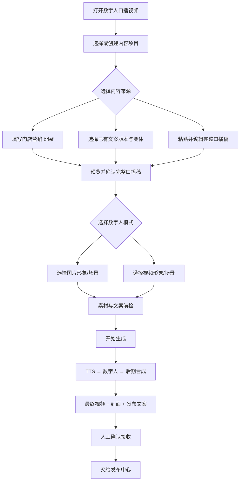
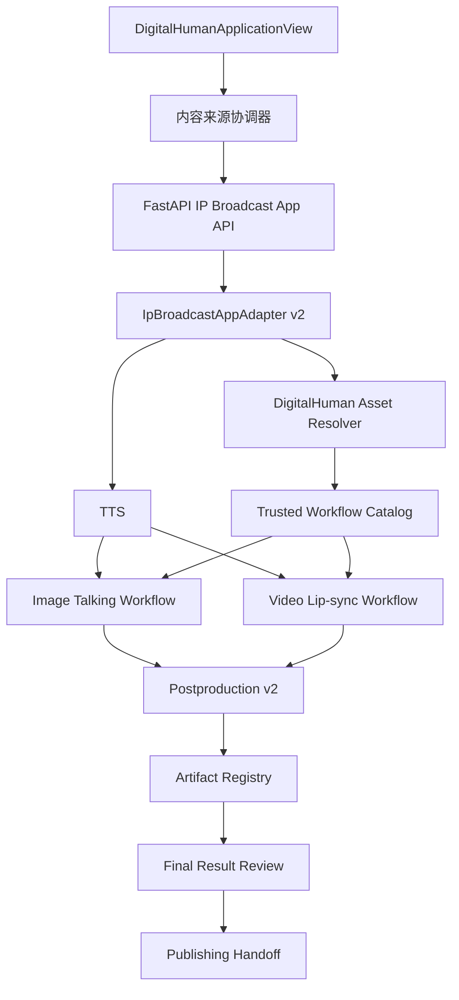

# Pixelle Video 数字人双模式与成片质量优化实施方案

- 日期：2026-07-24
- 版本：v1.0
- 状态：Active（已登记 CR-DH-DUAL-MODE-001，当前执行 DH-DUAL-0 Entry）
- 交付对象：Luna
- 实施主端：React/Tauri 桌面端 + FastAPI/Python 本地后端
- 对应应用：`builtin.digital-human-video`
- 上位方案：`2026-07-18-application-center-publishing-program-master-plan.md`
- 领域方案：`2026-07-18-application-center-product-architecture-implementation-plan.md`
- 架构决策：`ADR-007`、`ADR-008`
- 实时进度台账：`docs/reviews/2026-07-18-application-center-publishing-program-progress.md`

## 0. 执行结论

数字人口播应用升级为同时支持两种生产模式：

1. **图片数字人**：人物图片 + 口播文案/配音，生成会说话的数字人视频；
2. **视频数字人**：人物视频 + 口播文案/配音，保留原视频的动作、镜头和背景，通过唇形同步生成新口播视频。

两种模式共用同一条应用中心事实链：

```text
ContentProject
→ 内容来源与固定版本
→ 数字人素材与固定 revision
→ AppRun / RunAttempt
→ TTS
→ 图片数字人或视频唇形同步
→ 后期合成、字幕、封面、发布文案
→ Artifact / ArtifactVersion
→ 人工确认
→ 发布中心
```

本次不是重写现有口播系统。继续复用已经跑通的 `IpBroadcastWorkflow`、TTS、RunningHub、FFmpeg、模板、Artifact 和发布交接，只增加双模式契约、受控工作流路由、应用中心完整交互和质量优化。

本方案同时解决当前已确认的不足：

| 当前问题 | 已确认原因 | 本方案处理 |
| --- | --- | --- |
| 用户看不到字幕 | 应用中心未展示最终成片，旧流程还会展示未加字幕的 `digital_human_video` | 默认只展示 `final_video`，明确标记“最终成片（含字幕）”；原始视频收进诊断折叠区 |
| 字幕偏小、不够醒目 | 现有 `boss_clean` 在 1080×1920 下可能使用 28px 字号 | 新运行固定字幕样式 v2，使用更大的字号、字重、描边和双行限制 |
| 图片数字人动作少 | 图片驱动只能从静态图推断动作，现有稳定工作流偏保守 | 保留稳定模式，增加高自然度候选工作流；明确视频数字人是动作自然度优先的推荐模式 |
| 人物边缘、背景有轻微瑕疵 | 生成式图片驱动会重建人物边缘和背景 | 增加素材质量前检、受控提示词和工作流 A/B；需要保留真实动作/背景时默认推荐视频模式 |
| 封面文案太长 | 当前封面标题可能直接回退到脚本前 40 字，副标题可达 80 字 | `script`、`publish_title`、`cover_title` 分离；封面标题可编辑并有独立长度与行数规则 |
| 测试文案太泛 | 当前 `blank_project.goal` 被直接当作最终口播稿 | “自定义文案”和“自动生成文案”分离；自动生成复用门店营销文案应用，不在媒体适配器内复制 LLM 逻辑 |
| 选定标题后内容太短 | 当前 `selected_title` 可直接成为完整 `final_script` | 新运行中标题只能决定标题/封面，不再单独替代完整口播稿；必须同时固定关联文案版本 |

## 0.1 与总协调台账的关系

本方案属于已归档 `APP-IPB/AC-5` 之后的增强变更，不把旧 Gate 证据改写为新能力已通过。

Luna 开始业务代码前必须：

1. 在实时进度台账登记 `CR-DH-DUAL-MODE-001`；
2. 记录当前 branch、HEAD、`git status --short` 和本方案 SHA-256；
3. 明确当前 `PROGRAM-ROLLOUT` 外部边界如何处理；
4. 由协调层把 `current_stage` 切换为 `DH-DUAL-0`；
5. `DH-DUAL-0` Entry Gate 通过后才允许业务实现。

如果台账仍为其他 Stage，Luna 只能阅读本方案和准备 Entry 证据，不能绕过 `current_stage` 单独修改业务代码。

执行继续遵守：

- 同一时间只有一个 Stage 为 `in_progress`；
- 每个大批次完成实现、定向测试、必要构建和证据后，启动独立只读六维审查；
- 审查问题形成修复清单交回主执行线程，修复后复验，直到 P0/P1 为 0；
- 不把模拟、fixture、边界证据或一次 Provider 成功误报为完整生产稳定性；
- 真实 RunningHub 调用前先完成所有本地确定性验证，不进行无分析的连续重试；
- 最终平台发布按钮继续禁止自动点击。

## 0.2 本期目标与非目标

### 本期必须完成

- 图片、视频两种数字人素材模式可在同一应用中选择；
- 服务端根据资产真实媒体类型和受信工作流目录进行强校验；
- 自定义文案、自动生成文案、已有文案三类内容入口清晰可用；
- 选定标题必须与完整文案版本配套，不能只拿标题生成口播；
- 两种模式都经过 TTS、数字人、后期合成、字幕、封面和 Artifact 登记；
- 结果页默认预览最终成片、封面和发布文案；
- 图片模式与视频模式分别完成一次受控真实 Provider smoke；
- 重启恢复、失败重试、幂等、人工接收和最终发布停手均有证据；
- 旧 `1.0.0` AppRun、旧 session 和旧 `/ip` 入口保持可恢复。

### 本期明确不做

- 不自动点击抖音、快手、视频号或小红书最终发布按钮；
- 不建设管理员后台、RBAC、套餐、支付或多租户；
- 不允许前端提交任意 workflow 文件路径、Provider URL 或密钥；
- 不为图片模式承诺真人级大幅动作；
- 不引入第三套数字人 Provider；
- 不做复杂专业剪辑时间线；
- 不自动抓取互联网营销文案；
- 不在没有真实 A/B 证据时替换当前已验证的图片稳定工作流；
- 不为了本方案迁移 FastAPI 到 Node.js/NestJS。

## 1. 当前实现基线

### 1.1 已有可复用能力

当前代码已经具备以下基础：

- `DigitalHumanApplicationView.tsx` 已有项目、内容来源、数字人资产、AppRun、重试和人工接收；
- `IpBroadcastAppAdapter` 已绑定 ContentProject、AppRun、legacy session、Task 投影和 Artifact；
- `execute_provider` 已跑通 `voice → digital_human → postproduction`；
- `digital_combination.json` 图片模式已完成一次真实 RunningHub 验证；
- `digital_lip_sync_video.json` 已定义“视频形象 + 新音频”的唇形同步 AI App；
- `digital_talk_image_prompt.json` 和 `digital_talk_fast_720p.json` 已定义可控图片模式候选；
- 企业资产库的数字人 profile/scene 已能记录图片或视频媒体类型；
- 后期链路已能生成 `final_video`、`cover` 和 `publish_copy`；
- `final_video` 已具备烧录字幕能力；
- 发布中心已经可以消费不可变 ArtifactVersion/PublishPackage。

### 1.2 当前不能直接宣称双模式完成的原因

现有底层存在视频工作流文件，不等于应用已经支持视频模式。当前仍缺：

- 应用中心没有图片/视频模式选择；
- 资产选择器没有按所选场景真实媒体类型完成双向过滤和阻断；
- 应用输入没有稳定的 `digital_human_mode` 业务字段；
- 前端可能传入 `digital_human_workflow`，服务端尚未形成只允许受信目录映射的完整契约；
- 应用中心未展示最终视频、封面和发布文案；
- 视频模式未完成真实 Provider、Artifact、恢复和视觉质量证据；
- 当前 blank goal、选定标题和封面标题的语义不满足真实运营使用。

## 2. 产品定义与用户流程

## 2.1 两个维度必须分开

应用界面存在两个互不替代的选择维度：

### 内容来源

- `自动生成文案`
- `选择已有文案`
- `粘贴自定义文案`

### 数字人素材模式

- `图片数字人`
- `视频数字人`

禁止继续使用一个模糊的 `source_mode` 同时表达内容来源和数字人素材类型。

## 2.2 模式说明

| 模式 | 输入 | 核心能力 | 优点 | 客观限制 | 默认推荐场景 |
| --- | --- | --- | --- | --- | --- |
| 图片数字人 | 清晰人物图片 | 从静态图生成口型和轻微动作 | 素材门槛低、制作快 | 动作较少，复杂发丝/背景可能有生成瑕疵 | 日常知识分享、活动通知、短口播 |
| 视频数字人 | 连续真人视频 | 保留原动作/镜头/背景，替换为新音频口型 | 更自然、更接近真人原片 | 需要先准备合格视频，生成成本可能更高 | 老板 IP、专业观点、高质量门店营销 |

视频数字人是质量优先的推荐方向。`PG-DH-E` 已完成一次真实视频 smoke 和 bounded visual gate，现为 `stable` workflow，但 `default_mode=false`，因此仍由图片稳定模式作为默认；Program 级独立六维总审查仍按用户要求延后。首次进入仍可根据最近使用记录和可用资产给出建议，但不得绕过 release gate。

## 2.3 推荐用户主流程



### 自动生成文案

自动生成不是把一句“制作目标”直接当口播稿。用户至少提供：

- 行业/门店；
- 产品或活动；
- 目标顾客；
- 核心卖点；
- 优惠或行动指令；
- 希望时长；
- 语气。

应用复用 `builtin.marketing-copy` 的结构化生成和 ArtifactVersion，不在数字人 Adapter 中复制第二套 prompt。生成后先展示候选，用户选定或编辑，再通过 typed handoff 进入数字人 AppRun。

### 选择已有文案

用户必须能看见：

- 文案名称；
- 版本号；
- 生成/编辑时间；
- 变体名称；
- 文案正文预览；
- 预计口播时长。

默认选择该产物的当前版本，但用户可以切换历史版本。AppRun 创建后固定 `artifact_version_id + variant_index`，后续源文案变更不能热更新当前 Run。

### 粘贴自定义文案

输入框名称必须是“口播文案”，不能再叫“制作目标”。该内容被原样作为脚本事实，不经过隐式 LLM 改写。用户可以显式点击“帮我优化”，该动作必须产生新的可审查文案版本。

### 选定标题

标题不能单独充当口播稿。新流程中：

- 标题只写入 `publish_title` 和默认 `cover_title` 候选；
- 口播正文必须来自同项目的文案 ArtifactVersion 或自定义脚本；
- 如果标题 Artifact 能追溯到来源文案，默认带回该文案版本；
- 无法追溯时要求用户补选完整文案；
- 旧 `selected_title` AppRun 只做兼容恢复，不继续作为新运行默认入口。

## 2.4 页面结构

页面按业务步骤组织，不向用户暴露 AppRun 技术概念：

1. `准备内容`
2. `选择数字人`
3. `设置成片`
4. `开始生成`
5. `检查结果`

主动作统一为“开始生成”，不再要求普通用户先理解并点击“创建应用运行”再点击“生成数字人视频”。实现上仍先幂等创建 AppRun，再排队执行；前端把它包装为一次明确用户意图。

如果 AppRun 已创建但尚未执行，重启后恢复到“准备开始生成”；如果 Provider 已提交，则恢复运行状态，不创建第二个 Run 或第二个 Provider 任务。

## 3. 目标技术架构



边界保持不变：

- FastAPI 只负责请求协议和安全响应；
- `IpBroadcastAppAdapter` 负责输入归一化、旧 session 绑定、幂等、恢复和运行事实；
- 资产 resolver 负责把稳定资产 ID 解析为受信文件与真实媒体元数据；
- workflow catalog 负责模式到受信工作流的映射；
- `DigitalHumanService` 负责 Provider 调用；
- `IpBroadcastWorkflow` 负责音频、数字人和后期步骤；
- Artifact 是用户可继续使用的结果事实；
- PublishPackage 仍只由发布领域创建。

## 3.1 V2 输入契约

新运行使用语义明确的嵌套输入。示例：

```json
{
  "schema_version": 2,
  "project_id": "project_...",
  "content_source": {
    "mode": "custom_script",
    "script": "完整口播文案",
    "source_artifact_version_id": null,
    "selected_variant_index": null,
    "title_artifact_version_id": null
  },
  "digital_human": {
    "mode": "image_talking",
    "portrait_id": "digital_human_...",
    "scene_id": "scene_...",
    "asset_revision_id": "revision_...",
    "workflow_profile": "stable",
    "motion_prompt": "轻微自然点头，镜头稳定"
  },
  "voice": {
    "voice_id": null,
    "speed": 1.0
  },
  "delivery": {
    "cover_title": "开店最容易踩的三个坑",
    "publish_title": "开店前先避开这三个坑",
    "subtitle_preset": "readable_v2",
    "template_id": "boss_clean"
  }
}
```

### 内容来源枚举

| `content_source.mode` | 必需事实 |
| --- | --- |
| `custom_script` | `script` |
| `copywriting_artifact` | `source_artifact_version_id`、`selected_variant_index` |
| `generated_marketing_copy` | 上游生成完成后的 `source_artifact_version_id`、`selected_variant_index` |
| `title_plus_copywriting` | `title_artifact_version_id`、`source_artifact_version_id`、`selected_variant_index` |

`generated_marketing_copy` 在数字人执行前必须已经转化为固定 ArtifactVersion。媒体执行器不直接接收未完成的 brief。

### 数字人模式枚举

| `digital_human.mode` | 资产媒体类型 | 允许工作流能力 |
| --- | --- | --- |
| `image_talking` | `image` | `image_talking` |
| `video_lipsync` | `video` | `video_lipsync` |

前端传入的 mode 只表达用户意图，服务端必须重新读取：

- profile；
- scene；
- source asset；
- source revision；
- MIME；
- width/height；
- duration；
- sha256；
- status。

任一事实不匹配即 fail-closed，不以文件扩展名或前端标签代替服务端验证。

## 3.2 V1 兼容

新实现不能破坏已有 `1.0.0` Run：

- `blank_project.goal` 归一化为 `custom_script.script`；
- `copywriting + source_artifact_version_ids + selected_variant_index` 归一化为 `copywriting_artifact`；
- 旧 `selected_title` Run 允许恢复和完成，但新建 V2 Run 时必须补齐正文来源；
- 旧 `portrait_id`、`digital_human_scene_id` 继续可读；
- 旧运行已固定 `digital_human_workflow` 时只能恢复原受信工作流，不能静默切换；
- 新运行不接受前端任意 `digital_human_workflow` 路径。

推荐把应用登记版本升级到 `1.1.0`，并让 Adapter 显式支持 `1.0.0` 恢复和 `1.1.0` 新建。不能简单替换全局常量后让旧幂等重放出现 `IDEMPOTENCY_CONFLICT`。

当前 Registry 内置 manifest 仍为 `1.0.0`。`DH-DUAL-0` 只登记迁移事实，不修改 Registry；`DH-DUAL-1` 必须补齐 `1.0.0 → 1.1.0` manifest/input-schema mapping、旧 Run resume fixture 和幂等回归，mapping 未通过前不得创建 V2 新 Run。

如果当前 Registry 无法同时描述兼容版本，先增加 `supported_input_schema_versions` 和 `supported_resume_app_versions`，不通过删除旧版本解决问题。

## 3.3 受信工作流目录

前端只提交 `workflow_profile`，不得提交磁盘路径或 RunningHub App ID。

服务端目录最小字段：

```json
{
  "profile": "stable",
  "mode": "image_talking",
  "release_state": "pilot_verified",
  "workflow_key": "internal-key",
  "portrait_media_type": "image",
  "supports_prompt": false,
  "supports_duration": false,
  "supports_width": false,
  "supports_height": false,
  "quality_tier": "standard"
}
```

首批映射建议：

| 业务模式 | 用户档位 | 内部候选 | 初始策略 |
| --- | --- | --- | --- |
| 图片数字人 | 稳定生成 | `digital_combination.json` | 已有真实证据，继续作为默认 |
| 图片数字人 | 动作自然 | `digital_talk_image_prompt.json` 或 `digital_talk_fast_720p.json` | 完成 A/B Gate 后才展示 |
| 视频数字人 | 自然口型 | `digital_lip_sync_video.json` | 已完成一次真实 smoke，转为 `stable`；`default_mode=false`，不作为默认 |

workflow JSON 内的路径、webapp ID 和节点参数仅在 Python 内部使用。API 响应可以返回业务能力和 release state，不能返回密钥或任意本地绝对路径。

## 3.4 工作流路由规则

1. `image_talking + image asset + stable profile` 才能进入图片稳定工作流；
2. `video_lipsync + video asset + natural profile` 才能进入视频唇形同步工作流；
3. mixed profile 中必须固定具体 scene 的媒体类型，不能只看 profile 封面；
4. 工作流要求与资产不匹配时返回稳定错误码；
5. Run 创建后固定 mode、asset revision、workflow profile 和内部 workflow revision；
6. retry 复用同一固定输入，不因 Registry 后续变化静默换工作流；
7. 用户主动更换模式、素材、文案或工作流档位时创建新 AppRun，不篡改已有运行事实。

建议错误码：

```text
DIGITAL_HUMAN_MODE_REQUIRED
DIGITAL_HUMAN_MODE_INVALID
DIGITAL_HUMAN_ASSET_REQUIRED
DIGITAL_HUMAN_SCENE_REQUIRED
DIGITAL_HUMAN_ASSET_NOT_READY
DIGITAL_HUMAN_ASSET_REVISION_MISMATCH
DIGITAL_HUMAN_MEDIA_TYPE_MISMATCH
DIGITAL_HUMAN_WORKFLOW_PROFILE_INVALID
DIGITAL_HUMAN_WORKFLOW_NOT_RELEASED
DIGITAL_HUMAN_VIDEO_DURATION_INVALID
DIGITAL_HUMAN_VIDEO_GEOMETRY_INVALID
DIGITAL_HUMAN_CONTENT_SOURCE_INCOMPLETE
DIGITAL_HUMAN_TITLE_REQUIRES_SCRIPT
```

## 4. 内容质量优化

## 4.1 结构化门店 brief

自动生成文案复用门店营销文案应用，输入至少包含：

```text
门店/品牌
行业
本次推广对象
目标顾客
真实卖点
优惠/时间/条件
可信证明
行动指令
目标时长
语气
禁止表达
```

规则：

- 不在 brief 中的价格、效果、资质、数量不得自动捏造；
- 优惠没有有效期时不能生成“最后一天”；
- 医疗、美容、教育等高风险行业继续使用既有禁用词和事实白名单；
- 生成结果必须包含开头钩子、核心价值、可信支撑和行动指令；
- 生成三版候选，用户选定后才进入付费数字人生成；
- 用户编辑后的版本必须保存为新的 ArtifactVersion；
- 目标时长是约束，不是直接截断字符。

## 4.2 口播文案质量规则

自动生成的候选至少满足：

- 开头 3 秒能表达问题、利益或冲突；
- 一条视频只保留一个核心行动目标；
- 句子适合朗读，避免过长书面句；
- 不堆砌形容词；
- 有明确的门店、产品或服务上下文；
- 有 CTA，但不使用虚假稀缺；
- 文案与标题、封面标题语义一致；
- TTS 实际时长超出目标区间时提示编辑，不静默加速到不可听。

建议目标时长区间：

| 目标 | 建议中文字数 | 实际验收 |
| --- | --- | --- |
| 15 秒 | 50–80 字 | TTS 12–18 秒 |
| 30 秒 | 100–150 字 | TTS 25–35 秒 |
| 60 秒 | 200–280 字 | TTS 50–70 秒 |

字数只做前置提示，最终以真实 TTS 时长为准。

## 4.3 文案、标题与封面分离

新运行必须明确保存：

```text
spoken_script
publish_title
publish_description
cover_title
hashtags
```

禁止继续用同一个字段同时承担五种职责。

### 封面标题规则

- 推荐 12–18 个中文字符；
- 硬上限 24 个显示字符；
- 最多 2 行；
- 每行建议不超过 12 个中文字符；
- 不允许直接使用完整口播稿前 40 字；
- 用户可在生成前编辑；
- 超限时阻止开始生成并给出精简建议；
- 未填写时优先使用选定标题的短版，其次使用文案结构化 `cover_hook`；
- deterministic fallback 只能从完整句子中取短句，不从任意字符位置生硬截断。

### 封面副标题规则

- 可选；
- 最多 28 个中文字符；
- 默认不再使用完整 description 前 80 字；
- 标题已经表达完整意思时不展示副标题。

### 封面安全区

本期使用模板固定安全区和生成前预览，不在没有可靠人脸检测的情况下声称实现自动避脸。图片/视频人物占据标题安全区时，提示用户切换模板或调整素材构图。

## 5. 字幕与结果预览优化

## 5.1 最终成片是默认事实

应用中心结果区展示顺序固定为：

1. `final_video`：标题“最终成片（含字幕）”；
2. `cover`：标题“发布封面”；
3. `publish_copy`：标题、描述、话题；
4. “下载最终视频”“下载封面”“复制发布文案”；
5. 可折叠“生成诊断”，其中才允许查看 `digital_human_video` 原始片段。

`digital_human_video` 的业务名称改为“原始数字人片段（未完成后期）”，不能标记为最终结果，不能成为默认下载对象。

页面在 `needs_review` 时必须有真实媒体预览，不能只显示 AppRun ID、Session ID 和状态按钮。

## 5.2 字幕样式 v2

新 AppRun 固定 `subtitle_preset=readable_v2`，避免修改全局模板后影响旧 Run。建议初始值：

| 项目 | readable_v2 |
| --- | --- |
| 画布 | 1080×1920 |
| 字号 | 48px，模板允许在 44–56px 内适配 |
| 字重 | Bold |
| 每屏行数 | 最多 2 行 |
| 每行长度 | 建议 12–16 个中文字符 |
| 描边 | 3px |
| 半透明底 | 开启 |
| 下边距 | 170–220px，避开平台 UI 安全区 |
| 字体 | 打包的 Noto Sans CJK SC |

实现要求：

- 仍通过 ASS/FFmpeg 烧录，不依赖播放器外挂字幕；
- 模板预览与最终 libass 使用同一布局契约；
- 打包环境必须能解析同一字体；
- 字幕关闭是显式高级选项，默认开启；
- 生成完成后必须能证明使用的是 `final_video`；
- 旧 Run 没有 preset 时保持旧渲染语义，不静默重渲染。

## 5.3 字幕验收

自动验收：

- ASS/SRT 中存在非空事件；
- `final_video` 与无字幕 clean source 的 SHA 不同；
- 最终视频有可解码视频流和音频流；
- 最终视频时长与 TTS 音频差值不超过 `max(0.5 秒, 2%)`；
- 1080×1920、H.264/AAC；
- 字体和 FFmpeg 烧录无 fallback error。

人工视觉验收：

- 抽取 25%、50%、75% 三帧；
- 每帧当前字幕清晰可读；
- 不超出左右安全区；
- 不被应用预览控件裁掉；
- 不与平台底部主操作区重叠；
- 中英文、数字和标点无缺字。

## 6. 图片模式质量优化

## 6.1 素材前检

可自动阻断：

- 非 PNG/JPEG；
- 解码失败；
- 宽高为空；
- 短边低于 720px；
- 文件为空或超限；
- 资产未处于 ready；
- scene 的真实媒体类型不是 image；
- revision 或 sha 已变化。

先提示、不自动阻断：

- 多人；
- 侧脸；
- 面部过小；
- 手或头被裁切；
- 发丝、玻璃、反光和复杂纹理背景；
- 极暗、过曝或强逆光。

在未引入可靠本地人脸检测前，后一组使用清晰的素材指南和人工确认，不伪装成自动检测结果。

## 6.2 动作与背景策略

图片模式分为：

- `稳定生成`：动作克制、镜头稳定，当前已验证工作流；
- `动作自然`：允许轻微点头、眨眼和手势，只有候选工作流完成真实 A/B 后才开放。

受控提示词建议：

```text
正面半身口播，轻微自然点头和眨眼，偶尔小幅手势，保持身份和服装一致；
镜头固定，背景稳定，避免大幅摆动、快速转身、遮挡脸部和画面变形。
```

提示词由服务端模板和用户可选动作强度组合，不允许任意 prompt 改写身份、服装或背景而用户无感知。

图片模式的质量目标是“稳定可用”，不能在产品文案中暗示与真人原视频相同的动作自然度。需要自然动作时推荐视频模式。

## 6.3 边缘与背景瑕疵

按以下顺序解决：

1. 先通过素材指南和前检减少复杂边缘；
2. 对已存在的图片候选工作流做同源 A/B；
3. 选择身份稳定、边缘稳定、背景抖动较少的工作流；
4. 输出统一归一化到 1080×1920，避免重复拉伸；
5. 只有在现有 Provider 确实输出可靠 mask/alpha 时，才增加背景分割与重合成；
6. 不使用锐化或降噪掩盖严重生成人脸错误。

背景分割/替换登记为条件性 P2：只有 A/B 仍无法达到最低质量，且已有可复现 mask 能力时进入独立 Entry，不得临时塞入本批。

## 7. 视频模式质量优化

## 7.1 视频素材前检

首期建议：

| 项目 | 要求 |
| --- | --- |
| 容器 | MP4、MOV |
| 编码 | H.264 优先；其他可解码格式先转码 |
| 分辨率 | 最低 720×1280，推荐 1080×1920 |
| 方向 | 竖屏优先 |
| 时长 | 5–60 秒 |
| 人物 | 单人、正面或小角度、脸部连续可见 |
| 镜头 | 尽量无切镜、无大幅遮挡、无快速转身 |
| 原音频 | 生成时忽略，由新 TTS 替换 |

服务端必须使用 ffprobe/资产 revision 元数据验证，不能只依赖浏览器 `accept`。

如果源视频长度不足以可靠覆盖 TTS 音频，本期 fail-closed 并提示缩短文案或更换视频；在完成专项验证前，不默认循环、冻结末帧或随意拉伸。

## 7.2 视频模式执行语义

视频模式不是“根据视频重新创造一个新人物”，而是：

```text
保留选定人物视频的动作、服装、背景和镜头
+ 用新的 TTS 音频驱动嘴部
+ 统一后期字幕、封面和发布文案
```

执行完成后：

- 原视频音轨不能混入最终成片；
- 嘴部同步与 TTS 对齐；
- 不改变源视频宽高比后再二次挤压；
- 最终画布统一到 1080×1920；
- 最终长度服从新音频和已验证的 Provider 行为；
- 原始唇形同步输出仍只是中间产物。

## 7.3 视频模式最低质量 Gate

人工审查相同脚本、相同 TTS、固定测试视频，按 1–5 分记录：

| 维度 | 最低要求 |
| --- | --- |
| 唇形同步 | ≥ 4 |
| 人脸稳定 | ≥ 4 |
| 动作连续 | ≥ 4 |
| 背景稳定 | ≥ 4 |
| 边缘/纹理 | ≥ 4 |
| 字幕可读 | ≥ 4 |

出现以下任一情况直接失败，不使用平均分掩盖：

- 明显换脸/身份漂移；
- 嘴部大面积破损；
- 连续多帧背景撕裂；
- 音画错位超过可感知范围；
- 黑帧、卡死帧或不可解码；
- 最终视频没有烧录字幕；
- 原音频与 TTS 重叠。

## 8. Artifact 与恢复契约

## 8.1 用户可见输出

每次成功生成至少登记：

| Artifact | 内容 |
| --- | --- |
| `video` | 指向最终 `final_video` 的受信文件引用 |
| `cover` | 1080×1920 封面 |
| `publish_copy` | 标题、描述、话题、平台建议 |
| `spoken_script` | 最终确认的口播稿及来源引用 |

`digital_human_video` 和 `audio` 可以继续作为 session 内部中间产物和诊断证据，不作为应用中心默认主产物。

`video` ArtifactVersion 元数据增加非敏感执行快照：

```json
{
  "digital_human_mode": "video_lipsync",
  "workflow_profile": "natural",
  "source_asset_revision_id": "revision_...",
  "subtitle_preset": "readable_v2",
  "template_id": "boss_clean",
  "audio_duration_seconds": 29.4,
  "final_video_duration_seconds": 29.4
}
```

不保存：

- API key；
- Cookie；
- Authorization header；
- 任意绝对路径；
- Provider 请求完整正文；
- 用户浏览器 profile；
- 可还原密钥的错误日志。

## 8.2 幂等与重启恢复

固定事实必须进入 `source_revision` 或等价执行指纹：

- 内容 ArtifactVersion/自定义 script hash；
- selected variant；
- title version；
- digital human mode；
- profile/scene；
- asset revision/sha；
- workflow profile/revision；
- voice；
- subtitle preset；
- template；
- cover title。

规则：

- 相同幂等键 + 相同指纹：返回原 Run；
- 相同幂等键 + 不同指纹：409；
- Provider 已创建 task：重启后先查询原 task，不能再创建；
- Provider 尚未创建 task：恢复为可继续执行；
- failed retry：同一 AppRun 新 attempt，固定原输入；
- 用户修改任一固定事实：创建新 AppRun；
- 已完成 ArtifactVersion 不删除、不原地覆盖；
- accept 只能在完整的 video/cover/publish_copy/spoken_script 可验证时成功；
- accept 不触发平台上传或最终发布。

## 9. 实施阶段与 Gate

## 9.1 DH-DUAL-0：Entry、契约与基线

### Entry

必须读取：

- 上位协调方案；
- 实时进度台账；
- 本方案；
- ADR-007、ADR-008；
- AC-5 最终 Gate 和 2026-07-24 真实 smoke 证据；
- 当前实现与测试；
- 当前 git 状态。

### 交付

- 登记 `CR-DH-DUAL-MODE-001`；
- 冻结 V2 输入、输出、V1 兼容和错误码；
- 新增 contract 与正反 fixture；
- 记录当前图片模式真实产物和 UI 基线；
- 记录视频工作流仅“代码存在、未完成应用级 live gate”；
- 冻结本方案的真实 Provider 测试次数和暂停点；
- 独立六维 Entry 审查。

### Gate PG-DH-A

通过条件：

- P0/P1=0；
- schema、fixture、回滚和文件所有权清晰；
- 没有把旧图片 smoke 当作视频模式证据；
- 未发生真实 Provider 调用；
- 未修改业务实现。

## 9.2 DH-DUAL-1：服务端双模式与工作流路由

### 实现

- 增加 V2 input normalizer；
- 增加 V1 resume adapter；
- 服务端解析 profile/scene/source asset/revision；
- 增加 media type、MIME、分辨率、时长和 revision 校验；
- 扩展 workflow catalog 元数据；
- 前端输入改为 `workflow_profile`，后端映射内部工作流；
- mode/workflow/asset revision 加入 source fingerprint；
- 视频模式接入现有 `digital_lip_sync_video.json`；
- 旧图片模式继续使用已验证默认；
- 稳定错误码和安全响应；
- retry/restart 不重复创建 Provider task。

### 定向测试

- image/image 通过；
- video/video 通过；
- image/video、video/image 均拒绝；
- mixed scene 以 scene 真实媒体类型为准；
- 非受信 workflow profile 拒绝；
- 任意路径、webapp ID、provider、token 拒绝；
- revision 变化拒绝；
- V1 三种来源兼容；
- old AppRun 恢复；
- mode 变化导致新指纹；
- retry 固定原工作流 revision。

### Gate PG-DH-B

- Python 定向测试通过；
- 全量现有 AC-5 回归无退化；
- Ruff、diff check 通过；
- 独立六维审查 P0/P1=0；
- 不调用真实 Provider。

## 9.3 DH-DUAL-2：桌面双模式与素材体验

### 实现

- 页面拆分为可维护组件，避免继续扩大单文件；
- 增加“图片数字人/视频数字人”切换；
- 资产选择器按 scene 媒体类型过滤；
- 视频场景支持可播放预览；
- 选择后展示素材名称、媒体类型、分辨率、时长和质量提示；
- 模式切换时清理不兼容素材，但不清空已确认文案；
- 主动作改为“开始生成”；
- 恢复 pending/run 时恢复 mode、asset revision 和输入；
- 结果区默认展示 final_video、cover、publish_copy；
- 原始数字人视频移入诊断折叠区；
- 视觉样式与应用中心统一。

### 前端测试

- 模式 Tab 单层边框、键盘可操作；
- 图片模式只可确认图片 scene；
- 视频模式只可确认视频 scene；
- mixed profile 场景切换正确；
- 视频预览可播放；
- 不兼容选择有明确原因；
- pending 恢复保持 mode；
- 双击主动作不会创建两个 Run；
- needs_review 默认显示 final_video URL；
- 不以 `digital_human_video` 作为默认预览；
- 下载默认指向 final video；
- 1440×900、1280×800 和窄窗口无横向溢出。

### Gate PG-DH-C

- Vitest 定向通过；
- desktop build 通过；
- 真实桌面视觉截图与交互录像完成；
- 独立六维审查 P0/P1=0；
- 不调用真实 Provider。

## 9.4 DH-QUALITY-1：文案、标题、封面与字幕

### 实现

- 把 blank goal 改为明确 custom script；
- 自动生成接入已有 marketing-copy Artifact/Handoff；
- 历史文案版本和变体可选；
- selected title 要求关联完整文案；
- 新增/登记 `spoken_script`；
- `script/publish_title/cover_title/description/hashtags` 分离；
- 封面标题编辑、长度、行数和 fallback 规则；
- 封面副标题缩短或为空；
- 新 Run 固定 readable_v2 字幕 preset；
- 模板预览与最终烧录共享布局；
- 最终成片、封面、发布文案完整预览。

### 定向测试

- custom script 不被隐式改写；
- auto copy 走上游 Artifact，不直接在媒体 adapter 调 LLM；
- title-only 新建被拒绝；
- 标题与文案不同版本的 project/binding 校验；
- cover title 12–18 推荐、24 硬上限；
- fallback 不返回脚本任意前 40 字；
- readable_v2 样式固定；
- 旧 Run 不被新样式静默重渲染；
- ASS/SRT 非空；
- final video 与 clean source 不同；
- Artifact 完整性校验。

### Gate PG-DH-D

- 文案、Artifact、后期和 UI 测试通过；
- desktop build 和媒体集成测试通过；
- 视觉证据能看到真实字幕和短封面；
- 独立六维审查 P0/P1=0；
- 暂不调用真实 Provider。

## 9.5 DH-QUALITY-2：工作流 A/B 与媒体质量

### 执行前置

只有 PG-DH-A 至 PG-DH-D 全部通过后才能调用真实 RunningHub。

先使用同一份：

- 8–12 秒固定门店营销文案；
- 同一 TTS 音频；
- 同一人物；
- 合格图片；
- 同人物合格视频；
- 同一模板和字幕 preset。

### 真实测试顺序

1. 图片稳定工作流复核一次；
2. 图片高自然度候选最多各一次，只有在确需 A/B 时执行；
3. 视频唇形同步工作流一次；
4. 每次 Provider 调用完成后先保存 task、日志、媒体、ffprobe 和抽帧证据；
5. 失败后先定位 Provider 状态、输入、节点映射和输出，不得无分析连续重试；
6. 确认是可修复问题后，重新执行前记录原因和唯一重试计划。

### 质量评审

图片和视频分别记录：

- 口型；
- 身份稳定；
- 动作自然；
- 人物边缘；
- 背景稳定；
- 音画同步；
- 字幕；
- 封面；
- 文案完整性；
- 最终视频技术规格。

图片候选只有全面优于或明确在某一档位优于当前 stable，且无严重退化时才能开放。否则继续保留 current stable，不为了“新工作流”而切默认。

### Gate PG-DH-E

- 图片模式 `passed` 或 `passed_with_boundary`；
- 视频模式必须有独立于图片模式的一次真实 Provider smoke 与视觉质量门，才能标记 `stable`；`default_mode` 仍由产品选择策略单独控制，当前保持图片模式；
- video/cover/publish_copy/spoken_script Artifact 完整；
- final video 1080×1920、H.264/AAC；
- 字幕抽帧可见；
- Provider task 没有重复创建；
- `platform_actions=0`；
- `final_publish_clicked=false`；
- 独立六维审查 P0/P1=0。

## 9.6 DH-DUAL-3：恢复、失败与真实桌面验收

### 验收矩阵

- Provider 调用前重启；
- Provider running 时重启；
- Provider success、Artifact 登记前重启；
- needs_review 重启；
- failed 后一次受控 retry；
- 余额不足；
- Provider timeout；
- Provider 返回无视频；
- 资产 revision 已变化；
- 本地文件丢失；
- 字幕或封面后期失败；
- accept 前 Artifact 被篡改；
- 重复 accept；
- 切换图片/视频后旧 pending 不匹配；
- 最终发布动作始终为 0。

### Gate PG-DH-F

- 恢复矩阵通过；
- Tauri/sidecar 重启证据通过；
- 无重复 Provider task 或重复 ArtifactVersion；
- 失败提示给出下一步，不暴露密钥/路径；
- 独立六维审查 P0/P1=0。

## 9.7 DH-DUAL-4：灰度与收口

### Feature flags

建议增加独立双开关：

```text
PIXELLE_APP_CENTER_DIGITAL_HUMAN_DUAL_MODE
VITE_APP_CENTER_DIGITAL_HUMAN_DUAL_MODE
```

双开关必须作为联合门控：后端 readiness 与桌面 readiness 均为 true 且两个 flag 同时开启时才允许 V2；后端 flag 关闭必须保留旧 `/ip` 路由，桌面 flag 关闭只隐藏 V2 入口；任何 desktop-only 开启都不能绕过后端 readiness。

默认关闭时：

- 保留当前图片模式；
- 旧 `/ip` 入口可用；
- 已有 Run 和 Artifact 可恢复；
- 不删除 V2 数据；
- 视频模式入口隐藏；
- 质量修复中不改变事实语义的结果预览修复可以保留。

### 灰度顺序

1. 开发/测试环境；
2. 本机受控灰度；
3. 图片模式；
4. 视频模式；
5. 双模式同时开启；
6. 重启与 rollback；
7. 产品签字。

### Gate PG-DH-G

完成条件见第 14 节 Definition of Done。PG-DH-G 只能关闭本方案，不能自动关闭上位 Program 的 Windows、平台或其他外部边界。

## 10. 测试矩阵

| 层级 | 必测内容 |
| --- | --- |
| Contract | schema v2、v1 normalize、mode/media/workflow 映射、错误码 |
| Repository | asset/scene/revision 事实、同项目来源、Artifact 版本 |
| Adapter | source fingerprint、V1 resume、idempotency、retry、reconcile |
| Service | image workflow、video workflow、Provider task 复用、输出提取 |
| Postproduction | 画布、音频、字幕、封面、发布文案 |
| API | 安全字段、422/409、无路径/密钥泄漏 |
| Frontend | 双模式、资产过滤、视频预览、内容来源、恢复、最终结果 |
| Desktop build | TypeScript、Vite、Tauri sidecar 契约 |
| Runtime | Tauri/sidecar 重启、进程关闭、端口关闭 |
| Live Provider | 图片一次、视频一次，必要 A/B 有明确上限 |
| Visual | 字幕、封面、边缘、背景、动作、窄窗口、键盘 |
| Safety | platform actions=0、final publish=false |

### 最低自动化回归

Luna 必须在实际仓库脚本基础上执行，不照抄不存在的命令。最低要求：

```text
数字人 Adapter/API/Artifact 定向 Python 测试
RunningHub workflow catalog/config 测试
口播数字人、后期、字幕、模板回归
应用中心数字人 React 测试
应用中心全量前端测试
desktop build
Python Stage 相关聚合回归
Ruff
git diff --check
contract/fixture/evidence JSON 校验
```

## 11. 证据规范

每个真实 Run 的证据 JSON 至少记录：

```json
{
  "stage": "DH-QUALITY-2",
  "mode": "video_lipsync",
  "project_id": "project_...",
  "app_run_id": "run_...",
  "session_id": "session_...",
  "source_artifact_version_ids": ["av_..."],
  "source_asset_revision_id": "revision_...",
  "workflow_profile": "natural",
  "provider_task_id": "task_...",
  "provider_task_create_count": 1,
  "tts_duration_seconds": 0,
  "raw_video": {
    "sha256": "",
    "bytes": 0
  },
  "final_video": {
    "sha256": "",
    "bytes": 0,
    "codec": "h264",
    "audio_codec": "aac",
    "width": 1080,
    "height": 1920,
    "duration_seconds": 0
  },
  "cover": {
    "sha256": "",
    "width": 1080,
    "height": 1920,
    "cover_title_length": 0
  },
  "subtitle": {
    "preset": "readable_v2",
    "burned_in": true,
    "sample_frames": []
  },
  "artifacts": {
    "video": "ready",
    "cover": "ready",
    "publish_copy": "ready",
    "spoken_script": "ready"
  },
  "recovery": {
    "restart_checked": true,
    "duplicate_provider_task": false,
    "duplicate_artifact_version": false
  },
  "safety": {
    "platform_actions": 0,
    "final_publish_clicked": false
  }
}
```

脱敏规则：

- API key、token、cookie、Authorization 不落证据；
- 个人本机绝对路径不写入长期 Artifact；
- 证据可记录隔离测试目录，但不得把它作为生产下载契约；
- 人物素材截图只在用户授权的本地证据目录保存；
- Provider 完整请求仅在必要时做脱敏摘要。

## 12. 代码组织与预计修改范围

### 前端

- `desktop/src/features/app-center/DigitalHumanApplicationView.tsx`
- 新增 `desktop/src/features/app-center/digital-human/model.ts`
- 新增 `desktop/src/features/app-center/digital-human/api.ts`
- 新增 `desktop/src/features/app-center/digital-human/components/**`
- `desktop/src/features/assets/components/AssetPickerDialog.tsx`
- `desktop/src/styles.css` 或对应 feature 样式
- 对应 Vitest 测试

要求：

- 把双模式状态、输入归一化、结果预览拆出，避免继续扩大单文件；
- 新 feature API 优先留在 feature 内，不继续无边界扩大根 `desktop/src/api.ts`；
- 复用现有资产预览和受保护媒体 URL；
- 不建立第二套应用卡片或视觉系统。

### FastAPI/API

- `api/schemas/app_center.py`
- `api/routers/ip_broadcast_app.py`
- 必要时新增专用 workflow profile/readiness 只读端点

要求：

- 使用明确 Pydantic schema，逐步替代任意 `dict[str, Any]`；
- 错误响应只返回稳定 code 和安全下一步；
- 不返回绝对路径、workflow 文件路径或 webapp ID。

### 应用中心领域

- `pixelle_video/app_center/registry.py`
- `pixelle_video/app_center/ip_broadcast_adapter.py`
- 必要时新增 `digital_human_input.py`、`digital_human_workflow_catalog.py`

要求：

- Adapter 保持集成 seam，不吸收 LLM prompt、资产库 SQL 或 Provider HTTP 细节；
- V1/V2 normalize 独立可测；
- mode/workflow/asset revision 进入不可变执行指纹；
- 旧 Run 恢复是显式能力，不靠偶然兼容。

### 媒体与工作流

- `pixelle_video/services/digital_human_service.py`
- `pixelle_video/services/ip_broadcast_workflow.py`
- `pixelle_video/services/ip_broadcast_templates.py`
- `workflows/runninghub/digital_combination.json`
- `workflows/runninghub/digital_lip_sync_video.json`
- `workflows/runninghub/digital_talk_image_prompt.json`
- `workflows/runninghub/digital_talk_fast_720p.json`

要求：

- workflow JSON 增加业务模式和 capability 元数据；
- 不把 Provider ID 暴露给前端；
- readable_v2 只作用于新 Run；
- postproduction 始终生成最终成片；
- raw output 不覆盖 final output。

### 合同、测试与证据

- 新增 `docs/contracts/app-center/digital-human-video-input-v2.contract.json`
- 新增 `docs/contracts/app-center/fixtures/digital-human-video-input-v2-fixtures.json`
- 更新 AC-5 兼容合同但不篡改历史证据
- 新增 `docs/reviews/application-publishing-program/DH-DUAL-*`
- 新增 `docs/reviews/application-publishing-program/qa/DH-DUAL-*`
- 更新实时进度台账

## 13. 独立六维审查清单

每个大批次审查者必须只读验证：

### 需求完整性

- 两种模式是否都能从页面开始；
- 三类内容来源是否真实可用；
- 最终视频、封面、发布文案、脚本是否齐全；
- 用户是否能理解两种模式差异；
- 最终发布安全边界是否保留。

### 逻辑正确性

- mode、asset media type 和 workflow capability 是否一致；
- title 是否错误替代 script；
- final preview 是否错误指向 raw；
- Artifact 是否来自固定来源；
- retry/restart 是否保持同一输入。

### 边界情况

- mixed scene；
- 旧 Run；
- revision 变化；
- 视频过短；
- Provider 余额、timeout、无输出；
- 后期字幕/封面失败；
- 重复点击、重启和取消。

### 代码质量

- 领域边界；
- schema 明确；
- 无重复 prompt；
- 无任意路径/workflow 注入；
- 前端组件可维护；
- 日志脱敏；
- 无无关重构。

### 测试覆盖

- 正向、反向、恢复、媒体、UI、构建和 live smoke；
- 真实 Provider 次数有控制；
- fixture 不冒充真实结果；
- 旧回归通过。

### 实际运行结果

- 图片真实生成；
- 视频真实生成；
- 字幕真实可见；
- 封面真实短标题；
- 文案具有具体门店营销结构；
- Artifact 和恢复真实存在；
- 平台动作始终为 0。

审查输出必须包含：

```text
结论
P0/P1/P2 清单
六维逐项依据
实际执行的命令与结果
真实媒体/截图/录像/JSON 证据路径
边界和不能外推的结论
是否允许进入下一 Gate
```

## 14. Definition of Done

只有以下全部满足，Luna 才能把本方案标记为完成：

- [ ] 总协调台账已登记 CR 和完整 Stage/Gate；
- [ ] 图片/视频模式在产品界面清晰分开；
- [ ] 服务端强校验真实媒体类型、revision 和受信工作流；
- [ ] 前端不能提交任意 workflow 路径或 Provider 标识；
- [ ] 自定义文案原样可用；
- [ ] 自动生成文案复用 marketing-copy Artifact；
- [ ] 已有文案可选历史版本和变体；
- [ ] 标题不再单独替代完整口播稿；
- [ ] cover title 独立、可编辑、符合长度和行数；
- [ ] 新 Run 默认 readable_v2 烧录字幕；
- [ ] 应用中心默认展示 final_video；
- [ ] raw digital_human_video 只在诊断区；
- [ ] video、cover、publish_copy、spoken_script Artifact 完整；
- [ ] 图片模式完成真实 Provider smoke；
- [x] 视频模式完成真实 Provider smoke；（见 `DH-QUALITY-2-video-live-gate-2026-07-24`）
- [x] 视觉质量评审没有严重身份、口型、背景或字幕问题；（bounded visual gate 通过）
- [x] Provider task 不重复创建；（单次创建、0 次重试）
- [ ] 重启、失败、retry 和 accept 通过；
- [ ] 旧 `1.0.0` Run 和旧 `/ip` 可恢复；
- [ ] feature flag off 回滚通过；
- [ ] desktop 测试、构建和相关 Python 回归通过；
- [ ] 独立六维终审 P0=0、P1=0；
- [ ] `platform_actions=0`；
- [ ] `final_publish_clicked=false`；
- [ ] 证据已归档，不能完成的边界已明确登记。

## 15. 交给 Luna 的启动指令

```text
严格按照《Pixelle Video 数字人双模式与成片质量优化实施方案》执行。

先读取《应用中心与桌面自动发布整体协调实施方案》和实时进度台账，
将本方案登记为 CR-DH-DUAL-MODE-001。以台账 current_stage 为唯一入口；
未切换到 DH-DUAL-0、PG-DH-A 未通过前，不得修改业务实现。

按 DH-DUAL-0 → DH-DUAL-1 → DH-DUAL-2 → DH-QUALITY-1
→ DH-QUALITY-2 → DH-DUAL-3 → DH-DUAL-4 严格串行执行。

每次只执行一个 Stage。完成 Entry、实现、定向测试、必要构建、证据和
独立六维审查后，才能更新 Gate 并进入下一 Stage。审查线程只读，不直接修改代码；
问题形成修复清单交回主线程，修复后复验，直到 P0/P1 为 0。

真实 RunningHub 测试前必须完成所有本地确定性检查。每种模式先计划一次有目的的
live smoke；失败后先定位原因和保存证据，不得无分析连续重试。

最终平台发布自动点击保持关闭，任何真实扫码、第三方授权、最终发布、
破坏性操作、重大架构变更或必须人工确认的事项都按上位方案暂停并通知用户。
```
