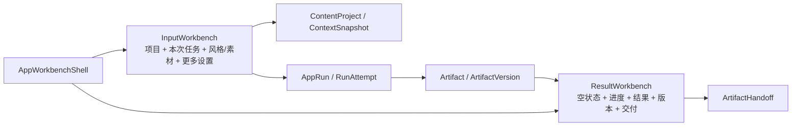
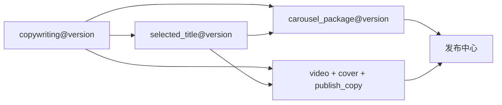

# Pixelle Video 应用工作台体验优化实施方案

- 日期：2026-07-28
- Change Request：`CR-APP-WORKBENCH-001`
- 建议协调 Stage：`APP-WORKBENCH-0`
- 上位方案：
  - `docs/superpowers/specs/2026-07-18-application-center-publishing-program-master-plan.md`
  - `docs/superpowers/specs/2026-07-18-application-center-product-architecture-implementation-plan.md`
  - `docs/superpowers/specs/2026-07-24-digital-human-dual-mode-and-quality-optimization-implementation-plan.md`
- 当前事实源：
  - `docs/reviews/2026-07-18-application-center-publishing-program-progress.md`
- 执行者：Luna

## 0. 执行结论

本方案不是新增一批彼此孤立的 AI 工具，而是把已经实现的门店营销文案、爆款标题、抖音图文和数字人口播视频，统一升级为真正可连续工作的“应用工作台”。

核心产品决策：

1. `ContentProject` 是所有应用共享的长期业务上下文，作用对应参考产品中的“选商品”，但 Pixelle 面向门店、品牌、商品和服务，语义更广；
2. 应用详情在桌面宽度下统一使用“左侧输入控制台 + 右侧结果工作区”；
3. 门店资料、产品/服务、目标顾客、卖点、优惠、证据和禁用表述写入版本化 `ContextSnapshot`，不要求用户每次重复填写；
4. 标题和文案增加受信任、版本化的风格样例库，同时允许本次粘贴自定义参考；
5. 结果不再以 AppRun ID、运行记录或裸 JSON 为中心，而以可编辑、可选择、可版本化的 Artifact 卡片为中心；
6. 跨应用流转继续使用固定来源版本的 `ArtifactHandoff`，不得直接复制或覆盖来源内容；
7. 数字人继续复用已完成的图片/视频双模式、TTS、RunningHub、后期、字幕、封面与发布素材链路，只重构应用工作台交互；
8. 所有 LLM 应用继续复用当前模型管理和 `local-default` 配置，不增加第二套 provider、key 或模型事实源；
9. 最终发布按钮继续由用户人工点击，本方案不扩大自动发布权限；
10. 新体验使用独立 feature flag 灰度，可一键回退旧工作区，旧项目、Run 和 Artifact 不迁移丢失。

目标体验：

```text
选择项目
→ 自动恢复项目资料
→ 补充本次任务信息
→ 选择风格或素材
→ 一次点击生成
→ 在右侧审阅、编辑和选择结果
→ 保存 ArtifactVersion
→ 交给下一个应用或发布中心
```

## 0.1 与总协调台账的关系

当前台账 `current_stage=PROGRAM-ROLLOUT`、`current_substage=PG-L`、`current_stage_status=waiting_user`。本方案不能绕过台账直接修改业务代码。

推荐协调动作：

1. 完成当前 Windows 热修安装包构建和留证；
2. 登记 `CR-APP-WORKBENCH-001`；
3. 将原 `PROGRAM-ROLLOUT/PG-L` 外部验收边界原样保留为 suspended checkpoint；
4. 自审通过后，由协调层将唯一入口切换为：

```text
current_stage: APP-WORKBENCH
current_substage: APP-WORKBENCH-0
current_stage_status: in_progress
gate_status: PG-AW-A_entry_in_progress
```

5. 每次只推进一个 Stage；Entry、实现、定向测试、构建、视觉证据和 Gate 全部完成后，才能进入下一 Stage；
6. `APP-WORKBENCH-7` 收口后回到 `PROGRAM-ROLLOUT/PG-L`，Windows 实机、产品负责人签字和真实 rollback/WebView SLA 边界不得被本方案悄悄关闭。

## 0.2 本期目标

### 必须完成

- 四个现有应用统一左右工作台；
- 项目选择与项目业务资料上下文；
- 门店营销文案风格库和更完整 brief；
- 爆款标题风格库、自定义参考、分组结果与逐条操作；
- 抖音图文输入、素材和实时结果预览分栏；
- 数字人图片/视频模式、内容卖点、口播文案和更多设置分栏；
- 结果区的空、运行、失败、待审、已保存状态；
- Artifact 版本编辑、选中主结果、复制、下载和跨应用 handoff；
- 桌面窄窗口的“配置 / 结果”Tab 降级；
- 原工作区回滚、旧数据恢复和重启恢复；
- 自动化测试、真实渲染截图和至少一次受控真实 LLM 文本应用验证。

### 明确不做

- 不复制万相营造的品牌、配色、图标、文案或商业化界面；
- 不解析淘宝、抖音等外部商品链接；
- 不建设外部风格市场、用户公开模板市场或第三方插件；
- 不建设管理员后台、RBAC、套餐、支付或多租户；
- 不为每个应用新增单独模型配置；
- 不重写数字人媒体执行链路；
- 不改最终发布人工确认边界；
- 不在本期用点赞数据训练或微调模型；
- 不声称标题有确定“爆款概率”；
- 不把运行日志和技术诊断作为默认用户结果。

## 1. 参考体验分析与 Pixelle 取舍

### 1.1 参考体验的有效部分

本次参考材料包括：

- 标题文案输入与风格样例库截图；
- 导购文案风格样例截图；
- 左侧输入、右侧结果的应用工作区截图；
- 51.688 秒完整标题文案功能视频。

值得采用的结构：

1. 先选择业务对象，再补本次卖点；
2. 输入控制与结果展示同时可见；
3. 风格样例以用户能理解的例句呈现，而不是暴露 prompt；
4. 结果一条一卡，并提供编辑、复制和反馈；
5. 生成前展示样例，减少空白页和用户猜测；
6. 主操作固定在输入区底部，长表单滚动后仍可触达。

### 1.2 不能直接照搬的部分

- Pixelle 的核心对象不是单一商品，而是门店、品牌、商品、服务或活动组成的创作项目；
- Pixelle 的结果要继续进入图文、数字人和发布中心，因此必须保留 Artifact 与 Handoff；
- Pixelle 已有双模式数字人和发布安全边界，不能退化成一次性生成页；
- Pixelle 是桌面端生产工具，必须覆盖窗口缩放、重启恢复、本地资产和长任务；
- 参考产品的风格文本不能直接复制为生产 prompt，必须重新定义风格意图、约束和示例。

### 1.3 体验判断

对当前四个应用，左右布局优于上下布局：

- 用户可以一边调整输入，一边比较右侧结果；
- 输入和输出的因果关系更清楚；
- 运行记录不再把结果推到长页面下方；
- 图文和视频有足够横向空间展示真实预览；
- 统一工作台能降低四个应用之间的学习成本。

上下布局只作为窄窗口降级，不再是桌面默认。

## 2. 产品信息架构

## 2.1 应用中心

应用中心首页继续负责发现能力，不在本期塞入项目管理表格。

卡片主动作：

- 无最近项目：`开始创作`；
- 有未完成项目：`继续创作`；
- 不可用：`待上线` 或明确的配置修复入口。

点击应用后进入应用工作台，不再先进入项目列表页。

## 2.2 项目作为全局上下文

应用工作台左侧顶部固定“当前创作项目”：

- 搜索或切换已有项目；
- 新建项目；
- 查看当前项目摘要；
- 展开编辑项目资料；
- 显示资料完整度和缺失事实，不显示虚假百分比评分。

项目资料建议结构：

```json
{
  "schema_version": 2,
  "subject_type": "store|brand|product|service|campaign",
  "store_or_brand": {
    "name": "门店或品牌名",
    "industry": "行业",
    "address": "可选",
    "contact": "可选"
  },
  "offer": {
    "name": "商品、服务或活动",
    "category": "类别",
    "price_facts": [],
    "promotion_facts": []
  },
  "audience": {
    "primary": "目标顾客",
    "scenes": []
  },
  "selling_points": [],
  "proof_points": [],
  "required_facts": [],
  "forbidden_claims": [],
  "asset_refs": [],
  "brand_revision_ref": null
}
```

规则：

- 项目资料保存为新的 `ContextSnapshot`，旧快照不可原地覆盖；
- AppRun 创建时固定 `context_snapshot_id`；
- 用户修改项目资料后，旧 Run 和旧 Artifact 仍绑定旧快照；
- 新运行默认使用最新快照；
- 缺少价格、活动期限、资质或效果事实时不得由 LLM 编造；
- 项目切换时如果有未保存输入，必须提供保存、放弃或取消；
- 项目不是新的模型配置源，也不保存任何 key、Cookie 或 provider 请求正文。

## 2.3 应用工作台统一骨架



页面组成：

```text
应用页头：返回 / 应用名 / 当前项目 / 保存状态 / readiness
工作区主体：
  左侧：输入控制台
  右侧：结果工作区
窄窗口：
  配置 Tab
  结果 Tab
```

## 3. UI 布局规范

## 3.1 桌面布局

外层仍使用现有 AppShell 和 224px 一级侧栏。

应用工作区：

```css
grid-template-columns: clamp(360px, 34vw, 460px) minmax(0, 1fr);
gap: 16px;
```

建议比例：

| 应用 | 左侧 | 右侧 | 说明 |
| --- | ---: | ---: | --- |
| 门店营销文案 | 36% | 64% | 右侧需要并排或分组展示多版文案 |
| 爆款标题 | 36% | 64% | 右侧需要分组候选和逐条操作 |
| 抖音图文 | 34% | 66% | 右侧优先保证竖版页面预览 |
| 数字人口播视频 | 40% | 60% | 左侧设置较多，右侧播放最终视频 |

实现要求：

- 主页面不出现横向滚动条；
- 左右区高度使用可视窗口，允许各自滚动；
- 左侧底部主操作保持 sticky；
- 右侧页头或结果工具栏保持 sticky；
- 不制造三层以上嵌套滚动；
- 结果编辑器展开时保持结果卡片宽度稳定；
- 应用页头高度、容器、卡片、Tab、Tag、按钮和状态卡使用现有 tokens。

## 3.2 响应式降级

| 宽度 | 行为 |
| --- | --- |
| `>= 1180px` | 左右双栏 |
| `960–1179px` | 左侧固定约 360px，右侧自适应 |
| `< 960px` | `配置 / 结果` 两个 Tab |
| `< 600px` | 单栏、主按钮满宽、结果操作折叠 |

窄屏不是删除功能：

- 生成完成后自动切到“结果”；
- 从结果点击“调整输入”返回“配置”；
- 运行中切换 Tab 不取消任务；
- 键盘焦点在 Tab 切换后落到对应区域标题；
- 所有输入标签、错误和帮助文案保持可读。

## 3.3 左侧输入控制台

从上到下固定顺序：

1. 当前创作项目；
2. 本次任务目标；
3. 应用特定必要输入；
4. 风格、素材或内容来源；
5. `更多配置` 折叠区；
6. 有可靠数据时展示预计结果、时长或消耗；无可靠数据时不伪造；
7. sticky 主动作。

按钮规则：

- 主动作只有一个；
- 未满足条件时使用中性灰 disabled 样式并显示缺失原因；
- 不再要求用户理解“创建运行草稿”“执行 Run”等技术步骤；
- 点击主动作时幂等保存项目/输入、创建 Run 并开始执行；
- 生成中按钮变为进度状态，不允许重复提交；
- 失败后按钮变为“按原输入重试”，输入仍可编辑并另起新 Run。

## 3.4 右侧结果工作区

统一状态：

### 未生成

- 展示该应用能交付的结果类型；
- 展示 2–4 个风格或结果示例；
- 告知最少需要填写什么；
- 不显示空的运行记录表。

### 生成中

- 只展示由 AppRun、RunAttempt、Task 或媒体工作流真实状态支持的业务步骤；
- 文本应用显示“理解项目 / 生成候选 / 校验事实 / 准备结果”；
- 图文显示“策划分页 / 渲染页面 / 打包”；
- 数字人显示“TTS / 数字人 / 字幕与后期 / 产物登记”；
- 没有真实百分比时使用阶段状态，不伪造 37%、82% 等进度；
- 重启后从 AppRun/Task 恢复，不制造第二个任务。

### 失败

- 主文案使用业务语言；
- 保留输入；
- 提供重试、调整输入和复制诊断；
- 技术错误码放到折叠详情；
- 失败 Run 不生成伪 Artifact。

### 待审与已保存

- 默认打开本次结果；
- 支持 `本次结果 / 历史版本` Tab；
- 编辑产生新的 ArtifactVersion；
- “确认完成”改为业务动作，例如“保存所选标题”“接收最终成片”；
- 保存后给出确定性的下一步建议。

## 4. 功能优化

## 4.1 门店营销文案

### 左侧输入

- 当前项目；
- 本次营销目标；
- 主推商品、服务或活动；
- 本次内容卖点，可从项目卖点选择并排序；
- 营销利益点，例如新品、折扣、节日、到店、咨询、复购；
- 目标顾客和使用场景；
- 内容载体：口播、图文、通用；
- 目标长度；
- 风格来源：风格样例库 / 自定义参考；
- 更多配置：语气、必须出现、禁用表达、CTA、活动期限。

### 内置文案风格

首期建议：

- `卖点讲解`：事实清楚、结构完整；
- `老板口吻`：第一人称、自然可信；
- `探店种草`：场景体验和到店理由；
- `网红推荐`：口语化推荐，但禁止虚构身份和体验；
- `买家体验`：第一人称体验表达，但必须标记为“表达风格”，不得伪造真实购买者证言；
- `活动促销`：优惠、条件、期限、CTA 清楚；
- `知识科普`：问题、解释、建议、门店关联；
- `客户案例`：只允许使用项目中已有的真实案例事实。

每个风格包含：

```json
{
  "style_id": "copy.owner_voice",
  "version": 1,
  "name": "老板口吻",
  "description": "用门店老板第一人称自然介绍",
  "example": "用户可见的短样例",
  "prompt_rules": [],
  "forbidden_patterns": [],
  "supported_apps": ["builtin.marketing-copy"]
}
```

用户可粘贴自定义参考，但必须：

- 明确提示只模仿表达方式，不复制事实；
- 限制长度；
- 只固定在本次 AppRun input snapshot，不写入项目长期资料；
- 本期不提供“保存为我的风格”，个人风格库和分享市场后置独立评审。

### 右侧结果

每个文案版本卡片展示：

- 风格标签；
- 创作角度；
- 开头、正文、CTA；
- 完整文案；
- 字数和预计时长；
- 缺失事实或风险；
- 复制、编辑、保存、设为主文案；
- 交给爆款标题、抖音图文、数字人口播。

## 4.2 爆款标题

### 左侧输入

- 当前项目；
- 内容来源：已有文案、已有主题、自定义原文；
- 本次卖点和营销利益点；
- 发布平台；
- 目标：点击、到店、咨询、完播、收藏；
- 候选数量；
- 风格来源：风格样例库 / 自定义参考；
- 更多配置：关键词、长度范围、禁用词、是否允许数字、是否允许问句。

### 内置标题风格

首期建议：

- `商品短标题`：事实 + 核心利益；
- `信息流标题`：场景问题 + 具体收益；
- `好奇标题`：保留信息缺口但不故弄玄虚；
- `冲突标题`：对比或反常识，不制造虚假冲突；
- `数字清单`：数字 + 方法或结果；
- `身份场景`：明确目标人群和场景；
- `科普标题`：问题 + 知识价值；
- `活动标题`：活动事实 + 条件 + 时间。

“浮夸风”不作为默认名称；可用“强情绪”替代，并通过确定性规则限制夸大、绝对化和虚假稀缺。

### 右侧结果

结果默认按风格或角度分组，不使用伪精确爆款分数。

每条候选展示：

- 标题正文；
- 风格/角度标签；
- 字符数；
- 平台规则检查；
- 风险标签及原因；
- 复制、编辑、收藏、喜欢、不喜欢、设为主标题；
- 交给抖音图文或数字人口播。

反馈只记录本地 `app_event`：

- 不修改当前 Artifact；
- 不自动训练模型；
- 不把反馈内容或项目事实发送给新的外部服务；
- 后续可用于本地推荐常用风格。

## 4.3 抖音图文

### 左侧输入

- 当前项目；
- 内容来源及固定版本；
- 主标题或封面钩子；
- 图文目标；
- 图片资产选择；
- 页数和模板；
- 风格：门店种草、活动清单、知识卡片、案例拆解；
- 更多配置：品牌色、必须使用图片、CTA、发布文案偏好。

### 右侧结果

- 未生成时展示图文结构示例；
- 生成计划后展示分页结构；
- 渲染后展示竖版页面预览和缩略图导航；
- 页面文本可编辑；
- 替换图片只重渲染受影响页；
- 单页失败可单独重试；
- 右侧工具栏提供保存版本、下载图片组、下载 ZIP、复制发布文案、交给发布中心。

## 4.4 数字人口播视频

### 左侧输入

1. 当前项目；
2. 内容来源：
   - 选择已有文案；
   - 自动生成文案；
   - 自定义口播稿；
3. 数字人素材：
   - 图片数字人；
   - 视频数字人；
4. 从资产库选择或本地导入素材；
5. 本次内容卖点，从项目资料自动推荐；
6. 口播文案及预计 TTS 时长；
7. 更多配置：
   - 音色；
   - 语速；
   - 画面比例；
   - 字幕样式和开关；
   - 背景或模板；
   - 背景音乐；
   - 封面标题；
   - 发布标题、描述和话题；
   - 清晰度。

默认：

- 图片模式仍为默认；
- 视频模式显示 `stable`，不默认；
- 字幕默认开启并使用 `readable_v2`；
- 最终发布不自动点击。

### 右侧结果

- 未选素材：图片/视频素材要求与效果示例；
- 已选素材：人物、裁切和字幕安全区预览；
- 生成中：TTS、数字人、字幕与后期、Artifact 登记；
- 待审核：
  1. 最终成片；
  2. 发布封面；
  3. 发布标题、描述、话题；
  4. 最终口播稿；
- 操作：播放、下载、复制、重试、接收结果、交给发布中心；
- 原始数字人片段只在“生成诊断”中显示。

数字人页面重构不得：

- 在 UI 层复制媒体状态机；
- 直接调用 RunningHub；
- 把 selected title 当口播正文；
- 修改已完成 Run 的固定输入；
- 因布局重构重复创建 Provider task。

## 5. 风格系统

## 5.1 数据所有权

新增受信任的 `StylePresetRegistry`：

- 随代码发布；
- `style_id + version` 永久稳定；
- 用户可见名称、说明和短样例；
- 服务端拥有 prompt rules；
- 前端不能提交任意 prompt template；
- 应用 manifest 声明支持的 style families；
- AppRun 保存 `style_ref` 和自定义参考的内容指纹；
- ArtifactVersion 保存非敏感风格元数据。

首期不需要新增独立数据库表来保存内置风格；Registry 使用 Python 受信常量和契约 fixture。用户私有风格后续单独迁移。

## 5.2 风格与事实边界

- 风格只决定表达方式，不引入新的业务事实；
- 自定义参考中的价格、品牌、效果、人物和活动不得自动迁移为项目事实；
- 风格示例不得包含无法证明的医疗、教育、金融或效果承诺；
- Prompt 仍走现有 `AppLLMPort`；
- 确定性 validator 继续校验长度、数量、禁用词、重复、来源和风险；
- LLM 输出失败仍最多进行现有的一次结构化 repair。

## 6. 结果、Artifact 与跨应用传递

## 6.1 结果事实

右侧结果区只消费服务端事实：

```text
AppRun
→ output_artifact_ids
→ Artifact
→ current ArtifactVersion / history
```

不得把大段结果长期复制到 localStorage。

## 6.2 Artifact 渲染器

共享：

- `ResultWorkbench`;
- `ResultState`;
- `ArtifactHeader`;
- `ArtifactActions`;
- `VersionSwitcher`;
- `HandoffActions`;
- `SourceArtifactBadge`;
- `BusinessErrorPanel`.

领域渲染器：

- `CopywritingResultCards`;
- `ViralTitleResultList`;
- `CarouselResultPreview`;
- `DigitalHumanResultReview`.

不创建由大量 `app_id` 条件拼成的万能结果组件。

## 6.3 编辑和保存

- 用户编辑结果时先进入本地 draft；
- 离开未保存结果时提示；
- 保存创建新的 `ArtifactVersion(source="edited")`；
- 原版本不覆盖；
- 主文案、主标题等选择写入结构化结果或独立 typed artifact；
- 保存后刷新和重启仍能恢复；
- 未知 artifact schema 使用只读安全摘要。

## 6.4 Handoff



交付规则：

- 来源固定到 `artifact_version_id`；
- 目标应用先显示“已带入内容”，用户确认后执行；
- 来源更新时只提示，不热更新目标 Run；
- 同一 handoff 重试幂等；
- handoff 失败不影响来源 Artifact；
- 目标应用返回后仍可追溯来源；
- 去发布中心创建或选择 PublishPackage，但不触发最终发布。

## 7. API 与数据契约

## 7.1 ContextSnapshot v2

保留现有接口：

```text
POST /api/content-projects/{project_id}/context-snapshots
GET  /api/content-projects/{project_id}/context-snapshots/current
```

增加 payload v2 Pydantic 校验和稳定错误码：

- `PROJECT_CONTEXT_INVALID`;
- `PROJECT_CONTEXT_FACT_CONFLICT`;
- `PROJECT_CONTEXT_ASSET_NOT_FOUND`;
- `PROJECT_CONTEXT_CROSS_PROJECT_REF`;
- `PROJECT_CONTEXT_SCHEMA_UNSUPPORTED`.

旧 v1 payload 继续可读；进入编辑时做显式映射预览，用户保存后才产生 v2 快照。

## 7.2 应用输入 schema v2

建议：

```text
marketing-copy-input.v2
viral-titles-input.v2
douyin-carousel-input.v2
digital-human-video-input.v2 继续扩展 UI 映射，不改变已冻结媒体语义
```

共同字段：

```json
{
  "project_id": "project_...",
  "context_snapshot_id": "context_...",
  "task_brief": {},
  "style_ref": {
    "style_id": "copy.owner_voice",
    "version": 1
  },
  "custom_style_reference": null,
  "source_artifact_version_ids": []
}
```

`style_ref` 和 `custom_style_reference` 属于版本化 `input_payload`，不是 AppRun 表新增的顶层可变字段。Run 创建后不得原地更换风格；调整风格必须创建新 Run。

服务端继续拒绝：

- API key；
- provider/base_url/model 覆盖；
- Cookie、Authorization、浏览器 profile；
- 任意本地绝对路径；
- 跨项目 ArtifactVersion；
- 未注册 style_id/version。

## 7.3 Result feedback

复用 `app_events` 记录：

```text
result.copied
result.edited
result.selected
result.liked
result.disliked
handoff.started
handoff.completed
```

事件只保存 ID、序号、动作和非敏感摘要，不保存完整文案副本。

## 8. 前端组件与代码组织

建议目录：

```text
desktop/src/features/app-workbench/
  AppWorkbenchShell.tsx
  InputWorkbench.tsx
  ResultWorkbench.tsx
  ProjectContextSelector.tsx
  ProjectBriefEditor.tsx
  StylePresetPicker.tsx
  CustomStyleReference.tsx
  WorkbenchState.tsx
  ArtifactActions.tsx
  HandoffActions.tsx
  VersionSwitcher.tsx
  workbench.css

desktop/src/features/marketing-copy/
  MarketingCopyInputPanel.tsx
  MarketingCopyResultCards.tsx

desktop/src/features/viral-titles/
  ViralTitlesInputPanel.tsx
  ViralTitleResultList.tsx

desktop/src/features/douyin-carousel/
  DouyinCarouselInputPanel.tsx
  CarouselResultPreview.tsx

desktop/src/features/digital-human/
  DigitalHumanInputPanel.tsx
  DigitalHumanResultReview.tsx
```

迁移边界：

- `CreationWorkspace.tsx` 先成为兼容容器，再逐应用拆分；
- 新业务组件不得继续堆入 `StudioApp.tsx`；
- 现有 `api.ts` 可先复用，Stage 4 前拆出 app-workbench API；
- 继续使用 Ant Design、Lucide 和现有 `--app-*` tokens；
- 不新增应用中心专属色板；
- 共享布局，不共享领域表单；
- 所有 `Select`、Tab、输入和按钮必须有稳定 label 和键盘焦点。

## 9. Feature flag、迁移与回滚

建议 flags：

```text
PIXELLE_APP_WORKBENCH_V2=0
PIXELLE_APP_WORKBENCH_TEXT_V2=0
PIXELLE_APP_WORKBENCH_CAROUSEL_V2=0
PIXELLE_APP_WORKBENCH_DIGITAL_HUMAN_V2=0
```

灰度顺序：

1. 开发和自动化；
2. 文案/标题内部开启；
3. 抖音图文开启；
4. 数字人开启；
5. 全部应用开启；
6. 观察稳定后再评估删除旧容器。

回滚：

- 关闭 UI flag 回到旧工作区；
- 新 ContextSnapshot/ArtifactVersion 保留；
- 旧客户端忽略不认识的 v2 字段，不能删除数据；
- 运行中的 AppRun 不因 UI 回滚而取消；
- 数字人 Provider task 继续由原 adapter 恢复；
- 不回滚或删除已经生成的文件；
- 回滚不改变发布人工确认边界。

## 10. 实施 Stage 与 Gate

## 10.1 APP-WORKBENCH-0：Entry、契约与基线

交付：

- 登记 `CR-APP-WORKBENCH-001`；
- 冻结项目上下文 v2、风格 Registry、输入 schema v2、结果状态和 handoff；
- 保存当前四应用 1440×900、1280×800、900×760 基线；
- 保存参考材料的结构性审查结论；
- 冻结 feature flags、允许修改范围和回滚；
- 建立契约 fixture 和 Entry tests。

禁止：

- 不改业务 UI；
- 不调用真实 LLM、RunningHub 或平台；
- 不改默认 flags。

Gate `PG-AW-A`：

- 需求、契约、数据所有权、错误码、迁移和回滚自洽；
- Entry tests、JSON、Ruff、diff check 通过；
- 自审 P0/P1=0。

## 10.2 APP-WORKBENCH-1：统一左右工作台外壳

实现：

- `AppWorkbenchShell`；
- 左右布局、sticky 操作、结果状态；
- 窄窗口 Tab 降级；
- 四应用以旧数据接入，不改变 executor；
- 旧容器 flag 回退。

Gate `PG-AW-B`：

- 1440、1280、900、390 四档无错行、遮挡和横向滚动；
- 键盘、focus、Tab、disabled 样式通过；
- 四应用旧功能回归通过。

## 10.3 APP-WORKBENCH-2：项目上下文

实现：

- ProjectContextSelector；
- ProjectBriefEditor；
- ContextSnapshot v2；
- 项目切换、草稿保护和重启恢复；
- 应用输入自动带入项目事实。

Gate `PG-AW-C`：

- v1/v2 兼容；
- 旧 Run 仍固定旧快照；
- 跨项目引用、事实冲突和缺失处理通过；
- 无重复项目和无隐式覆盖。

## 10.4 APP-WORKBENCH-3：文案与标题

实现：

- StylePresetRegistry；
- 文案/标题风格选择和自定义参考；
- 输入 schema v2；
- 文案版本卡、标题分组卡；
- 复制、编辑、选择、反馈；
- 真实 Doubao/Ark Responses API 受控 smoke。

Gate `PG-AW-D`：

- 风格不引入项目外事实；
- 标题数量、去重、长度、禁用词和风险校验；
- 编辑和选择产生正确 ArtifactVersion；
- 文案→标题真实 typed handoff；
- 每个真实用例只执行一次有目的测试，唯一 repair 不算重复用户提交。

## 10.5 APP-WORKBENCH-4：抖音图文

实现：

- 左侧来源、素材、风格、页数和模板；
- 右侧分页计划、页面预览、局部编辑和下载；
- 来源版本和资产恢复；
- 图文包到发布中心 handoff。

Gate `PG-AW-E`：

- 单页重试和局部重渲染；
- ZIP、页序、发布文案和 Artifact 完整；
- 资产缺失、字体和文本溢出可见；
- 不打开发布平台。

## 10.6 APP-WORKBENCH-5：数字人

实现：

- 图片/视频素材模式；
- 内容来源、本次卖点、口播稿和更多配置；
- 右侧预览、进度和最终结果；
- 复用现有双模式 API/adapter；
- 最终成片、封面、发布文案、口播稿四 Artifact。

Gate `PG-AW-F`：

- 图片和视频模式 UI 均可用；
- 图片默认、视频 stable 非默认；
- 字幕、安全区和结果顺序正确；
- 重启恢复、失败重试和幂等通过；
- 不重复创建真实 Provider task；
- 最终发布自动点击为 0。

## 10.7 APP-WORKBENCH-6：交付与跨应用

实现：

- 统一 ArtifactActions、VersionSwitcher 和 HandoffActions；
- 文案→标题/图文/数字人；
- 标题→图文/数字人；
- 图文/数字人→发布中心；
- 本次结果/历史版本；
- 下一步建议。

Gate `PG-AW-G`：

- 来源版本固定；
- 目标 draft 显示带入内容；
- 重复点击幂等；
- 来源更新提示；
- 发布中心接收正确 package；
- 不执行最终发布。

## 10.8 APP-WORKBENCH-7：灰度、视觉终审与收口

实现：

- 分应用开启 flags；
- 全量回归和 production build；
- 真实浏览器可视化验收；
- 重启恢复；
- 记录性能、错误和迁移；
- 保留旧容器回滚。

Gate `PG-AW-H`：

- 四应用主流程均完成一次真实可视化验收；
- P0/P1 缺陷为 0；
- 真实文本应用 smoke 通过；
- 数字人不因布局重构新增付费 Provider 风险；
- 安装包构建通过；
- 回滚 smoke 通过；
- 台账返回 `PROGRAM-ROLLOUT/PG-L`。

## 11. 测试矩阵

### 后端

- ContextSnapshot v1/v2；
- project brief 校验和 fingerprint；
- StylePreset Registry/version；
- 输入 schema v2；
- 风格事实隔离；
- LLM 错误矩阵和唯一 repair；
- ArtifactVersion 编辑与并发；
- handoff 同项目、固定版本和幂等；
- app_event 脱敏；
- migration/rollback；
- 数字人旧 Run 恢复。

### 前端

- 左右布局和窄窗 Tab；
- 项目新建、切换、草稿保护；
- 所有 Select 对齐；
- disabled 可读；
- sticky 主动作；
- 空、运行、失败、待审、已保存；
- 风格选择和自定义参考；
- 文案/标题逐条编辑；
- 图文预览和局部操作；
- 数字人图片/视频素材选择；
- Artifact 与 handoff 操作；
- 重启恢复投影。

### 可视化

每个应用至少保存：

```text
01-empty
02-project-selected
03-input-ready
04-running
05-result
06-editing
07-handoff
08-narrow-window
```

视口：

- 1440×900；
- 1280×800；
- 900×760；
- 390×760 仅验证降级，不宣称移动端产品。

截图必须先检查：

- 页面身份正确；
- 无 loading/错误遮罩；
- 无错行和裁切；
- 输入与结果状态一致；
- disabled、focus、状态不只靠颜色；
- 用户信息和 key 已脱敏。

### 真实运行

- 文案：一次真实 provider；
- 标题：一次真实 provider；
- 文案→标题：一次真实 handoff；
- 图文：本地真实渲染和 ZIP；
- 数字人：优先复用既有真实质量证据，除非契约变化必须重新调用 Provider；
- 发布：只到发布中心 handoff，不点击最终发布。

## 12. 性能与可用性预算

- 应用工作台首屏可交互：本地目标 `< 1.5s`；
- 项目切换 UI 反馈：`< 150ms`，数据加载使用 skeleton；
- 大结果不阻塞输入；
- 右侧媒体按需加载；
- 不因风格样例一次加载全部历史 Artifact；
- 项目/Artifact 列表保持分页或上限；
- AppRun 轮询只在 queued/running 时开启；
- 页面离开后清理 timer；
- 项目快速切换使用 AbortController、request sequence 或等价方式，旧请求不得回写新项目状态；
- 生成中重启恢复不重复执行。

## 13. 安全、隐私与合规

- key 继续只显示脱敏首尾；
- 自定义参考可能包含外部文案，提示用户确认使用权；
- 自定义参考不自动沉淀为项目事实；
- 不保存第三方 Cookie 或登录态；
- 不把完整 provider 响应写入日志；
- 高风险行业继续 fail closed；
- “买家体验”只表示写作视角，不得伪造真实评价；
- 喜欢/不喜欢只保存在本地事件；
- Artifact 和诊断不得包含绝对路径；
- 发布继续人工确认。

## 14. 自审清单

### 需求完整性

- 是否覆盖功能、UI 布局、结果展示和传递；
- 是否逐一覆盖四个应用；
- 是否覆盖项目和风格系统；
- 是否覆盖 Windows/Tauri、重启和窄窗。

### 逻辑正确性

- 项目资料是否固定到 ContextSnapshot；
- Run、Artifact 和 Handoff 是否仍是唯一事实；
- 风格是否与事实分离；
- 编辑是否产生新版本；
- 目标应用是否固定来源版本。

### 边界情况

- 无项目、无资料、无模型、无资产；
- 项目切换有未保存输入；
- v1 旧项目和旧 Run；
- provider 失败、重启、重复点击；
- 结果 schema 未知；
- 窄窗口；
- 数字人 Provider 已提交后的恢复。

### 代码质量

- 是否复用统一外壳和 tokens；
- 是否避免继续扩大 StudioApp；
- 是否避免万能条件组件；
- 是否保留领域组件；
- 是否没有第二套模型配置。

### 测试覆盖

- 契约、单元、集成、构建、可视化、真实 smoke；
- 每个 Gate 是否有明确命令和证据；
- 是否避免无目的重复真实调用。

### 实际运行

- 用户是否能在一个工作台完成输入、生成、编辑、保存和下一步；
- 重启后是否恢复；
- 最终发布是否仍人工；
- Windows 安装包是否可构建；
- 回滚是否保留数据。

## 15. Definition of Done

- [ ] CR 和台账唯一入口已登记；
- [ ] 四应用统一左右工作台；
- [ ] 窄窗 Tab 降级；
- [ ] 项目上下文 v2 可保存和恢复；
- [ ] 文案/标题风格库可用；
- [ ] 自定义参考事实隔离；
- [ ] 文案、标题、图文和数字人结果可见、可编辑、可版本化；
- [ ] typed handoff 全链路通过；
- [ ] 数字人双模式和四 Artifact 无回归；
- [ ] 当前模型管理继续唯一；
- [ ] 最终发布人工确认不变；
- [ ] 全量测试、生产构建、可视化验收和 Windows CI 通过；
- [ ] P0/P1 缺陷为 0；
- [ ] 旧 UI flag 回滚通过；
- [ ] 台账和证据已更新。

## 16. 交给 Luna 的启动指令

```text
读取《应用中心与桌面自动发布整体协调实施方案》、
实时进度台账和
《Pixelle Video 应用工作台体验优化实施方案》。

登记 CR-APP-WORKBENCH-001。
安装包构建证据归档后，由协调层将 current_stage 切换为
APP-WORKBENCH-0。

以 current_stage 为唯一工作入口。
每次只执行一个 Stage；完成 Entry、实现、定向测试、
生产构建、真实可视化证据、自审和 Gate 更新后，
才能进入下一 Stage。

项目资料必须固定到 ContextSnapshot；
运行必须经过 AppRun；
结果必须登记 ArtifactVersion；
跨应用必须经过 ArtifactHandoff。

继续复用当前 LLM 管理、FastAPI、SQLite、资产库、
数字人双模式和发布中心。
不得增加第二套模型配置，不得自动点击最终发布，
不得绕过上位台账，不得把参考产品视觉原样复制。
```
